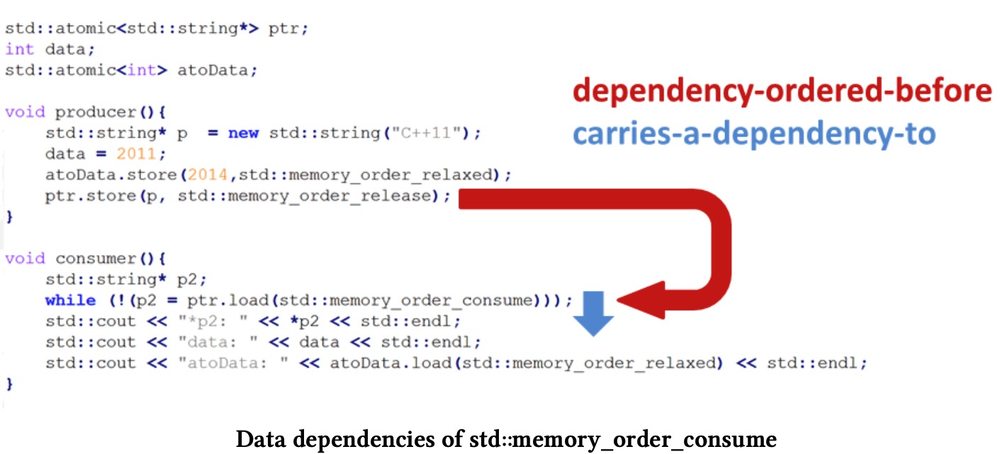
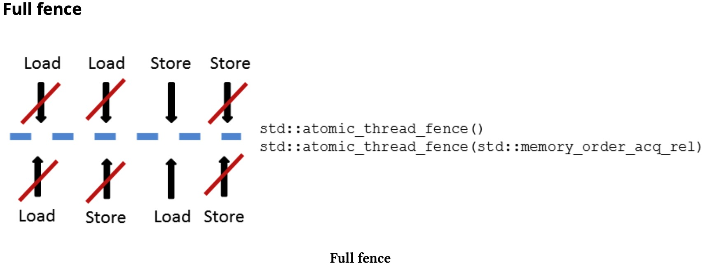

## what is a memory model?

> The C++ memory model defines a contract, this contract is between the programmer and the system
> The system consists of the compiler that generates machine code, the processor that executes the machine
> code and includes the different caches that store the state of the program. Each of the participants wants to optimise its part
> with the strong memory model I refer to sequential consistency, and with the weak memory model I refer to relaxed semantic.

1. 内存模型定义了程序员和系统(包含编译器、处理器、Cache)的约定，有了这些约定，系统才可以尽可能的做各种优化。
2. 强内存模型对应顺序一致性、弱内存模型泽对应松散语义


Sequential consistency provides two guarantees:
• The instructions of a program are executed in source code order.
• There is a global order of all operations on all threads.

顺序一致性提供了两个保证:

1. 程序的指令执行是按照代码中的顺序来的
2. 所有的操作在所有的线程中的都是全局有序的。


`std::atomic_flag` has two outstanding properties.
`std::atomic_flag` is

• the only lock-free atomic. A non-blocking algorithm is lock-free if there is guaranteed system- wide progress.
• the building block for higher level thread abstractions.

The only lock-free atomic? The remaining more powerful atomics can provide their functionality by using a mutex internally according to the C++ standard.
These remaining atomics have a method called is_lock_free to check if the atomic uses a mutex internally. On the popular microprocessor architectures,
I always get the answer true. You should be aware of this and check it on your target system if you want to program lock-free.

`std::atomic_flag  != std::atomic<bool>`

Condition variables may be victim to two phenomena:

1. spurious wakeup: the receiver of the message wakes up, although no notification happened
2. lost wakeup: the sender sends its notification before the receiver gets to a wait state.


There are three different kinds of operations:
• Readoperation:memory_order_acquire and memory_order_consume
• Write operation: memory_order_release
• Read-modify-write operation:memory_order_acq_rel and memory_order_seq_cst

memory_order_relaxed defines no synchronisation and ordering constraints. It does not fit in this taxonomy.
The default for atomic operations is std::memory_order_seq_cst

六种原子操作的memory model，可以分为三类，不能随便用，否则意义不大，比如

load 属于read，但是如果给他添加memory_order_release则没有任何意义，等同于memory_order_relaxed，如果添加的是memory_order_acq_rel，它是属于
Read-modify-write类型，所以writer部分就没有效果了。等同于memory_order_acquire。

总体上分为三类:

• Sequential consistency: memory_order_seq_cst
• Acquire-release: memory_order_consume, memory_order_acquire, memory_order_release, and
memory_order_acq_rel
• Relaxed:memory_order_relaxed

While the sequential consistency establishes a global order between threads, the acquire-release semantic establishes an
ordering between reading and writing operations on the same atomic variable with different threads.
The relaxed semantic only guarantees the modification order of some atomic m. Modification order means that all modifications on a particular atomic m occur in some particular
total order.Consequently, reads of an atomic object by a particular thread never see “older” values than those the thread has already observed.

顺序一致性保证了在线程间是全局有序的，acquire-release语义则建立对于相同的原子变量的的不同线程之间的read和write操作是有序的。relaxed语义只保证某些原子m的修改顺序。
修改顺序意味着对特定原子m的所有修改都以特定的总顺序发生。因此，特定线程对原子对象的读取永远看不到这个线程已经观察到的“旧”值。


* `compare_exchange_strong` and `compare_exchange_weak`

The reason the operation compare_exchange_strong is called strong is apparent. There is also a method compare_exchange_weak. The weak version can fail spuriously. That means,
although *atomicValue == expected holds, atomicValue was not set to desired and the function call returns false, so you have to check the condition in a loop:
 while (!atomicValue.compare_exchange_weak(expected, desired)). The weak form exists be- cause some processor doesn’t support an atomic compare-exchange instruction.
 When called in a loop the weak form should be preferred. On some platforms, the weak form can run faster.

weak版本在返回的时候，并不保证一定设置成功，所以需要while循环来重复调用。提供weak版本的目的是因为在一些不支持原子的compare-exchange指令的平台上性能更好。


* CAS的ABA问题

CAS operations are open for the so-called ABA problem. This means you read a value twice and each time it returns the same value A;
therefore you conclude that nothing changed in between. However, you overlooked that the value may have changed to B in between readings.

* wait-free 和 lock-free的区别

  1. lock-free数据结构不采用互斥锁，多个线程可以同时访问数据结构而不管发生了何种事件。一般采用compare_and_swap原语，直到某个条件触发。
     一直while循环等待条件发生。但是，理论上存在某个线程一直在该条件上面无限循环下去。

  2. wait-free数据结构首先是一个lock-free数据结构，但是增加了如下的属性：每一个访问数据结构的线程在有限步内可以完成相应的工作，而不管其他线程的行为。
    一般采用atomic_fetch_add原语

spin lock等采用busy-wait模式的算法都不是lock free的，因为如果一个线程获得锁但是被挂起，则其他线程无法继续进行工作。
对于lock-free算法，如果任何时刻一个操作该数据结构的线程被挂起，其他线程仍然可以访问数据结构并完成相应工作。
wait-free首先是一个lock-free算法，但是进行了加强，线程在有限步内需要完成相应工作。


* 小心map的[]索引访问，当key不存的时候，实际上会创建一个默认的值，这是一个写操作。小心会产生data race

* Atomic Smart Pointers (C++20开始支持)

保证对相同的shared_ptr变量的读写是原子的，是线程安全的，默认的shared_ptr不是线程安全的。


* sequenced-before、happens-before、synchronizes-with(=inter-thread happens-before)、release-sequence

如果一个操作happens-before另一个操作，那么意味着第一个操作的结果对第二个操作可见，而且第一个操作的执行顺序将排在第二个操作的前面。 两个操作之间存在happens-before关系，
sequenced-before 指的同一线程下，代码上的顺序关系，顺序一致性模型下，sequenced-before等于happend-before，这是这种内存模型可以保证的。
synchronizes-with则是跨线程之间的关系，被称之为线程内的happens-before关系。但是happens-before而言，synchronizes-with存在同步的语义，


> happends-before具备传递性


* `std::memory_order_consume`

比较复杂难懂，没有编译器支持，默认等于`std::memory_order_acquire`

std::memory_order_consume deals with data dependencies on atomics. Data dependencies exist in two ways. First, let us look at carries-a-dependency-to in a thread and
dependency-ordered before between two threads. Both dependencies introduce a happens-before relation. These are the kind of relations we are looking for.
 What does carries-a-dependency-to and dependency-order-before mean?

• carries-a-dependency-to: if the result of operation A is used as an operand in operation B, then: A carries-a-dependency-to B.

• dependency-ordered-before: a store operation (with std::memory_order_release, std::memory_- order_acq_rel, or std::memory_order_seq_cst) is
  dependency-ordered-before a load operation B (with std::memory_order_consume) if the result of load operation B is used in a further operation
  C in the same thread. It is important to note that operations B and C have to be in the same thread.





* Acquire/Release语义


There is no global synchronisation between threads in the acquire-release semantic;
there is only synchronisation between atomic operations on the same atomic variable.
A write operation on one thread synchronises with a read operation on another thread on the same atomic variable.

The acquire-release semantic is based on one fundamental idea: a release operation synchronises with an acquire
operation on the same atomic and establishes an ordering constraint. This means all read and write operations cannot be moved after a release operation,
and all read and write operations cannot be moved before an acquire operation.

简单来说就是Acquire/Release语义在对相同的原子变量的Release和Acquire两个操作之间建立了顺序限制，所有在Release操作之前的读写操作都无法移动到Release之后，所有在Acquire之后的
读写操作都无法移动到Acquire之前。


* memory_order_relaxed

没有任何同步和顺序限制，典型的使用场景就是对于顺序无关的一些操纵，例如计数器、比如shared_ptr里面的引用计数。只需要关注原子性
不关注计数的顺序。


* Fence

The fundamental idea of std::atomic_thread_fence is to establish synchronisation and ordering constraints between threads without an atomic operation.

C++ support two kind of fences: a std::atomic_thread_fence and a std::atomic_signal_fence.
• std::atomic_thread_fence: synchronises memory accesses between threads.
• std::atomic_signal_fence: synchronises between a signal handler and code running on the
same thread.


* 什么是LoadLoad、LoadStore、StoreLoad、StoreStore?

The expression if(resultRead) return result is a load, followed by a store operation.


Fence分为三类:

1. Full fence: `std::atomic_thread_fence`可以阻止任意操作的重排序，但是没办法对StoreLoad类型的操作阻止其重排序



2. Acquire fence: `std::atomic_thread_fence(std::memory_order_acquire)`，可以阻止acquire前的read操作，重排序到acquire之后
3. Release fence: `std::atomic_thread_fence(std::memory_order_release)`，可以阻止release前的write操作，重排序到release之前


* Fire and Forget

Fire and forget futures look very promising but have a big drawback. A future that is created by std::async waits on its destructor,
until its promise is done. In this context, waiting is not very different from blocking.
The future blocks the progress of the program in its destructor. This becomes more evident, when you use fire and forget futures.
What seems to be concurrent actually runs sequentially.

```cpp
#include<chrono>
#include<future>
#include<iostream>
#include<thread>
int main(){
  std::cout << std::endl;
  std::async(std::launch::async, []{
    std::this_thread::sleep_for(std::chrono::seconds(2));
    std::cout << "first thread" << std::endl;
  });

  std::async(std::launch::async, []{
    std::this_thread::sleep_for(std::chrono::seconds(1));
    std::cout << "second thread" << std::endl;}
  );

  std::cout << "main thread" << std::endl; std::cout << std::endl;
}
```


* ThreadSanitizer `-fsanitize=thread`


Lock free:

1. Hazard Pointers
2. RCU
3. fast latching
