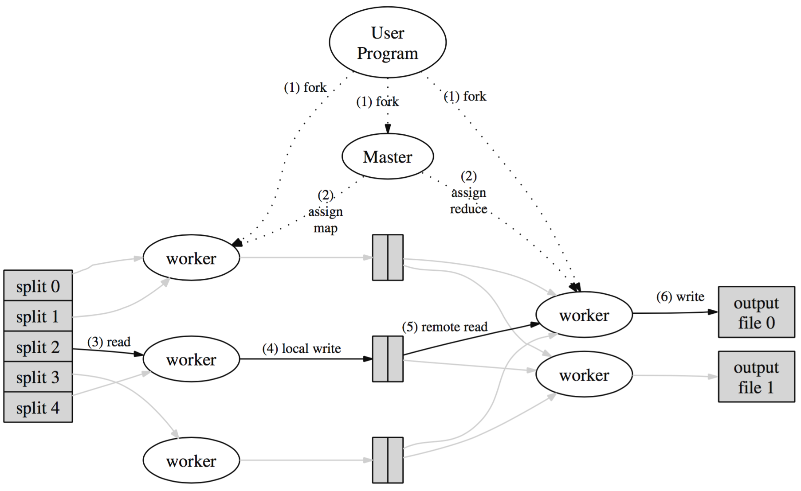

##  什么是MapReduce?

​     它是一种编程模型，其思想来自于函数式编程，和Python，Lisp语言中的map和reduce函数类似，其次它也是处理大数据集的一种实现，抽象出一个Map接口和一个Reduce接口，屏蔽底层的基础设施的细节，让使用者可以轻松的编写分布式的应用。

## 实现MapReduce需要解决哪些问题?

1. 输入的数据如何分割
2. 大量计算机组成的集群如何调度
3. 集群中的计算机发生了错误如何处理
4. 如何管理集群中的计算机之间的通信

## MapReduce中的map和reduce两个阶段分别做哪些事情?
  ​

  * Map阶段

  Map阶段主要是将用户输入的文件，分成N份，对于每一份文件由一个work进程读取其内容回调用户的Map函数得到输出，根据输出的 key进行hash，然后对reduce阶段的work进程个数进行取模得到要输出给哪个work，然后根据这个work进程的index得到输出文件名最终把这个key输出到这个文件中。

  * Reduce阶段

  Reduce阶段会从每一个Map的work进程中拿到输出的文件名，然后打开这个文件读取内容回调用户的reduce函数，得到输出，然后排序最终写入到输出的文件名。

## MapReduce的整个执行流程是怎么样的?

  

1. 用户程序首先调用MapReduce库将输入文件分割成M个数据片，每个数据片的大小通常是16MB到64MB左右，然后用户程序开始在集群中创建大量的进程。

2. 这些进程中有一个特殊的进程叫master，其它的都是worker进程，由master分配任务，有M个Map任务和R个Reduce任务将被分配，master将一个Map任务或Reduce任务分配给一个空闲的worker。

3. 被分配的map任务的worker程序读取相关的输入数据片段，从输入的数据片段中解析出key/value对，然后把key/value 对传递给用户自定义的Map函数中，由Map函数生成并输出中间的key/value对，并缓存在内存中。

4. 缓存的key/value对通过分区函数分成R个区域，之后周期性的写入到本地磁盘上，缓存的key/value对在本地磁盘上的存储位置被回传给master，由master负责把这些存储位置再传送给Reduce阶段的worker。

5. 当Redcue worker程序接收到master程序发来的数据存储位置信息后 ，使用RPC从Map worker所在主机的磁盘上读取这些缓存的数据，当Reduce worker读取了所有的中间数据后，通过对key进行排序后使得具有相同的key值的数据聚合在一起。由于许多不同的key值会映射到相同的Reduce任务上，因此必须进行排序。如果中间数据太大无法在内存中完成排序，那么就要在外部进行排序。

6. Reducer worker程序遍历排序后的中间数据，对于每一个唯一的中间key值，Reducer worker程序将这个key值和它相关的中间value值的集合传递给用户自定义的Reduce函数。Reduce函数的输出被追加到所属分区的输出文件。

7. 当所有的map和Reduce任务都完成后，master唤醒用户程序。在这个时候，在用户程序里的对MapReduce调用才返回。

## MapReduce是怎么做容错处理?

容错处理主要针对下面几种错误进行处理:

1. worker故障
​     周期性的去ping worker，固定时间没有收到响应就把这个worker标记失效，把这个worker完成的任务也设置为初始空闲状态等待重新调度，因为map的输出是在本地，而已经完成的reducer任务不需要重新的调度，因为reduce的输出在全局文件系统上。

2. master失败
master周期性的将自己保存的元数据刷新到磁盘中，master只要一失败就中止MapReduce的运算，这样就可以保证刷新到磁盘中的元数据是最新的，并且客户也可以检查到这个失败的状态。

3. 其它方面
通过原子提交来保证任务的输出是完整的，这个是借助于POSIX的rename是原子操作这一特性，通过把任务的输出写到临时文件，然后原子的重命名为最终的文件名。

> 问题? MapReduce如何处理非幂等性的函数？，非幂等性的情况下worker失效导致任务重新执行，会导致的到不预期的结果。

## 输入数据的存放位置和处理这个数据的worker之间的关系?

尽可能的保证worker要处理的数据就在worker所在机器上，这一就可以避免不必要的网络带宽。

## 输入数据Map阶段被分割的个数M，以及Reduce阶段被分割的个数R，如何抉择?

master需要维护任务的信息，需要将任务调度到不同的机器上执行，考虑到这个问题的话，要减少master做任务调度的次数，减少master保存的元数据信息大小，Reduce阶段的的任务个数R是用户自定义的。

## MapReduce的备用任务机制?

​    备用任务机制处理集群中出现的"落伍者"，当一个MapReduce任务接近完成的时候，master调度备用任务进程来执行剩下的处于中间状态的任务。无论是最初的进程还是备用任务进程完成了任务都会把任务标记为完成。

## Combiner机制?

通过将map阶段的本地输出数据进行合并，减少对网络带宽的消耗。

## 如何做好负载均衡?

让任务的数量远远大于worker的数量，这样，好的机器可以多完成一些任务，差的机器可以少完成任务，这样最后完成的任务的时候，所有机器的绝对时间都差不多。

## 什么因素会影响集群的性能?

网络带宽会影响到集群的性能，要尽可能少在计算机之间移动数据。

## MapReduce如何做crash恢复?
1. Map Worker crash
  master定期去ping Worker，如果得不到响应就认为Worker已经crash了，crash的worker产生的中间
  输出会丢失，但也有可能已经被Reduce worker读取过去。对于这种情况 master会重新运行crash的worker。

2. Reduce Worker crash
  同样存在两种情况，一种就是中途crash了，这种需要重新运行，另外一种就是结果已经输出了，但是进程
  已经crash了，对于这种情况下不需要重新运行worker，因为Reduce阶段的输出是保存在全局的GFS文件系统
  中的。

3. Reduce Worker在文件写入过程中crash
  这个是通过原子的rename保证，写入结果的时候是先写入到中间文件中，然后原子的进行重命名。

## MapReduce如何做crash恢复?
1. Map Worker crash
  master定期去ping Worker，如果得不到响应就认为Worker已经crash了，crash的worker产生的中间
  输出会丢失，但也有可能已经被Reduce worker读取过去。对于这种情况 master会重新运行crash的worker。

2. Reduce Worker crash
  同样存在两种情况，一种就是中途crash了，这种需要重新运行，另外一种就是结果已经输出了，但是进程
  已经crash了，对于这种情况下不需要重新运行worker，因为Reduce阶段的输出是保存在全局的GFS文件系统
  中的。

3. Reduce Worker在文件写入过程中crash
  这个是通过原子的rename保证，写入结果的时候是先写入到中间文件中，然后原子的进行重命名。

## 其他问题
1. 用户程序出现bug导致Map Reduce在处理某些数据的时候crash?
   通常做法是修复bug然后再次运行，但是有的时候寻找这个bug并修复它并不是一件容易的事情。MapReduce会通过给每个worker进程设置信号处理函数来捕捉内存段异常和总线错误。在MapReduce库在操作之前会通过全局变量记录序号。
   如果用户程序触发了一个系统信号，消息处理函数会用最后一口气通关UDP包向master发送处理的最后一条记录序号。而master如果看到某条特定记录失败多次，那么下次重新执行的时候就会对这条数据的处理。

2. 如何对MapReduce进行调试?
  提供一套MapReduce的本地版本用于调试，这样就可以很方便的使用本地调试工具来调试MapReduce。

## 哪些应用程序不适合MapReduce?
1. 不适合map/shuffle/reduce这种模式的工作
2. 小数据集
3. 对于大数据的的小更新(例如添加一个小的文档到一个很大的索引中)
4. 非预期的读
5. 多次shuffle(Shuffle描述着数据从map task输出到reduce task输入的这段过程)，例如pagerank算法
  虽然可以通过多次MR来解决，但是这种方式效率不高。

## 参考文献:
[mapreduce](https://pdos.csail.mit.edu/6.824/papers/mapreduce.pdf)
