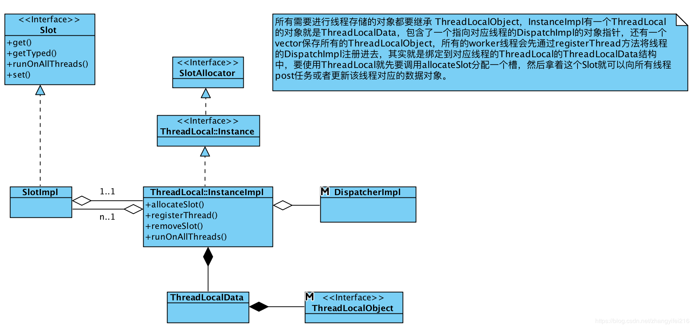

# Envoy源码分析之ThreadLocal

## ThreadLocal整体结构

Envoy中严重依赖`ThreadLocal`，为了避免加锁Envoy会尽可能在单一线程中完成所有的事件，但是多个线程之间难免会有一些数据需要共享，还有可能需要读写，为了避免加锁Envoy将一些需要在线程之间共享的数据放在`ThreadLocal`中，当`ThreadLocal`中的数据需要更新的时候则会通过主线程将更新后的数据Post到各个线程中，交由各个线程来更新自己的`ThreadLocal`。Envoy在C++11的`thread_local`的基础上结合`Dispatcher`实现了一个`ThreadLocal`对象。本文则会重点分析下`ThreadLocal`的设计与实现。先来看下`ThreadLocal`的整体结构，下文会逐一进行分析。


## ThreadLocal实现

`ThreadLocalObject`是一个空的接口类，要求所有的`ThreadLocal`数据对象都要继承自这个空接口，比如下面这个`ThreadLocal`对象。

```cpp
class ThreadLocalObject {
public:
  virtual ~ThreadLocalObject() {}
};

struct ThreadLocalCachedDate : public ThreadLocal::ThreadLocalObject {
   ThreadLocalCachedDate(const std::string& date_string) : 
   date_string_(date_string) {}
  const std::string date_string_;
};
```

所有的`ThreadLocalObject`对象会保存在`ThreadLocalData`中，这是一个使用C++11的`thread_local`关键字声明的变量，是真正的线程局部存储。这个对象包含了两个成员，其中一个是vector，保存了所有的`ThreadLocalObject`，另外一个保存的是`Dispatcher`，指向当前线程的`Dispatcher`对象。相关代码如下:

```cpp
struct ThreadLocalData {
  Event::Dispatcher* dispatcher_{};
  std::vector<ThreadLocalObjectSharedPtr> data_;
};
```

当你要使用`ThreadLocal`对象的功能时，你需要一个`SlotAllocator`分配器，从这个分配器可以分配一个`Slot`，一个`Slot`包含了一个`ThreadLocalObject`，从这个`Slot`中就可以获取到保存在线程局部存储中的`ThreadLocalObject`对象。下面是`Slot`对象的结构。

```cpp
class Slot {
public:
  virtual ~Slot() {}
  virtual ThreadLocalObjectSharedPtr get() PURE;
  template <class T> T& getTyped() { 
  	return *std::dynamic_pointer_cast<T>(get()); 
  }
  virtual void runOnAllThreads(Event::PostCb cb) PURE;
  virtual void runOnAllThreads(Event::PostCb cb, Event::PostCb all_threads_complete_cb) PURE;
  typedef std::function<
  	ThreadLocalObjectSharedPtr(Event::Dispatcher& dispatcher)> InitializeCb;
  virtual void set(InitializeCb cb) PURE;
};
```

`Slot`是一个接口类，这个接口提供了几个关键功能，一个就是获取到对应的`ThreadLocalObjec`对象，另外一个就是在所有注册的线程中执行`PostCb`类型的回调方法。`Slot`对应的实现类是`SlotImpl`。

```cpp
struct SlotImpl : public Slot {
  SlotImpl(InstanceImpl& parent, uint64_t index) : 
		   parent_(parent), index_(index) {}
  ~SlotImpl() { parent_.removeSlot(*this); }
  .......
  InstanceImpl& parent_;
  const uint64_t index_;
};
```

`SlotImpl`保存了对`InstanceImpl`的引用，还有一个索引值，这个值是`SlotImpl`对应的`ThreadLocalObject`对象在`ThreadLocalData`中的索引(上文中说到了，所有的`ThreadLocalObject`对象都存在`ThreadLocalData`中的一个vector成员中。)通过这个索引就可以快速找到该`SlotImpl`对应的`ThreadLocalObject`对象了。接下来再看下`SlotAllocator`， `SlotImpl`并不是直接构造来使用的，而是通过`SlotAllocator`分配的。

```cpp
class SlotAllocator {
public:
  virtual ~SlotAllocator() {}
  virtual SlotPtr allocateSlot() PURE;
};
```

`SlotAllocator`是一个接口，只有一个方法就是`allocateSlot`，这个方法用于分配一个`Slot`，`Instance`接口继承自`SlotAllocator`，对其进行了扩展，是整个`ThreadLocal`的基础接口，直接暴露给用户使用的。其接口如下。

```cpp
class Instance : public SlotAllocator {
public:
  virtual void registerThread(Event::Dispatcher& dispatcher, bool main_thread) PURE;
  virtual void shutdownGlobalThreading() PURE;
  virtual void shutdownThread() PURE;
  virtual Event::Dispatcher& dispatcher() PURE;
};
```

所有要进行数据共享的线程都需要通过`registerThread`接口进行注册，`dispatcher`接口则是用来返回当前线程对应的`Dispatcher`对象。`InstanceImpl`实现了`Instance`接口。

```cpp
class InstanceImpl : Logger::Loggable<Logger::Id::main>, public Instance {
public:
  InstanceImpl() : main_thread_id_(std::this_thread::get_id()) {}
  ~InstanceImpl();

  // ThreadLocal::Instance
  ........
private:
  static void setThreadLocal(uint32_t index, ThreadLocalObjectSharedPtr object);
  static thread_local ThreadLocalData thread_local_data_;
  std::vector<SlotImpl*> slots_;
  std::list<std::reference_wrapper<Event::Dispatcher>> registered_threads_;
  std::thread::id main_thread_id_;
  Event::Dispatcher* main_thread_dispatcher_{};
  std::atomic<bool> shutdown_{};
};
```

`main_thread_dispatcher_`用来保存主线程的`Dispatcher`对象，`registered_threads_`用来保存所有注册到`ThreadLocal`中的`Dispatcher`对象。`slots_`则保存了所有分配出去的`Slot`，每分配出一个`Slot`就会new一个`SlotImpl`对象，然后保存在`slots_`中，使用者通过分配的`Slot`，拿到其对应的索引值，然后通过`setThreadLocal`静态方法就可以把要共享的数据放到线程存储中了。

```cpp
void InstanceImpl::setThreadLocal(uint32_t index, ThreadLocalObjectSharedPtr object) {
  if (thread_local_data_.data_.size() <= index) {
    thread_local_data_.data_.resize(index + 1);
  }

  thread_local_data_.data_[index] = object;
}
```

线程注册的过程也很简单，就是把传递进来的`Dispatcher`对象放到`registered_threads_`中，需要注意的是这里用的是`std::reference_wrapper<Event::Dispatcher>`，保存的是`Dispatcher`的引用。

```cpp
void InstanceImpl::registerThread(Event::Dispatcher& dispatcher, bool main_thread) {
  ASSERT(std::this_thread::get_id() == main_thread_id_);
  ASSERT(!shutdown_);

  if (main_thread) {
    main_thread_dispatcher_ = &dispatcher;
    thread_local_data_.dispatcher_ = &dispatcher;
  } else {
    ASSERT(!containsReference(registered_threads_, dispatcher));
    registered_threads_.push_back(dispatcher);
    dispatcher.post([&dispatcher] { 
  		thread_local_data_.dispatcher_ = &dispatcher; 
	});
  }
}
```

如果是主线程的话，还会额外设置下`main_thread_dispatcher_`，让其指向主线程的`Dispatcher`。将`Dispatcher`对象放到`registered_threads_`中后，需要更新对应线程的`thread_local_data_`局部存储中的`dispatcher_`指针，使其指向线程自己的`Dispatcher`对象。所以这里是通过`Dispatcher`的post方法来执行这个callback的，因为post保证callback会和`Dispatcher`对象所在线程中执行。线程注册完成后就可以通过`allocateSlot`接口来分配`Slot`了，这里对于`Slot`的分配其实是惰性的，只有在需要的时候才会分配。

```cpp
SlotPtr InstanceImpl::allocateSlot() {
  ASSERT(std::this_thread::get_id() == main_thread_id_);
  ASSERT(!shutdown_);

  for (uint64_t i = 0; i < slots_.size(); i++) {
    if (slots_[i] == nullptr) {
      std::unique_ptr<SlotImpl> slot(new SlotImpl(*this, i));
      slots_[i] = slot.get();
      return std::move(slot);
    }
  }

  std::unique_ptr<SlotImpl> slot(new SlotImpl(*this, slots_.size()));
  slots_.push_back(slot.get());
  return std::move(slot);
}
```

遍历所有的`Slot`，如果发现是`Slot`是空的就会进行分配，如果都没有找到就直接重新分配一个`Slot`，然后插入到`slots_`中，有了`Slot`后需要通过其`set`方法将要存储的`ThreadLocalObject`对象放到线程局部存储中。

```cpp
typedef std::function<
  ThreadLocalObjectSharedPtr(Event::Dispatcher& dispatcher)> InitializeCb;

void InstanceImpl::SlotImpl::set(InitializeCb cb) {
  ASSERT(std::this_thread::get_id() == parent_.main_thread_id_);
  ASSERT(!parent_.shutdown_);

  for (Event::Dispatcher& dispatcher : parent_.registered_threads_) {
    const uint32_t index = index_;
    dispatcher.post([index, cb, &dispatcher]() -> void { 
  		setThreadLocal(index, cb(dispatcher)); 
	});
  }

  // Handle main thread.
  setThreadLocal(index_, cb(*parent_.main_thread_dispatcher_));
}
```

首先通过`InitializeCb`拿到要存储的`ThreadLocalObject`，然后到所有线程中调用`setThreadLocal`方法来更新`ThreadLocalObject`对象到对应线程的局部存储中。这个方法只能在主线程中调用。调用完成后，所有的线程通过`Slot`就可以访问到存储的`ThreadLocalObject`对象了。除了存储数据外，`SlotImpl`还提供了二个用于在所有线程中执行任务的接口。

```cpp
void InstanceImpl::runOnAllThreads(Event::PostCb cb) {
  ASSERT(std::this_thread::get_id() == main_thread_id_);
  ASSERT(!shutdown_);

  for (Event::Dispatcher& dispatcher : registered_threads_) {
    dispatcher.post(cb);
  }
  cb();
}

void InstanceImpl::runOnAllThreads(Event::PostCb cb, Event::PostCb all_threads_complete_cb) {
  ASSERT(std::this_thread::get_id() == main_thread_id_);
  ASSERT(!shutdown_);
  cb();
  std::shared_ptr<std::atomic<uint64_t>> worker_count =
      std::make_shared<std::atomic<uint64_t>>(registered_threads_.size());
  for (Event::Dispatcher& dispatcher : registered_threads_) {
    dispatcher.post([this, worker_count, cb, 
					 all_threads_complete_cb]() -> void {
      cb();
      if (--*worker_count == 0) {
        main_thread_dispatcher_->post(all_threads_complete_cb);
      }
    });
  }
}
```

因为`ThreadLocal`保存了所有注册进来的`Dispatcher`对象，通过`Dispatcher`的`post`方法就可以向对应线程投递任务来执行，`runOnAllThreads`的第二个重载实现可以在所有线程都执行完毕后，回调主线程的`all_threads_complete_cb`方法，实现方式也是比较简单易懂的，就是通过将一个`std::shared_ptr` 的原子计数器拷贝到要执行的任务中，任务执行完就递减计数器，等到计数器为0就回调`all_threads_complete_cb`。到此为止`ThreadLocal`的两大核心功能就分析完毕了，一个是通过`set`方法更新所有线程的局部存储，另外一个就是通过`runOnAllThreads`往所有的线程投递任务。 最后我们来分析下`ThreadLocal`的`shutdown`过程，这个过程比较难理解，`InstanceImpl`提供了两个方法用于shutdown。

```cpp
void InstanceImpl::shutdownGlobalThreading() {
  ASSERT(std::this_thread::get_id() == main_thread_id_);
  ASSERT(!shutdown_);
  shutdown_ = true;
}

```

`shutdownGlobalThreading`方法只是设置了一个`shutdown_`的`flag`，只能在主线程中调用，这个`flag`的作用只是用于在`Slot`析构的时候不通知所有线程将对应`Slot`从其线程存储中去除，正常情况下一个`Slot`析构需要更新所有线程的局部存储，从中去掉`Slot`对应的`ThreadLocalObject`对象。而在Shutdown的过程则不需要，因为主线程进行shutdown的时候表明其他线程已经shutdown了，其关联的`Dispatcher`对象已经不存活。所以这种情况下`Slot`析构什么也不做。

```cpp
~SlotImpl() { parent_.removeSlot(*this); }

void InstanceImpl::removeSlot(SlotImpl& slot) {
  ASSERT(std::this_thread::get_id() == main_thread_id_);
  if (shutdown_) {
    return;
  }

  const uint64_t index = slot.index_;
  slots_[index] = nullptr;
  runOnAllThreads([index]() -> void {
    if (index < thread_local_data_.data_.size()) {
      thread_local_data_.data_[index] = nullptr;
    }
  });
}
```

还有另外一个shutdown函数就是`shutdownThread`，这个函数会遍历所有的线程存储的数据，然后进行reset操作，最后把整个`vector`进行clear()。每一个worker都持有`InstanceImpl`实例的引用，在析构的时候会调用`shutdownThread`。这个函数的实现如下:

```cpp
void InstanceImpl::shutdownThread() {
  ASSERT(shutdown_);
  for (auto it = thread_local_data_.data_.rbegin(); 
	   it != thread_local_data_.data_.rend(); ++it) {
    it->reset();
  }
  thread_local_data_.data_.clear();
}
```

很奇怪的是这里是逆序来遍历所有的`ThreadLocalObject`对象来进行reset的，这是因为一些"持久"(活的比较长)的对象如`cluster manager`很早就会创建`ThreadLocalObject`对象，但是直到shutdown的时候也不析构，而在此基础上依赖`cluster manager`的对象的如`grpc client`等，则是后创建`ThreadLocalObject`对象，如果`cluster manager`创建的`ThreadLocalObject`对象先析构，而grpc client相关的`ThreadLocalObject`对象后析构就会导致shutdown问题。为此这里选择逆序来进行`reset`，先从一个高层的对象开始，最后才开始对一些基础的对象所关联的`ThreadLocalObject`进行`reset`。例如下面这个例子:

```cpp
struct ThreadLocalPool : public ThreadLocal::ThreadLocalObject {
    ThreadLocalPool(InstanceImpl& parent, Event::Dispatcher& dispatcher,
                    const std::string& cluster_name);
    ~ThreadLocalPool();
    PoolRequest* makeRequest(const std::string& hash_key, const RespValue& request, PoolCallbacks& callbacks);
    void onHostsRemoved(const std::vector<Upstream::HostSharedPtr>& hosts_removed);

    InstanceImpl& parent_;
    Event::Dispatcher& dispatcher_;
    Upstream::ThreadLocalCluster* cluster_;
    std::unordered_map<Upstream::HostConstSharedPtr, 
		ThreadLocalActiveClientPtr> client_map_;
    Envoy::Common::CallbackHandle* local_host_set_member_update_cb_handle_;
};
```

`redis_proxy`中定义了一个`ThreadLocalPool`，这个`ThreadLocalPool`又依赖较为基础的`ThreadLocalCluster`(是`ThreadLocalClusterManagerImpl`的数据成员，也就是`Cluster manager`所对应的`ThreadLocalObject`对象)，如果`shutdownThread`按照顺序的方式析构的话，那么`ThreadLocalPool`中使用的`ThreadLocalCluster`(其实是`ThreadLocalClusterManagerImpl`会先析构)会先被析构，然后才是`ThreadLocalPool`的析构，而`ThreadLocalPool`析构的时候又会使用到`ThreadLocalCluster`，但是`ThreadLocalCluster`已经析构了，这个时候就会出现野指针的问题了。

```cpp
InstanceImpl::ThreadLocalPool::ThreadLocalPool(InstanceImpl& parent, Event::Dispatcher& dispatcher, const std::string& cluster_name)
    : parent_(parent), dispatcher_(dispatcher), 
cluster_(parent_.cm_.get(cluster_name)) {
  .....
  local_host_set_member_update_cb_handle_ = 
  cluster_->prioritySet().addMemberUpdateCb(
      [this](uint32_t, const std::vector<Upstream::HostSharedPtr>&,
             const std::vector<Upstream::HostSharedPtr>& hosts_removed) -> void {
        onHostsRemoved(hosts_removed);
      });
}

InstanceImpl::ThreadLocalPool::~ThreadLocalPool() {
  // local_host_set_member_update_cb_handle_是ThreadLocalCluster的一部分
  // ThreadLocalCluster析构会导致local_host_set_member_update_cb_handle_变成野指针
  local_host_set_member_update_cb_handle_->remove();
  while (!client_map_.empty()) {
    client_map_.begin()->second->redis_client_->close();
  }
}
```

## 总结

通过上文我相信我们应该足以驾驭Envoy中的`ThreadLocal`，从其设计可以看出有其巧妙之处，也有其不足的地方，比如其抽象出一个`Slot`和对应的线程存储进行了关联，`Slot`可以任意传递，因为不包含实际的数据，拷贝的开销很低，只包含了一个索引值，具体关联的线程存储数据是不知道的，避免直接暴露给用户背后的数据。而`InstanceImpl`对象则管理着所有`Slot`的分配和移除以及整个`ThreadLocal`对象的`shutdown`。不足的地方我觉得主要有两点， 其中一个就是`Slot`的分配机制效率不太高，如果`Slot`在大量进行了分配和释放后，整个`vector`中的空闲的`Slot`其实很稀疏，这个时候如果从头开始遍历来找下一个可用的`Slot`则效率不高，而且根据`Slot`分配的特点来看，越靠前的`Slot`越有可能没释放(越基础的对象，越早创建`Slot`，但是最后才释放)，这样的话，每次遍历找空闲的`Slot`的时候，其实前N个很大概率都是在做无用功，影响查找的效率。另外一个我觉得不太好的地方就是`shutdownThread`的实现，这个其实比较难理解，对使用者也没有太多的约束，如果两个`ThreadLocalObject`产生了依赖(比如A依赖B)，但是A是先分配`Slot`的，B是后分配的，那么这种情况下逆序进行析构的时候会先把B析构，等到析构A的时候，如果在其析构函数中又使用了B就会产生野指针的问题，而且这种情况也没有检查机制很难被发现。
