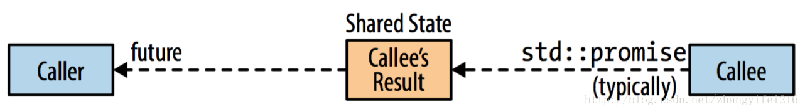

## Item38 Be aware of varying thread handle destructor behavior

&emsp; &emsp;在[Item37](http://blog.csdn.net/zhangyifei216/article/details/70187289)中解释过一个状态为**joinable**的**std::thread**对象其底层对应一个系统线程。**std::future**对象和**std::thread**比较类似，一个**future**对象也对应着一个系统线程。尽管如此这两者在析构的时候其行为也是不一样的。在[Item37](http://blog.csdn.net/zhangyifei216/article/details/70187289)中已经提到过一个**joinable**状态的**std::thread**对象在析构的时候会导致程序**terminate**，这是因为无论是调用**join**还是**detach**都是一个糟糕的行为，这个在[Item37](http://blog.csdn.net/zhangyifei216/article/details/70187289)中已经进行了解释。而本文所说的**std::future**对象，它的析构有的时候类似于隐式调用**join**，有的时候则是类似于隐式调用**detach**，甚至两者都不是，但是**std::future**不会导致程序**terminate**。

&emsp; &emsp;既然谈到了**std::future**，那就来进一步看一下**std::future**到底是什么东西，这个对象对于在异步编程中有很大的作用，可以异步获取线程的执行结果，相当于是一个**channel**，用来链接调用者和被调用者，被调用者通常会异步的将结果写入到这个**channel**中(通常是**std::promise**)，调用者通过**std::future**对象来获取写入的结果，整个过程如下图：

&emsp; &emsp;看到上面这个图，你或许会奇怪，这个结果是保存在哪呢？首先肯定是不能放在`std::promise`对象的，因为结果可能是在调用`future`对象获取时早已保存起来了，那么被调用者运行结束会将`std::promise`析构，如果结果保存在这个对象中那就会导致结果丢失了。那么能否放在`std::future`对象里面呢? 同样也不行，因为**std::future**可以用来创建**std::shared_future**，那么就需要将结果保存在每一个**future**对象中，会导致这个结果被多次拷贝和复制，或许可以使用引用计数的方式来记录当前有多少个**future**对象关联到这个结果中，这也不失为一种方法。但是无论是何种方式，都会造成一定的开销，算不上是一个不错的方式。因此**C++11**将结果保存在一个特殊的位置，这个位置被称为共享状态。可以简单的使用下面这张图来表示它们之间的关系：

​这个共享状态很重要，因为**std::future**对象的析构行为和这个状态息息相关，这也是本文要讨论的主题。

1. 通过**std::async**发起的non-deferred策略的task，其返回的**std::future**，并且是最后一个引用共享状态的，其析构会一直阻塞，直到这个task运行结束，相当于隐式的做了**join**。
2. 其他形式的**std::future**对象的析构就是简单的析构，对于异步运行的task来说，这类似于隐式调用detach，对于deferred策略运行的task来说，相当于这个task将不会运行。

&emsp; &emsp;让我们把**std::future**析构会隐式进行join这个行为进一步细化一下，只要满足下列三个条件的情况，**std::future**的析构才会是隐式的做join。

1. 这个**std::future**是通过**std::async**创建的，并且引用了一个共享状态
2. **std::async**运行任务的时候指定的运行策略是**std::launch::async**
3. 这个**future**对象是最后一个引用共享状态的对象

​&emsp; &emsp;**std::future**的这种特殊的析构行为让我们的程序行为变得不可预测，特别是我们没有办法知道哪个 **future**会隐式的**join**，哪些又是**detach**，从**std::future**对象本身来看是无法看出来的。尽管如此，但是我们知道，凡是从**std::async**创建的**std::future**都有可能是隐式的**join**，而其他方式创建的**std::future**对象则不是，比如通过**std::packaged_task**创建的**std::future**，其析构就不会隐式的进行**join**。