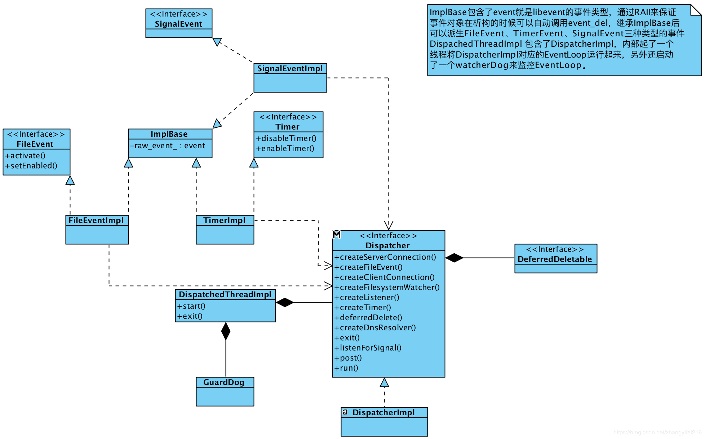
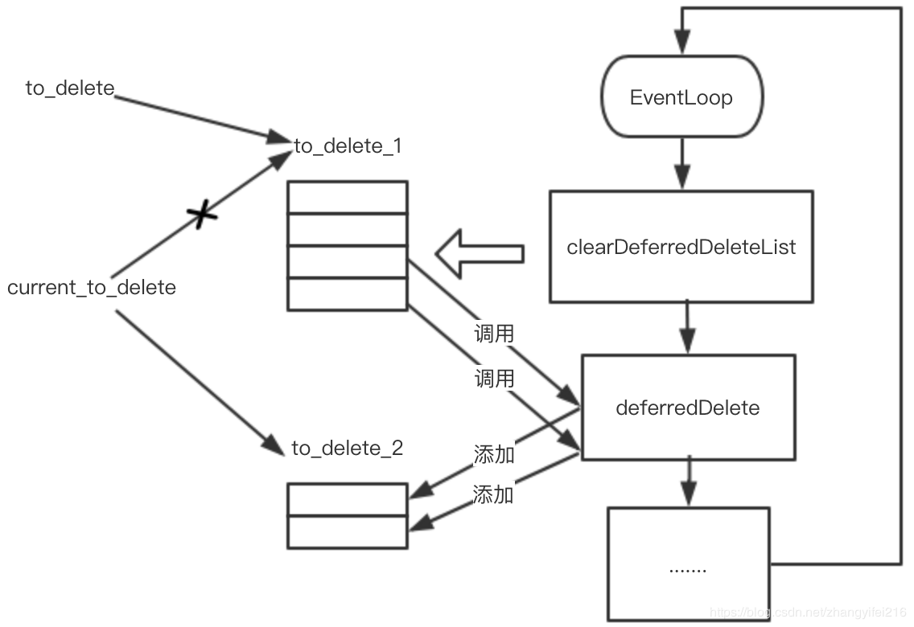

# Envoy源码分析之Dispatcher
## Dispatcher

在Envoy的代码中`Dispatcher`是随处可见的，可以说在Envoy中有着举足轻重的地位，一个`Dispatcher`就是一个[EventLoop](https://en.wikipedia.org/wiki/Event_loop)，其承担了任务队列、网络事件处理、定时器、信号处理等核心功能。在[Envoy threading model](https://blog.envoyproxy.io/envoy-threading-model-a8d44b922310)这篇文章所提到的`EventLoop`(`Each worker thread runs a “non-blocking” event loop`)指的就是这个`Dispatcher`对象。这个部分的代码相对较独立，和其他模块耦合也比较少，但重要性却不言而喻。下面是与`Dispatcher`相关的类图，在接下来会对其中的关键概念进行介绍。


## Dispatcher 和 Libevent

`Dispatcher`本质上就是一个[EventLoop](https://en.wikipedia.org/wiki/Event_loop)，Envoy并没有重新实现，而是复用了Libevent中的`event_base`，在Libevent的基础上进行了二次封装并抽象出一些事件类，比如`FileEvent`、`SignalEvent`、`Timer`等。Libevent是一个C库，而Envoy是C++，为了避免手动管理这些C结构的内存，Envoy通过继承`unique_ptr`的方式重新封装了这些libevent暴露出来的C结构。

```cpp
template <class T, void (*deleter)(T*)>
class CSmartPtr : public std::unique_ptr<T, void (*)(T*)> {
public:
  CSmartPtr() : std::unique_ptr<T, void (*)(T*)>(nullptr, deleter) {}
  CSmartPtr(T* object) : std::unique_ptr<T, void (*)(T*)>(object, deleter) {}
};
```

通过`CSmartPtr`就可以将Libevent中的一些C数据结构的内存通过[RAII](https://es.wikipedia.org/wiki/RAII)机制自动管理起来，使用方式如下:

```cpp
extern "C" {
void event_base_free(event_base*);
}

struct evbuffer;
extern "C" {
void evbuffer_free(evbuffer*);
}
.....
typedef CSmartPtr<event_base, event_base_free> BasePtr;
typedef CSmartPtr<evbuffer, evbuffer_free> BufferPtr;
typedef CSmartPtr<bufferevent, bufferevent_free> BufferEventPtr;
typedef CSmartPtr<evconnlistener, evconnlistener_free> ListenerPtr;
```

在Libevent中无论是定时器到期、收到信号、还是文件可读写等都是事件，统一使用`event`类型来表示，Envoy中则将`event`作为`ImplBase`的成员，然后让所有的事件类型的对象都继承`ImplBase`，从而实现了事件的抽象。

```cpp
class ImplBase {
protected:
  ~ImplBase();

  event raw_event_;
};
```

## SignalEvent

SignalEvent的实现很简单，通过`evsignal_assign`来初始化事件，然后通过`evsignal_add`添加事件使事件成为未决状态(关于Libevent事件状态见附录)。

```cpp
class SignalEventImpl : public SignalEvent, ImplBase {
public:
  // signal_num: 要设置的信号值
  // cb: 信号事件的处理函数
  SignalEventImpl(DispatcherImpl& dispatcher, int signal_num, SignalCb cb);
private:
  SignalCb cb_;
};

SignalEventImpl::SignalEventImpl(DispatcherImpl& dispatcher, 
                                 int signal_num, SignalCb cb) : cb_(cb) {
  evsignal_assign(
      &raw_event_, &dispatcher.base(), signal_num,
      [](evutil_socket_t, short, void* arg) -> void { 
          static_cast<SignalEventImpl*>(arg)->cb_(); },
      this);
  evsignal_add(&raw_event_, nullptr);
}
```

## Timer

Timer事件暴露了两个接口一个用于关闭Timer，另外一个则用于启动Timer，需要传递一个时间来设置Timer的到期时间间隔。

```cpp
class Timer {
public:
  virtual ~Timer() {}
  virtual void disableTimer() PURE;
  virtual void enableTimer(const std::chrono::milliseconds& d) PURE;
};
```

创建Timer的时候会通过`evtimer_assgin`对event进行初始化，这个时候事件还处于未决状态而不会触发，需要通过`event_add`添加到`Dispatcher`中才能被触发。

```cpp
class TimerImpl : public Timer, ImplBase {
public:
  TimerImpl(Libevent::BasePtr& libevent, TimerCb cb);

  // Timer
  void disableTimer() override;
  void enableTimer(const std::chrono::milliseconds& d) override;

private:
  TimerCb cb_;
};

TimerImpl::TimerImpl(DispatcherImpl& dispatcher, TimerCb cb) : cb_(cb) {
  ASSERT(cb_);
  evtimer_assign(
      &raw_event_, &dispatcher.base(),
      [](evutil_socket_t, short, void* arg) -> void { 
          static_cast<TimerImpl*>(arg)->cb_(); }, 
      this);
}
```

`disableTimer`被调用时其内部会调用`event_del`来删除事件，使事件成为非未决状态，`enableTimer`被调用时则间接调用`event_add`使事件成为未决状态，这样一旦超时时间到了就会触发超时事件。

```cpp
void TimerImpl::disableTimer() { event_del(&raw_event_); }
void TimerImpl::enableTimer(const std::chrono::milliseconds& d) {
  if (d.count() == 0) {
    event_active(&raw_event_, EV_TIMEOUT, 0);
  } else {
    std::chrono::microseconds us = 
  		std::chrono::duration_cast<std::chrono::microseconds>(d);
    timeval tv;
    tv.tv_sec = us.count() / 1000000;
    tv.tv_usec = us.count() % 1000000;
    event_add(&raw_event_, &tv);
  }
}
```

>  上面的代码在计算`timer`时间`timeval`的时候实现的并不优雅，应该避免使用像`1000000`这样的不具备可读性的数字常量，社区中有人建议可以改成如下的形式。

```cpp
auto secs = std::chrono::duration_cast<std::chrono::seconds>(d);
auto usecs = 
  std::chrono::duration_cast<std::chrono::microseconds>(d - secs);
tv.tv_secs = secs.count();
tv.tv_usecs = usecs.count();
```

## FileEvent

`socket`套接字相关的事件被封装为`FileEvent`，其上暴露了二个接口：`activate`用于主动触发事件，典型的使用场景比如: 唤醒EventLoop、Write Buffer有数据，可以主动触发下可写事件(Envoy中的典型使用场景)等；`setEnabled`用于设置事件类型，将事件添加到`EventLoop`中使其成为未决状态。

```cpp
void FileEventImpl::activate(uint32_t events) {
  int libevent_events = 0;
  if (events & FileReadyType::Read) {
    libevent_events |= EV_READ;
  }
  if (events & FileReadyType::Write) {
    libevent_events |= EV_WRITE;
  }
  if (events & FileReadyType::Closed) {
    libevent_events |= EV_CLOSED;
  }
  ASSERT(libevent_events);
  event_active(&raw_event_, libevent_events, 0);
}

void FileEventImpl::setEnabled(uint32_t events) {
  event_del(&raw_event_);
  assignEvents(events);
  event_add(&raw_event_, nullptr);
}
```

## 任务队列

`Dispatcher`的内部有一个任务队列，也会创建一个线程专们处理任务队列中的任务。通过`Dispatcher`的`post`方法可以将任务投递到任务队列中，交给`Dispatcher`内的线程去处理。

```cpp
void DispatcherImpl::post(std::function<void()> callback) {
  bool do_post;
  {
    Thread::LockGuard lock(post_lock_);
    do_post = post_callbacks_.empty();
    post_callbacks_.push_back(callback);
  }
  if (do_post) {
    post_timer_->enableTimer(std::chrono::milliseconds(0));
  }
}
```

`post`方法将传递进来的`callback`所代表的任务，添加到`post_callbacks_`所代表的类型为`vector<callback>`的成员表变量中。如果`post_callbacks_`为空的话，说明背后的处理线程是处于非活动状态，这时通过`post_timer_`设置一个超时时间时间为0的方式来唤醒它。`post_timer_`在构造的时候就已经设置好对应的`callback`为`runPostCallbacks`，对应代码如下:

```cpp
DispatcherImpl::DispatcherImpl(TimeSystem& time_system,
							   Buffer::WatermarkFactoryPtr&& factory)
    : ......
      post_timer_(createTimer([this]() -> void { runPostCallbacks(); })),
      current_to_delete_(&to_delete_1_) {
  RELEASE_ASSERT(Libevent::Global::initialized(), "");
}
```

`runPostCallbacks`是一个while循环，每次都从`post_callbacks_`中取出一个`callback`所代表的任务去运行，直到`post_callbacks_`为空。每次运行`runPostCallbacks`都会确保所有的任务都执行完。显然，在`runPostCallbacks`被线程执行的期间如果`post`进来了新的任务，那么新任务直接追加到`post_callbacks_`尾部即可，而无需做唤醒线程这一动作。

```cpp
void DispatcherImpl::runPostCallbacks() {
  while (true) {
    std::function<void()> callback;
    {
      Thread::LockGuard lock(post_lock_);
      if (post_callbacks_.empty()) {
        return;
      }
      callback = post_callbacks_.front();
      post_callbacks_.pop_front();
    }
    callback();
  }
}
```

## DeferredDeletable

最后讲一下`Dispatcher`中比较难理解也很重要的`DeferredDeletable`，它是一个空接口，所有要进行延迟析构的对象都要继承自这个空接口。在Envoy的代码中像下面这样继承自`DeferredDeletable`的类随处可见。

```cpp
class DeferredDeletable {
public:
  virtual ~DeferredDeletable() {}
};
```

那何为延迟析构呢？用在哪个场景呢?延迟析构指的是将析构的动作交由`Dispatcher`来完成，所以`DeferredDeletable`和`Dispatcher`密切相关。`Dispatcher`对象有一个`vector`保存了所有要延迟析构的对象。

```cpp
class DispatcherImpl : public Dispatcher {
  ......
 private:
  ........
  std::vector<DeferredDeletablePtr> to_delete_1_;
  std::vector<DeferredDeletablePtr> to_delete_2_;
  std::vector<DeferredDeletablePtr>* current_to_delete_;
 }
```

`to_delete_1_`和`to_delete_2_`就是用来存放所有的要延迟析构的对象，这里使用两个`vector`存放，为什么要这样做呢?。`current_to_delete_`始终指向当前正要析构的对象列表，每次执行完析构后就交替指向另外一个对象列表，来回交替。

```cpp
void DispatcherImpl::clearDeferredDeleteList() {
  ASSERT(isThreadSafe());
  std::vector<DeferredDeletablePtr>* to_delete = current_to_delete_;
  size_t num_to_delete = to_delete->size();
  if (deferred_deleting_ || !num_to_delete) {
    return;
  }
  ENVOY_LOG(trace, "clearing deferred deletion list (size={})", num_to_delete);
  if (current_to_delete_ == &to_delete_1_) {
    current_to_delete_ = &to_delete_2_;
  } else {
    current_to_delete_ = &to_delete_1_;
  }
  deferred_deleting_ = true;
  for (size_t i = 0; i < num_to_delete; i++) {
    (*to_delete)[i].reset();
  }

  to_delete->clear();
  deferred_deleting_ = false;
}
```

上面的代码在执行对象析构的时候先使用`to_delete`来指向当前正要析构的对象列表，然后将`current_to_delete_`指向另外一个列表，这样在添加延迟删除的对象时，就可以做到安全的把对象添加到列表中了。因为`deferredDelete`和`clearDeferredDeleteList`都是在同一个线程中运行，所以`current_to_delete_`是一个普通的指针，可以安全的更改指针指向另外一个，而不用担心有线程安全问题。

```cpp
void DispatcherImpl::deferredDelete(DeferredDeletablePtr&& to_delete) {
  ASSERT(isThreadSafe());
  current_to_delete_->emplace_back(std::move(to_delete));
  ENVOY_LOG(trace, "item added to deferred deletion list (size={})", current_to_delete_->size());
  if (1 == current_to_delete_->size()) {
    deferred_delete_timer_->enableTimer(std::chrono::milliseconds(0));
  }
}
```

当有要进行延迟析构的对象时，调用`deferredDelete`即可，这个函数内部会通过`current_to_delete_`把对象放到要延迟析构的列表中，最后判断下当前要延迟析构的列表大小是否是1，如果是1表明这是第一次添加延迟析构的对象，那么就需要通过`deferred_delete_timer_`把背后的线程唤醒执行`clearDeferredDeleteList`函数。这样做的原因是避免多次唤醒，因为有一种情况是线程已经唤醒了正在执行`clearDeferredDeleteList`，在这个过程中又有其他的对象需要析构而加入到`vector`中。

 

到此为止`deferredDelete`的实现原理就基本分析完了，可以看出它的实现和任务队列的实现很类似，只不过一个是循环执行`callback`所代表的任务，另一个是对对象进行析构。最后我们来看一下`deferredDelete`的应用场景，却“为何要进行延迟析构?”在Envoy的源代码中经常会看到像下面这样的代码片段。

```cpp
ConnectionImpl::ConnectionImpl(Event::Dispatcher& dispatcher, 
							   ConnectionSocketPtr&& socket,
                               TransportSocketPtr&& transport_socket,
							   bool connected) {
......
  }
  // 传递裸指针到回调中
  file_event_ = dispatcher_.createFileEvent(
      fd(), [this](uint32_t events) -> void { onFileEvent(events); }, 
      Event::FileTriggerType::Edge,
      Event::FileReadyType::Read | Event::FileReadyType::Write);
	......
}
```

传递给`Dispatcher`的`callback`都是通过裸指针的方式进行回调，如果进行回调的时候对象已经析构了，就会出现野指针的问题，我相信C++水平还可以的同学都会看出这个问题，除非能在逻辑上保证`Dispatcher`的生命周期比所有对象都短，这样就能保证在回调的时候对象肯定不会析构，但是这不可能成立的，因为`Dispatcher`是`EventLoop`的核心。

一个线程运行一个`EventLoop`直到线程结束，`Dispatcher`对象才会析构，这意味着`Dispatcher`对象的生命周期是最长的。所以从逻辑上没办法保证进行回调的时候对象没有析构。可能有人会有疑问，对象在析构的时候把注册的事件取消不就可以避免野指针的问题吗? 那如果事件已经触发了，`callback`正在等待运行呢？ 又或者`callback`运行了一半呢？前者libevent是可以保证的，在调用`event_del`的时候可以把处于等待运行的事件取消掉，但是后者就无能为力了，这个时候如果对象析构了，那行为就是未定义了。沿着这个思路想一想，是不是只要保证对象析构的时候没有`callback`正在运行就可以解决问题了呢？是的，只要保证所有在执行中的`callback`执行完了，再做对象析构就可以了。可以利用`Dispatcher`是顺序执行所有`callback`的特点，向`Dispatcher`中插入一个任务就是用来对象析构的，那么当这个任务执行的时候是可以保证没有其他任何`callback`在运行。通过这个方法就完美解决了这里遇到的野指针问题了。

或许有人又会想，这里是不是可以用[shared_ptr](https://en.cppreference.com/w/cpp/memory/shared_ptr)和[shared_from_this](https://en.cppreference.com/w/cpp/memory/enable_shared_from_this/shared_from_this)来解这个呢? 是的，这是解决多线程环境下对象析构的秘密武器，通过延长对象的生命周期，把对象的生命周期延长到和`callback`一样，等`callback`执行完再进行析构，同样可以达到效果，但是这带来了两个问题，第一就是对象生命周期被无限拉长，虽然延迟析构也拉长了生命周期，但是时间是可预期的，一旦`EventLoop`执行了`clearDeferredDeleteList`任务就会立刻被回收，而通过`shared_ptr`的方式其生命周期取决于`callback`何时运行，而`callback`何时运行这个是没办法保证的，比如一个等待`socket`的可读事件进行回调，如果对端一直不发送数据，那么`callback`就一直不会被运行，对象就一直无法被析构，长时间累积会导致内存使用率上涨。第二就是在使用方式上侵入性较强，需要强制使用`shared_ptr`的方式创建对象。

## 总结

`Dispatcher`总的来说其实现还是比较简单明了的，比较容易验证其正确性，同样功能也相对较弱，和chromium的`MessageLoop`、boost的`asio`都是相似的用途，但是功能上差得比较多。好在这是专门给Envoy设计的，而且Envoy的场景也比较单一，不必做成那么通用的。另外一个我觉得比较奇怪的是，为什么在`DeferredDeletable`的实现中要用`to_delete_1_`和`to_delete_2_`两个队列交替来存放，其实按照我的理解一个队列即可，因为`clearDeferredDeleteList`和`deferredDelete`是保证在同一个线程中执行的，就和`Dispatcher`的任务队列一样，用一个队列保存所有要执行的任务，循环的执行即可。但是Envoy中没有这样做，我理解这样设计的原因可能是因为相比于任务队列来说延迟析构的重要性更低一些，大量对象的析构如果保存在一个队列中循环的进行析构势必会影响其他关键任务的执行，所以这里拆分成两个队列，多个任务交替的执行，就好比把一个大任务拆分成了好几个小任务顺序来执行。

## 附录

* Libevent状态转换图
 


