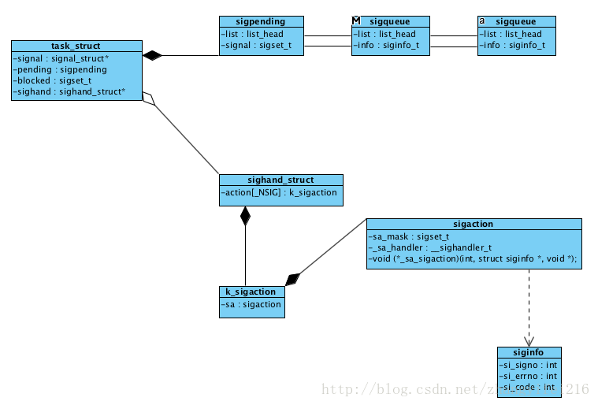

---
hide:
  - toc        # Hide table of contents
---
# Linux 信号FAQ
 
## 可重入、线程安全以及异步信号安全的区别?

​&emsp; &emsp;参考[可重入、线程安全和异步信号安全](http://blog.csdn.net/zhangyifei216/article/details/50809079)，需要强调的是异步信号安全，这个概念知道的人不多，平常大家在编写代码的时候也很少考虑这个因素，也不清楚哪些函数是异步信号安全的，哪些不是，典型的像`printf`就不是异步信号安全的，内部会加锁，但是平时很多人都喜欢在信号处理函数中调用。大多数情况下都不会出现问题的，所以让使用者错误的认为这是正确的写法。第二个需要注意的是可重入的概念，Linux有很不少系统调用的实现都是不可重入的，会将结果保存在内部的静态数据存储中，同时这类系统调用也提供了可重入版本的实现，其函数名就是尾部添加`_r`来标识。

## 信号的内部实现是怎么样的?



>​	如上图所示一个进程/线程就是一个task_struct结构，该结构包含了属于这个进程/线程的阻塞信号集、pending的信号等，所有投递到该进程/线程的信号都会通过双向链表组织在一起，链表的元素是sigqueue，所有的信号对应的信号处理函数存放在sighand_struct中的一个类型为k_sigaction数组，每次程序由核心态切换到用户态时，内核都会发起信号处理，执行信号处理程序的时候为了避免对内核产生影响，所以使用的是用户栈，还可以自定义信号处理的备用栈。
>
>​	信号处理函数是每次程序从核心态切换到用户态的时候，内核才会负责发起信号处理，也就是说信号处理的时机有以下两种:
>
>* 进程在当前时间片用完后，获得了新的时间片时(会发生内核态到用户态的切换)
>* 系统调用执行完成时(信号的传递可能会引起正在阻塞的系统调用过早完成)


## 如何查看一个进程当前等待的、阻塞的、忽略的、捕获的信号?

​&emsp; &emsp;通过查看`/proc/PID/status`文件，该文件中有几个字端的值，这些值按照十六进制的形式显示，最低的有效位表示信号1，相邻的左边一位代表信号2，依次类推，例如下面这几个数值:

```cpp
SigQ:	0/3872			      0是当前信号队列中的信号数，3872是信号队列的最大长度
SigPnd:	0000000000000000	   当前pending的信号，也就是没有信号投递给线程
ShdPnd:	0000000000000000	   当前pengding的信号，也就是没有信号投递给进程
SigBlk:	7be3c0fe28014a03	   当前阻塞的信号
SigIgn:	0000000000001000	   当前被忽略的信号
SigCgt:	00000001800004ec	   当前被捕获的信号
```


## 信号的默认处理方式有哪些?

​&emsp; &emsp;当信号到达的时候，默认情况下信号有如下几种处理方式:

* 忽略信号，内核直接将信号丢弃，不对进程产生任何影响
* 终止进程，是一种异常的终止方式，和调用exit而发生的终止不同
* 产生核心存储文件，同时进程终止
* 停止进程，暂停进程的运行
* 恢复之前暂停的进程
* 执行用户自定义的信号处理器

## signal和sigaction区别?

​&emsp; &emsp;这两者都可以用来改变信号处置，**signal**很原始，提供的接口也比较简单，而**sigaction**提供了**signal**所不具备的功能。为了兼容，**signal**系统调用仍然保存，但是**glibc**是使用**sigaction**实现了**signal**的功能。**sigaction**同时支持两种形式的信号处理，通过不用的**flags**区分，通过设置不同的**flags**可以得到不同的功能。

```cpp
struct sigaction {
  // 两种handler，兼容老的signal对应的信号处理函数
	void     (*sa_handler)(int);
	void     (*sa_sigaction)(int, siginfo_t *, void *);
	sigset_t   sa_mask;            // 要屏蔽的信号集
	int        sa_flags;
	void     (*sa_restorer)(void); // Not for application use
};

sa_flags:
1. SA_NOCLDSTOP  当接收一个信号而停止或恢复某一个子进程时，将不会产生SIGCHLD信号
2. SA_NOCLDWAIT  子进程终止时不会将其转化为僵尸
3. SA_NODEFER	 捕获信号后，不会在执行信号处理器程序的时候自动将该信号添加到进程掩码中，也就是不会被这个				 信号再次打断，成为死循环。
4. SA_ONSTACK	 在执行信号处理函数时，使用sigaltstack安装的备选栈
5. SA_RESETHAND  捕获信号后，会在调用处理器函数之前将信号处置为默认值
6. SA_RESTART	 自动重启由信号处理器程序中断的系统调用
7. SA_SIGINFO	 调用信号处理器程序时，携带额外的参数，也就是使用sa_sigaction类型的信号处理函数
```


## 通过Kill来检查进程是否存在?

​&emsp; &emsp;**kill**系统调用可以用来向指定进程发送信号，如果指定的信号是0的时候，**kill**仅会进行错误的检查，查看是否可以想目标进程发送信号，而这一特点恰好可以用来检测特定进程ID所对应的进程是否存在，如果不存在那么**kill**调用失败，并且**errno**设置为**ESRCH**


## 如何打印信号枚举值对应的信号描述?

```cpp
#include <string.h>
#include <signal.h>
#include <stdio.h>

int main() {
  printf("signal: %s\n", strsignal(SIGKILL)); // 和strerror等同
  psignal(SIGKILL, "signal");				 // 和perror等同
  return 0;
}
```


## 信号集的内部实现？

​&emsp; &emsp;信号集是一种用来表示一系列信号集合的数据结构，使用**sigset_t**来表示，它的底层存储类型其实只是一个**unsigned long**类型，如下:

```cpp
typedef unsigned long sigset_t;
```
​&emsp; &emsp;**unsigned long**一共是八个字节，总共是64位，每一位表示一个信号的话，最多可以表示64个信号，这个和信号的最大值是吻合的。信号集也提供了一系列用来操作信号集的方法，**sigemptyset**、**sigfillset**、**sigaddset**、**sigdelset**、**sigismember**、**sigisemptyset**等


## 如何阻塞信号，阻塞的信号在解除阻塞后是否会投递?

​&emsp; &emsp;阻塞信号的实现不难，通过上文中对信号内部实现的分析可知，通过将要阻塞的信号放到**task_struct**结构中的**blocked**成员中，那么在信号的投递时会先查看下要投递的信号是否在阻塞信号集中，如果在就停止投递，否则就触发对应的信号处理，通过sigprocmask可以设置当前进程的阻塞信号集，对应到内核的实现如下:

```cpp
int sigprocmask(int how, sigset_t *set, sigset_t *oldset)
{
	struct task_struct *tsk = current;
	sigset_t newset;

	/* Lockless, only current can change ->blocked, never from irq */
	if (oldset)
		*oldset = tsk->blocked;

	switch (how) {
	case SIG_BLOCK:
		sigorsets(&newset, &tsk->blocked, set);
		break;
	case SIG_UNBLOCK:
		sigandnsets(&newset, &tsk->blocked, set);
		break;
	case SIG_SETMASK:
		newset = *set;
		break;
	default:
		return -EINVAL;
	}

	__set_current_blocked(&newset);
	return 0;
}
```

​&emsp; &emsp;通过**sigprocmask**设置阻塞的信号集存在一个竞态，如果想在设置信号处理函数的同时再设置阻塞的信号集，那么这需要先调用**signal/sigaction**，然后再调用**sigprocmask**，在设置信号处理函数和调用**sigprocmask**之间存在一个间隙，如果在这个间隙期间后信号投递，那么就没有起到阻塞信号的作用了。为此**sigaction**的**sa_mask**成员可以用来设置阻塞信号集，这使得设置信号处理函数的同时就可以设置阻塞信号集。

​&emsp; &emsp;另外一个问题就是被阻塞的信号在等待解除阻塞后是否会投递到进程进行处理？信号被阻塞后就会变成待决信号，并通过链表链接起来，**task_struct**结构中的**pending**成员就是链表头，如果一个信号发送多次，linux是不保证投递相同次数的，只会保存一次，也就是非实时，不对信号排队。其中**SIGKILL**和**SIGSTOP**是不能被阻塞的。


## 如何知道当前哪些信号被阻塞了?

​&emsp; &emsp;说白了这里就是去查询待决信号的链表也就是**task_struct**结构中的**pending**成员，将里面的信号放到信号集中返回即可。对应到内核实现如下:

```cpp
static int do_sigpending(void *set, unsigned long sigsetsize)
{
	if (sigsetsize > sizeof(sigset_t))
		return -EINVAL;

	spin_lock_irq(&current->sighand->siglock);	//加锁
	sigorsets(set, &current->pending.signal,	// 将pengding和signal->shared_pending中的信号区取并集
		  &current->signal->shared_pending.signal);
	spin_unlock_irq(&current->sighand->siglock);

	/* Outside the lock because only this thread touches it.  */
	sigandsets(set, &current->blocked, set);	//最后将待决信号和阻塞的信号取交集，因为待决信号并不一定是阻塞的，有可能是还没来得及投递的，所以这里要取交集
	return 0;
}
```

​&emsp; &emsp;在用户态通过**sigpending**函数就可以查询当前哪些被阻塞的信号是未决的(也就是已经投递到进程了，但是因为被屏蔽了还没有被处理，也就是保存在进程的**pending**成员中)

## 信号处理函数该怎么设计，需要注意什么?

​&emsp; &emsp;信号处理函数和普通函数是有一些区别的，因为这个函数是异步被执行的，所以需要考虑异步信号安全的问题，在这个函数中没办法使用一些非异步信号安全的函数，为此编写信号处理函数一般要遵从一些设计，两种常见的设计如下:

1. 信号处理函数设置全局性变量并退出，主程序周期性检查，一旦置位就立即采取动作,或者信号处理函数通过忘管道中写    入一个字节来通知主程序。
2. 信号处理器函数执行某种类型的清理动作，然后终止进程或者执行非本地跳转，将栈解开并将控制权返回到主程序的预定位置。


## 信号处理函数在执行过程中是否会被信号再次打断?

​&emsp; &emsp;一个信号到达后会触发信号处理函数，在信号处理函数执行过程中，如果该信号再次产生是不会打断当前信号处理函数的，但是如果有其他信号进行了投递这个会打断当前信号处理函数的。**sigaction**的**sa_flags**成员有一个值就是用来控制这个行为的，如果值为**SA_NODEFER**(参考上文中对**sa_flags**的解释)表明在执行信号处理函数时是可以被相同信号打断的。这很容易造成递归死循环。

## sig_atomic_t数据类型的作用?

​&emsp; &emsp;信号处理函数一般要遵从上文中提到的设计，处理函数中只对一些全局变量进行处理，然后主程序周期性的检查，那么这个全局变量的类型需要考量两点:

1. 编译器一般会对变量的读写进行缓存，将刚写入的变量值放在寄存器中，下次读的时候直接从寄存器中读取，这个设计适用于gcc可以理解代码的上下文，但是信号处理函数是任何时候都有可能触发的，gcc没办法知道什么时候触发信号处理函数，如果某一时刻主程序对全局变量发生了写入，但是写入的值还没来得及回写内存，然后触发信号处理函数，编译器并不知道要从寄存器中读该全局变量的值(因为没上下文)，所以会直接从内存中读，这样读到的值就是一个脏值了。为了避免这个优化，在定义全局变量的时候会加上**volatile**关键字。

2. 全局变量的读写可能不止一条机器指令，如果在操作全局变量的中途被打断，那么在信号处理函数中再次操作这个全局变量就很有可能造成该全局变量最终值是一个未定义的值。所以**sig_atomic_t**的类型其实就是一个原子类型，通过阅读源码，发现这个数据类型其实就是一个int类型，代码如下，主要原因是因为在x86_64架构的CPU下，对于8、16、32、64这样的对齐大小对齐的数据类型，其参考是原子的，所以**sig_atomic_t**就是一个对int类型的别名。

   ```cpp
   typedef int __sig_atomic_t;
   typedef __sig_atomic_t sig_atomic_t;
   ```

   ​

## 终止信号处理器函数的方法有哪些?

​&emsp; &emsp;大多数情况下信号处理函数都是处理完一些事情后就回到了主程序继续执行，或者是做一些资源的释放和清理，接着就退出了程序， 除此之外其实还有更多的选择。

1. 使用_exit终止进程，处理器函数可以事先做一些清理工作，但是这里注意不能使用exit来终止，因为它不在异步信号安全函数的列表中。
2. 使用kill发送信号来杀掉进程
3. 在信号处理函数中执行非本地跳转
4. 使用abort终止进程，并产生核心转储

​&emsp; &emsp;对于1、2、4我觉得都是可以理解的，问题不大，重点是第三个，非本地跳转，跳转到另外一个地方后，栈会解旋转，但是有一些点还需要探讨，比如说默认情况下当一个信号开始触发信号处理函数时，默认会讲该信号加入到阻塞的信号集中，这样信号处理函数就不会被相同信号打断了，如果使用非本地跳转的化，带来的问题就是这个阻塞的信号集需要被恢复，早期的**BSD**实现时会将阻塞的信号恢复的，但是Linux是遵循**System V**的实现，是不会将阻塞的信号进行恢复的，鉴于这个行为在不通的平台其实现不同，这将有损于可移植性，**POSIX**通过定义了一堆新的函数来规范非本地跳转的行为，**sigsetjmp**和**siglongjmp**，其函数原型如下:

```cpp
#include <setjmp.h>
int sigsetjmp(sigjmp_buf env, int savesigs);	// savesigs非0时，会将当前的信号掩码保存
void siglongjmp(sigjmp_buf env, int val);	    // 恢复sigsetjmp保存的信号掩码
```


## 为什么系统调用会中断和重启?

​&emsp; &emsp;这个问题可能大多数人都只是知道要怎么去处理，但是却不知道为什么会发生中断? 如果一个系统调用在执行的时候，一个信号到来，这个时候需要切换到信号处理函数中执行，但是系统调用是在内核态中执行的，如果现在执行以内核态来运行用户态编写的信号处理函数，这会给内核带来安全风险，所以理论上这里应该要切换运行态岛用户态，既然要切换那么久需要保存当前的状态，但是这就涉及到一个问题就是中间状态，这个时候执行信号处理函数可能看到一个中间的无效状态，导致程序行为时未定义的，还有锁的问题，资源占用等问题。所以这种切换状态的方式是不可行的，linux使用了一种更加灵活的方式来处理，当系统调用在执行的过程中有信号到来则中断当前的系统调用，然后返回-1，并设置错误码为**EINTR**，交给用户来重新再运行该系统调用，更多的细节见[Interruption of system calls when a signal is caught ](https://unix.stackexchange.com/questions/16455/interruption-of-system-calls-when-a-signal-is-caught)**chromium**的基础库中就提供了一种比较方便的重启系统调用的宏。

```cpp
#define HANDLE_EINTR(x) ({ \
  decltype(x) eintr_wrapper_result; \
  do { \
    eintr_wrapper_result = (x); \
  } while (eintr_wrapper_result == -1 && errno == EINTR); \
  eintr_wrapper_result; \
})
```

​&emsp; &emsp;除了上面这个**HANDLE_EINTR**外，**GNU C**库还提供了一个非标准的宏，**TEMP_FAILURE_RETRY**，需要定义特性测试宏**_GNU_SOURCE**，在**unistd**头文件中还有另外一个宏可以起到相同的作用**NO_EINTR**，最后一个方法就是使用**sigaction**中的**SA_RESTART**标志，通过设置该标志后，但是很不幸的是这个标志并不能处理所有系统调用的自重启的问题。

### 信号备选栈是什么、如何使用?

​&emsp; &emsp;我们都知道进程的栈空间大小是有限制的，如果某一时刻栈空间增长到最大值，然后触发了信号处理函数，但是栈已经达到了最大值了，无法为信号处理函数创建栈帧，也就没有办法调用信号处理函数了，为此可以借助信号备选栈来创建一个额外的堆栈，用于执行信号处理函数，信号备选栈的创建过程如下 ：

1. 分配一块被称为**"备选信号栈"**的内存区域，作为信号处理函数的栈帧
2. 调用**sigaltstack**，告之内核备选栈的存在(也可以将已创建的备选信号栈的相关信息返回)
3. 在创建信号处理函数时指定SA_ONSTACK，也就是通知内核在备选信号栈上为处理器函数创建栈帧。

```cpp
#include <signal.h>
int sigaltstack(const stack_t *ss, stack_t *oss);

typedef struct {
  void  *ss_sp;     /* Base address of stack */
  int    ss_flags;  /* Flags */
  size_t ss_size;   /* Number of bytes in stack */
} stack_t;
```

​&emsp; &emsp;大多数情况下这个信号备选栈的用途还是比较有限的，只要重度依赖信号处理函数，对信号处理函数的执行成功与否比较敏感的程序才会考虑使用备选栈，比如说**google**的**breakpad**，重度依赖信号处理函数的，它通过注册新号处理函数的方式将要程序的**coredump**行为捕获，然后产生**minidump**，为了保证信号处理函数成功被执行，**breakpad**就使用了信号备选栈的方式来执行。下面通过模拟堆栈溢出，然后通过备选栈的方式顺利执行信号处理函数，代码如下:

```cpp
#include <signal.h>
#include <unistd.h>
void handler(int sig)
{
    write(2, "stack overflow\n", 15);
    _exit(1);
}
unsigned infinite_recursion(unsigned x) {
    return infinite_recursion(x)+1;
}
int main()
{
    static char stack[SIGSTKSZ];
    stack_t ss = {
        .ss_size = SIGSTKSZ,
        .ss_sp = stack,
    };
    struct sigaction sa = {
        .sa_handler = handler,
        .sa_flags = SA_ONSTACK
    };
    sigaltstack(&ss, 0);
    sigfillset(&sa.sa_mask);
    sigaction(SIGSEGV, &sa, 0);
    infinite_recursion(0);
}
```

## 如何通过信号传递更多的信息?

​&emsp; &emsp;传统的信号处理函数只会传递一个信号值，也不能自定义传递参数，通过设置**sigaction**的**sa_flags**为**SA_SIGINFO**就可以获取到信号的一些附加信息，设置了**SA_SIGINFO**后，信号处理函数的原型就变成了如下：

```cpp
void     (*sa_sigaction)(int, siginfo_t *, void *);

siginfo_t {
	int      si_signo;    /* Signal number */
	int      si_errno;    /* An errno value */
	int      si_code;     /* Signal code */
	int      si_trapno;   /* Trap number that caused hardware-generated signal (unused on most 							    architectures) */
	pid_t    si_pid;      /* Sending process ID */
	uid_t    si_uid;      /* Real user ID of sending process */
	int      si_status;   /* Exit value or signal */
	clock_t  si_utime;    /* User time consumed */
	clock_t  si_stime;    /* System time consumed */
	sigval_t si_value;    /* Signal value */
	int      si_int;      /* POSIX.1b signal */
	void    *si_ptr;      /* POSIX.1b signal */
	int      si_overrun;  /* Timer overrun count; POSIX.1b timers */
	int      si_timerid;  /* Timer ID; POSIX.1b timers */
	void    *si_addr;     /* Memory location which caused fault */
	long     si_band;     /* Band event (was int in glibc 2.3.2 and earlier) */
	int      si_fd;       /* File descriptor */
	short    si_addr_lsb; /* Least significant bit of address (since Linux 2.6.32) */
}


```

​&emsp; &emsp;使用了新的信号处理函数后，带来了几点变化，第一个就是可以传递一个**siginfo_t**的结构，该结构可以携带更多的信息，第二个是一个**void*** 参数，是一个指向**ucontext_t**类型的结构，该结构提供了所谓的上下文信息，用来描述调用信号处理器函数前的进程上下文(可以用来实现协程，目前在信号处理函数中没有使用，对应的设置和获取进程上下文的函数**getcontext**和**setcontext**因为可移植性问题已经从POSIX中废弃)

## 信号和核心转储文件的关系？

​&emsp; &emsp;一些信号的默认处理方式就是让进程产生**coredump**文件，该文件就是进程运行时的内存镜像，除了可以通过信号来产生外，还有通过执行**gcore**命令产生，默认情况下会将全部的内存映射区域都写入到核心存储文件中，通过**/proc/PID/coredump_filter**可以控制对哪些内存映射区域写入，更详细的内容可以**man core**来查询，最后就是核心存储文件产生的条件，下面列出了不会产生核心转储文件的情况：

1. 进程对核心转储文件没有写权限
2. 存在一个同名、可写的普通文件，但是指向该文件的(硬)链接数超过一个(也就是无法删除)
3. 将要创建的核心转储文件所在目录并不存在
4. 进程的核心存储文件大小限制为0
5. 对进程正在执行的二进制可执行文件没有读权限
6. 磁盘空间满了、inode资源耗尽了、达到磁盘配额限制、当前目录是只读挂载的文件系统
7. **Set-user-ID**程序在由非文件属主(或属组)执行时，不会产生核心转储文件(通过**prctl**和**PR_SET_DUMPABLE**可以控制这个行为，还可以通过**/proc/sys/fs/suid_dumpable**进行系统级的控制)

产生的core文件其名称还可以通过**/proc/sys/kernel/core_pattern**进行控制。

## SIGKILL和SIGSTOP信号和其他信号不同的地方?

​&emsp; &emsp;**SIGKILL**可以用来终止一个进程，**SIGSTOP**则是可以停止一个进程，二者的默认行为都是无法被改变的，一个停止的进程通过发送**SIGCONT**可以使得该信号恢复执行，这两个信号在大多数情况下都可以立即终止一个进程或者是停止一个进程，但是有一种情况除外，就是内核处于**TASK_UNINTERRUPTIBLE** 状态时，也就是睡眠状态，Linux上有两类睡眠状态，一类就是**TASK_INTERRUPTIBLE**，这个状态下进程时可以被中断的，处于这个状态下的进程一般时等待终端输入、等待数据写入当前的空管道等，通过PS查询的时候，显示为S。另外一种就是上文说道的**TASK_UNINTERRUPTIBLE**，不可中断的睡眠，这类进程一般都是在等待某些特定类型的事件，比如磁盘IO的完成，处于这类状态的进程时无法被信号终止的，通过PS查询的时候，显示为D，极端情况下这类进程可能会因为磁盘故障等原因，永远无法被终止，这个时候就只能通过重启机器来消灭这类进程了，在**linux 2.6.25**开始Linux加入了第三种状态**TASK_KILLABLE**，这个状态和**TASK_UNINTERRUPTIBLE**类似，但是却可以被致命信号唤醒。通过使用该状态可以避免因为进程挂起处于**TASK_UNINTERRUPTIBLE**状态而重启系统的情况。

## 信号的传递顺序是怎么样的?

​&emsp; &emsp;当痛过**sigprocmask**阻塞信号的时候，在此期间产生的信号都会变成待决信号，一旦阻塞信号被恢复，那么所有的待决信号都会被投递，而投递的顺序则取决于具体的实现。下面这个例子演示了信号的投递顺序。**TODO**

```cpp
#include <signal.h>
#include <unistd.h>
#include <stdio.h>
#include <stdlib.h>

void handler(int sig) {
    printf("signal: %d\n", sig);
}

int main()
{
  sigset_t set;
  sigemptyset(&set);
  sigaddset(&set, 1);
  sigaddset(&set, 2);
  sigaddset(&set, 3);
  sigaddset(&set, 4);

  struct sigaction sa = {0};
  sa.sa_handler = handler;
  sigaction(1, &sa, NULL);
  sigaction(2, &sa, NULL);
  sigaction(3, &sa, NULL);
  sigaction(4, &sa, NULL);

  sigprocmask(SIG_BLOCK, &set, NULL);

  sleep(60);

  printf("remove block signal\n");
  sigprocmask(SIG_UNBLOCK, &set, NULL);
  sleep(10);

  return 0;
}

开启另外一个终端，使用kill向该进程发送多个信号，
```

## 实时信号和标准信号的区别?

​&emsp; &emsp;实时信号是为了弥补标准信号的投递顺序未定义、信号不排队会丢失等问题的，相比于标准信号，实时信号具备如下优势：

1. 实时信号的信号范围有所扩大，可供应用程序自定义的目的，而标准信号中用于自定义的只有**SIGUSER1**和**SIGUSER2**。
2. 实时信号采取的是队列化管理，如果某一个信号多次发送给一个进程，那么该进程会多次收到这个信号，而标准信号才会丢失，只会接收到一次信号(不过队列是有大小限制的)。
3. 当发送一个实时信号时，可为信号指定伴随数据，供接收进程的信号处理器使用(标准信号目前也是可以的)。
4. 不同的实时信号的传递顺序是有保障的，信号的编号越小优先级越高，而标准信号这个行为是未定义的，取决于具体的实现。

> 对于排队的信号，是有一个上限的，这个上限值可以通过查看RLIMIT_SIGPENDING资源限制的值，至于等待某一个进程的实时信号数量，可以从Linux专有文件夹/proc/PID/status中的SigQ字段读取
>
> 通sigqueue可以给实时信号发送伴随数据

```cpp
// 发送端
#include <signal.h>

int main(int argc, char *argv[]) {
  union sigval sa;
  sa.sival_int = std::stoi(argv[2]);
  sigqueue(std::stoi(argv[1]), 34, sa);
  return 0;
}

// 消费端
#include <signal.h>
#include <iostream>
#include <unistd.h>

void handler_real_signal(int signum, siginfo_t* v, void* ucontext) {
  std::cout << v->si_value.sival_int << std::endl;
}

int main() {
  struct sigaction sa;
  sa.sa_sigaction = handler_real_signal;
  sigemptyset(&sa.sa_mask);
  sa.sa_flags = SA_SIGINFO;

  sigaction(34, &sa, nullptr);

  sleep(60);
  return 0;
}
```

​&emsp; &emsp;实时信号的编号是从32~63，**RTSIG_MAX**常量代表了实时信号的数量，**SIGRTMIN**和**SIGRTMAX**则表示的是实时信号的最小值和最大值。

## 如何主动等待信号到来?

​&emsp; &emsp;我们都知道信号是异步到来的，程序在运行的过程中时刻都有可能被信号打断，对于一些在运行关键任务的程序来说这可能是一个噩梦，通过**sigprocmask**或者是**sigaction**的**sa_mask**可以屏蔽信号。等关键任务执行完成后可能需要等待信号到来，然后开始处理信号，对于这样的场景可以通过**sigprocmask**解除屏蔽信号后，接着调用**pause**来等待信号到来。代码如下:

```cpp
#include <signal.h>
#include <stdio.h>
#include <stdlib.h>
#include <unistd.h>

void handler(int signum) {
  printf("Hello World\n");
}

int main() {
  sigset_t prevMask, intMask;
  struct sigaction sa;
  sigemptyset(&intMask);
  sigaddset(&intMask, SIGINT);
  sigemptyset(&sa.sa_mask);
  sa.sa_flags = 0;
  sa.sa_handler = handler;

  if (sigaction(SIGINT, &sa, nullptr) == -1) {
    perror("sigaction:");
    exit(EXIT_FAILURE);
  }

  if (sigprocmask(SIG_BLOCK, &intMask, &prevMask) == -1) {
    perror("sigprocmask:");
    exit(EXIT_FAILURE);
  }

  // deal with critical section

  if (sigprocmask(SIG_SETMASK, &prevMask, nullptr) == -1) {
    perror("sigprocmask:");
    exit(EXIT_FAILURE);
  }
  // 信号如果在此刻到来，这就会导致bug
  pause();
  return 0;
}

```

​&emsp; &emsp;很显然**sigprocmask**解除信号屏蔽和**pause**等待信号这两步并不是原子的，所以可能会导致潜在的**bug**，信号可能在**pause**之前达到，导致**pause**一致在等待信号。为了解决这个问题Linux提供了**sigsuspend**，将解除信号屏蔽和等待信号变成了原子的，代码如下:

```cpp
if (sigprocmask(SIG_SETMASK, &prevMask, nullptr) == -1) {
  perror("sigprocmask:");
  exit(EXIT_FAILURE);
}
// 信号如果在此刻到来，这就会导致bug
pause();
return 0;

替换成如下:
sigsuspend(&prevMask);

```

​&emsp; &emsp;到此为止我介绍了两种等待信号的方式，一种就是**pause**，另外一种就是**sigsuspend**，但是这两种等待信号的方式都很原始，只是知道有信号到来了，具体是什么信号是不知道的，还需要依靠信号处理函数去处理发生的信号。如果把信号比做一种消息的话，我希望可以同步的等待接收这个消息，然后同步的去处理这个消息，而不是靠信号处理函数打断当前执行流异步的处理。Linux提供了**sigwaitinfo**相应的还有一个**sigtimedwait**，前者是永久的等待信号，后者是带有超时功能的等待。

```cpp
#include <signal.h>
#include <stdio.h>
#include <stdlib.h>

int main() {
  sigset_t set;
  sigemptyset(&set);
  sigaddset(&set, SIGINT);

  sigprocmask(SIG_BLOCK, &set, nullptr);
  siginfo_t sv;
  int signum = sigwaitinfo(&set, &sv);
  printf("signal number:%d pid: %d, uid: %d\n",signum, sv.si_pid, sv.si_uid);
  return 0;
}
```

​&emsp; &emsp;通过**sigwaitinfo**来等待信号已经基本算满足了需求，但是对于一个网络程序来说，信号、网络IO、定时器等都属于事件，理想情况下应该将这些事件统一来处理，使用fd来管理这些事件这个在Linux下算是一种共识了，网络IO自然不用说，定时器可以通过**timerfd_create**来创建一个fd然后和一个定时器关联即可。而信号的化早期的做法是创建一个管道fd，然后在信号处理函数中往这个fd写入信号值，这样所有的事件就都可以使用fd来统一管理了，在Linux 2.6.27的时候提供了一个原生的解决方案就是**signalfd**，下面是一个简单的示例代码:

```cpp
#include <sys/signalfd.h>
#include <signal.h>
#include <unistd.h>
#include <stdlib.h>
#include <stdio.h>

#define handle_error(msg) \
  do { perror(msg); exit(EXIT_FAILURE); } while (0)

int main(int argc, char *argv[]) {
  sigset_t mask;
  int sfd;
  struct signalfd_siginfo fdsi;
  ssize_t s;

  sigemptyset(&mask);
  sigaddset(&mask, SIGINT);
  sigaddset(&mask, SIGQUIT);

  /* Block signals so that they aren't handled
     according to their default dispositions */

  if (sigprocmask(SIG_BLOCK, &mask, NULL) == -1)
    handle_error("sigprocmask");

  sfd = signalfd(-1, &mask, 0);
  if (sfd == -1)
    handle_error("signalfd");

  for (;;) {
    s = read(sfd, &fdsi, sizeof(struct signalfd_siginfo));
    if (s != sizeof(struct signalfd_siginfo))
      handle_error("read");

    if (fdsi.ssi_signo == SIGINT) {
      printf("Got SIGINT\n");
    } else if (fdsi.ssi_signo == SIGQUIT) {
      printf("Got SIGQUIT\n");
      exit(EXIT_SUCCESS);
    } else {
      printf("Read unexpected signal\n");
    }
  }
}
```