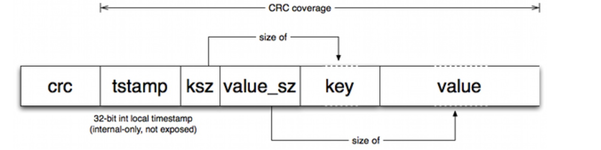
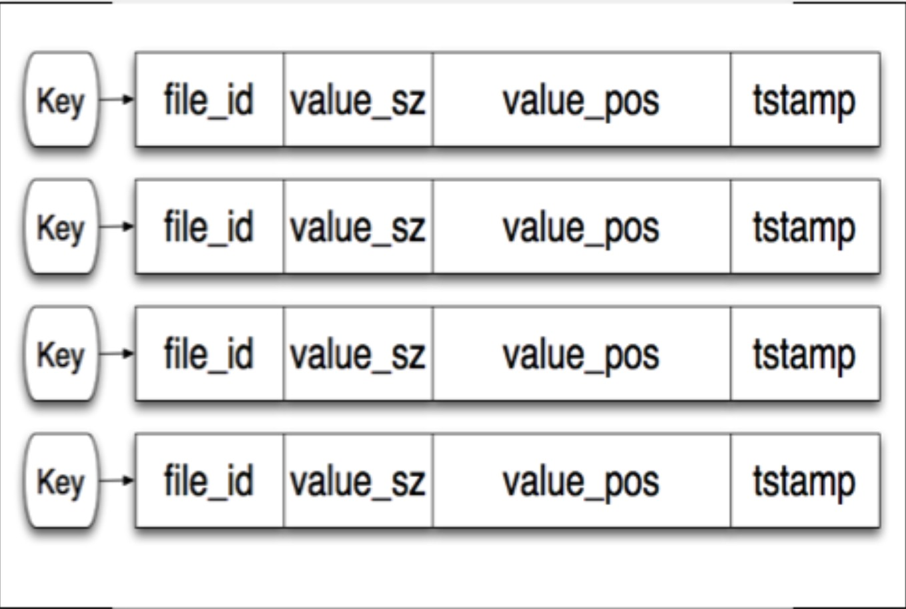
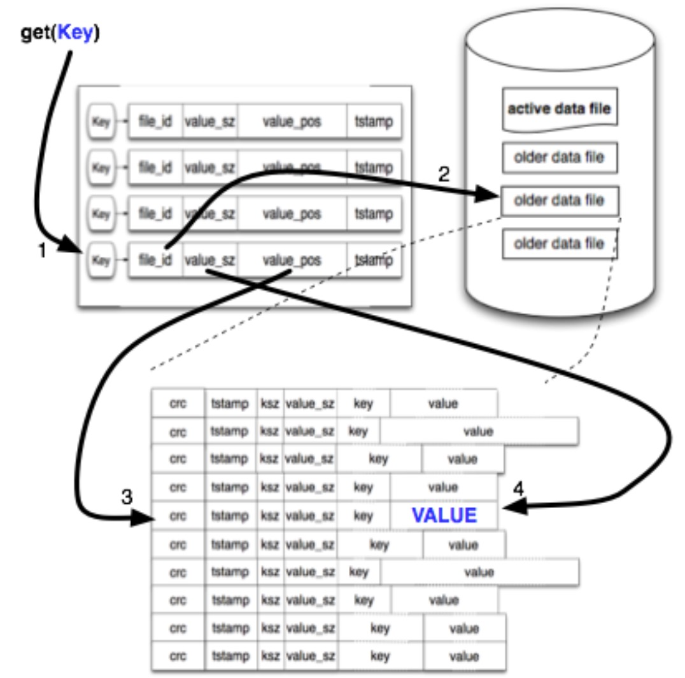
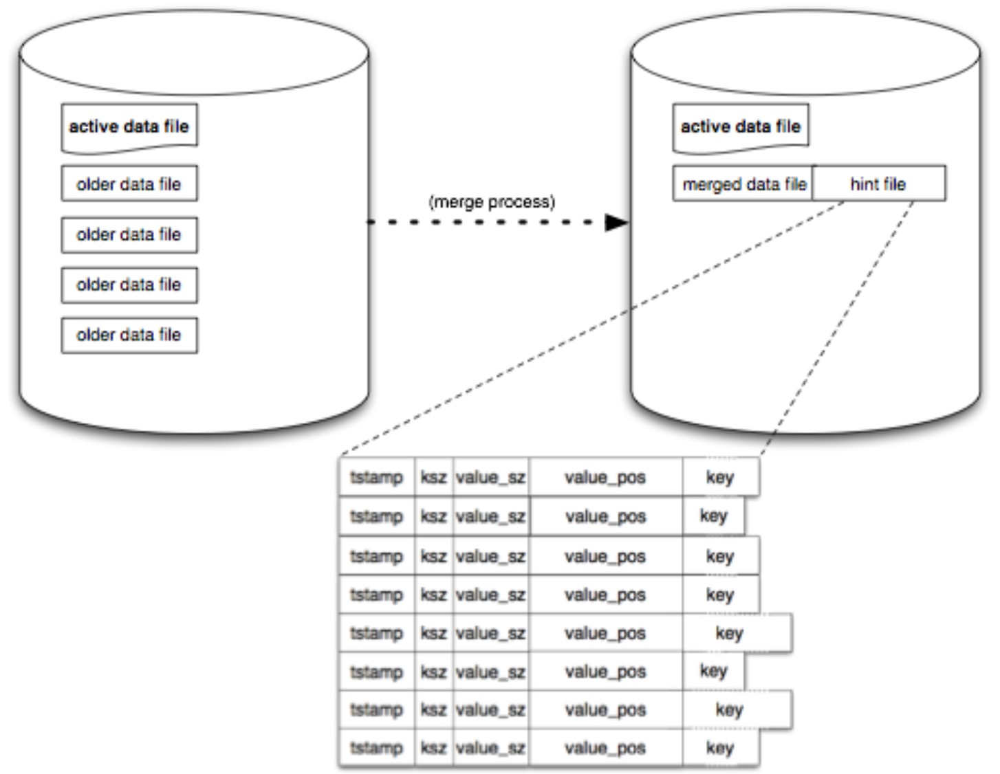

## 简介

bitcask是由Basho提出的海量小文件存储场景喜爱的一个存储解决方案，主要是为了解决下面几个问题：

1. 读写低延迟
2. 随机写请求的磁盘高吞吐量
3. 故障时的快速恢复且不丢数据
4. 使用简单

## 基本概念

一个bitcask实例是一个目录，在目录下只有一个文件是处于活动状态，在文件大小达到一个阀值的时候就会关闭掉，然后创建一个新的活动文件
活动的文件只会进行append写入，这意味着文件总是顺序写入的，并不需要做磁盘的seek，格式如下:

每次写入都会创建一个条目append到活动文件的尾部，而删除只是简单的写入一个带有特殊值的条目，真正的删除将会发生在下一次合并的时候。
每次append完成后，在内存中的一个叫做`keydir`的结构就会被更新。一个`keydir`就是一个简单的hashtable，保存了所有的key对应的
值大小、在文件中的位置，timestamp、存储在哪个文件中等信息，格式如下:

`keydir`始终指向最新的数据所在的位置，老的数据仍然在文件中没有删除，直到merge的时候才会删掉。借助这套机制，读取一个值是非常简单的。
下面是读取一个key的过程:

这套机制会占用比较多的磁盘空间，因为写入新的值后，老的值仍然在磁盘上吗，为了解决这个问题，就引入了megering的能力，merge的时候会迭代
所有不活动状态的文件，然后进行合并，输出一系列的文件，这些文件只会包含活跃的，最新版本的数据。然后产生一个hint file，这个文件中包含了
keydir的信息，进程只需要加载这个文件就可以快速的构建好keydir结构，

