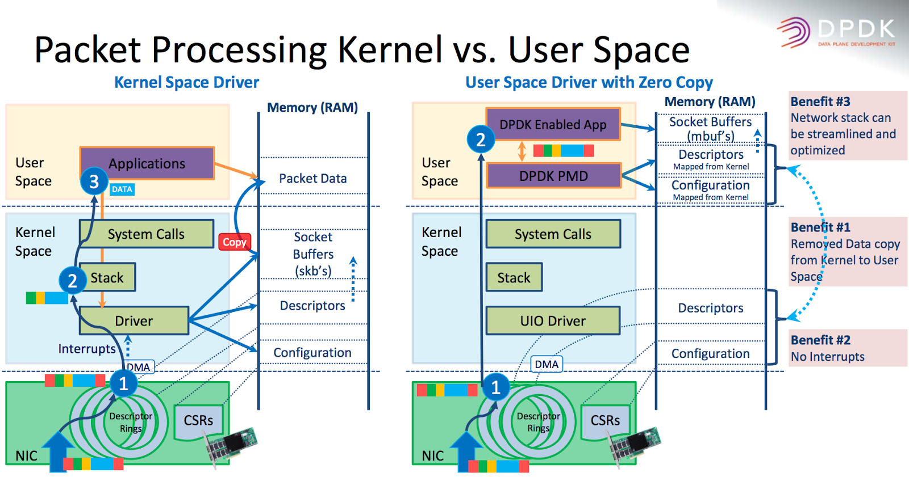

# DPDK
## 一些开源实现

1. [mTCP](https://github.com/eunyoung14/mtcp/blob/master/README)
2. [IWIP](http://git.savannah.gnu.org/cgit/lwip.git/tree/README)
3. [Seastar](http://www.seastar-project.org/)
4. [F-Stack](https://github.com/f-stack/f-stack)

## 基于OS内核的转发技术有哪些问题？

1. 局部性(缓存)失效的问题
网络处理往往运行在多核环境中，一个数据包的生命周期可能会运转在多个核上，比如驱动处理在Core0，内核处理在Core1，用户态处理在Core2，这样
跨越多个核心，CPU缓存可能会失效。再加上NUMA的影响，这个问题可能会更加严重。

2. 中断导致的开销和锁
网口收到报文，会产生硬件中断，级别越高，可以打断相对优先级较低的软中断和其他系统调用。这些硬件中断会导致系统上下文频繁切换。同时任务切换
往往对应同步和加锁。这些都会带来严重的消耗，特别是大量短🔗会导致系统性能急剧下降。

3. 内存多次拷贝导致的开销
基于OS内核的转发，数据包的路径是: 网口->DMA->内核缓冲区->用户态空间。

## DPDK技术带来的改变

1. 用户态驱动，绕过内核驱动收包，减少内存拷贝

2. 支持 CPU 亲和性绑定，支持对多核多线程的支撑，每个核对应一个免锁队列，减少线程调度和锁的消耗
3. 对 NUMA 的优化，尽量在处理时不跨 NUMA。
4. 利用 HugePage 技术，减少 CacheMiss 的情况
