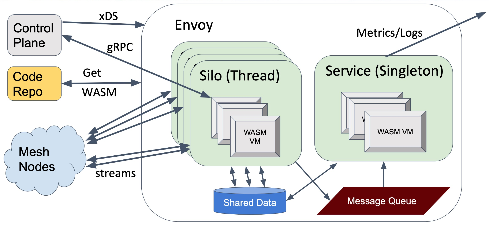

# Envoy Proxy Wasm分析
## To implement a WASM filter

1. Implement a root context class which inherits base root context class
2. Implement a stream context class which inherits the base context class.
3. Override context API methods to handle corresponding initialization and stream events from host.
4. Register the root context and stream context.


Root Context和Context是WASM Filter中比较关键的两个对象，前者用于WASM实例之间的全局共享，而Context则是和Stream相关的一个Context贯穿整个请求的生命周期
在这个请求之上的各个WASM实例可以共享这个Context，下面这张图是Wasm实例和Context之间的关系。
git 


Wasm在Envoy内部又分为两类，一类是用来提供Service能力的，另外一类则是用来提供Silo的，架构如下。



启动阶段创建Wasm Service，一个Wasm Service其实就是Wasm VM实例，可以设置为单例，也可以设置为per worker per Wasm VM
每一个Wasm VM下面可以运行多个Plugin。这些Plugin是用来提供服务能力的，比如log、metrics等等，和Wasm Http Filter、Network Filter是两类Wasm
这两者之间通过SharedData和MessageQueue进行相互通信


```protobuf
// WasmService is configured as a built-in *envoy.wasm_service* :ref:`ServiceConfig
// <envoy_api_msg_extensions.wasm.v3.WasmService>`. This opaque configuration will be used to
// create a Wasm Service.
message WasmService {
  // General plugin configuration.
  PluginConfig config = 1;

  // If true, create a single VM rather than creating one VM per worker. Such a singleton can
  // not be used with filters.
  bool singleton = 2;
}
```

```cpp
  // Optional Wasm services. These must be initialied afer threading but before the main
  // configuration which many reference wasm vms.
  if (bootstrap_.wasm_service_size() > 0) {
    auto factory = Registry::FactoryRegistry<Configuration::WasmFactory>::getFactory("envoy.wasm");
    if (factory) {
      for (auto& config : bootstrap_.wasm_service()) {
        auto scope = Stats::ScopeSharedPtr(stats_store_.createScope(""));
        Configuration::WasmFactoryContextImpl wasm_factory_context(*this, scope);
        // 最终会调用createWasmInternal来创建WasmService
        factory->createWasm(config, wasm_factory_context, [this](WasmServicePtr wasm) {
          if (wasm) {
            // If not nullptr, this is a singleton WASM service.
            wasm_.emplace_back(std::move(wasm));
          }
        });
      }
    } else {
      ENVOY_LOG(warn, "No wasm factory available, so no wasm service started.");
    }
  }
```

```cpp
class WasmService {
public:
  WasmService(Common::Wasm::WasmHandleSharedPtr singleton) : singleton_(std::move(singleton)) {}
  WasmService(ThreadLocal::SlotPtr tls_slot) : tls_slot_(std::move(tls_slot)) {}

private:
  Common::Wasm::WasmHandleSharedPtr singleton_;
  ThreadLocal::SlotPtr tls_slot_;
};
```

WasmService 持有对wasm vm的handle，也就是`Common::Wasm::WasmHandleSharedPtr`，如果是单例就是singleton_,如果不是单例就通过tls_slot来获取
当前线程的`Common::Wasm::WasmHandleSharedPtr`。创建WasmHandlerSharedPtr的核心代码如下:

```C++
WasmHandleSharedPtr getOrCreateThreadLocalWasm(const WasmHandleSharedPtr& base_wasm,
                                               const PluginSharedPtr& plugin,
                                               Event::Dispatcher& dispatcher,
                                               CreateContextFn create_root_context_for_testing) {
  // proxy-wasm-host中的getOrCreateThreadLocalWasm方法创建WasmHandleBase，然后
  // 转换为派生类WasmHandle返回即可。
  auto wasm_handle = proxy_wasm::getOrCreateThreadLocalWasm(
      std::static_pointer_cast<WasmHandle>(base_wasm), plugin,
      [&dispatcher, create_root_context_for_testing](
          const WasmHandleBaseSharedPtr& base_wasm) -> WasmHandleBaseSharedPtr {
        auto wasm =
            std::make_shared<Wasm>(std::static_pointer_cast<WasmHandle>(base_wasm), dispatcher);
        wasm->setCreateContextForTesting(nullptr, create_root_context_for_testing);
        return std::make_shared<WasmHandle>(wasm);
      });
  return std::static_pointer_cast<WasmHandle>(wasm_handle);
}

// 本质上维护了wasm vm key到wasm vm handle的thread local map
// 这样就可以通过wasm vm key找到对应的handle
std::shared_ptr<WasmHandleBase>
getOrCreateThreadLocalWasm(std::shared_ptr<WasmHandleBase> base_wasm,
                           std::shared_ptr<PluginBase> plugin, WasmHandleCloneFactory factory) {
  auto wasm_handle = getThreadLocalWasm(base_wasm->wasm()->vm_key());
  if (wasm_handle) {
    auto root_context = wasm_handle->wasm()->getOrCreateRootContext(plugin);
    if (!wasm_handle->wasm()->configure(root_context, plugin)) {
      base_wasm->wasm()->fail("Failed to configure thread-local Wasm code");
      return nullptr;
    }
    return wasm_handle;
  }
  return createThreadLocalWasm(base_wasm, plugin, factory);
}
```


`Common::Wasm::createWasm` 创建 wasm vm实例，内部调用`Common::Wasm::createWasmInternal`


createWasmInternal会根据Config来创建Wasm实例:

1. wasm的code是否来自远程，如果是则从远程获取，并维护code cache
2. 创建wasm stats
3. 清除code cache缓存
4. 如果不是来自远程就从本地加载
5. 如果远程获取失败就继续获取，并设置callback
6. 如果获取成功就直接构建Wasm
  1. 创建vmKey，用于唯一表示一个wasm(相同的配置，但是code不同也是不同的wasm vm)
  2. 创建wasm
    1. 从map中根据vm_key查找对应的wasm，查找到后直接返回
    2. 如果没有查找到就创建一个Wasm


内部获取到code后，会调用`proxy_wasm::createWasm`来创建最终的wasm vm实例，最终创建的实例就是`Wasm`


以一个Rust Example为例，来分析下，整个流程:

1. Rust SDK中定义了许多由Envoy暴露给Wasm的方法，这些方法只有声明没有定义，具体的实现在Envoy中，是在创建wasm的时候由wasm进行link

```rust
extern "C" {
    fn proxy_log(level: LogLevel, message_data: *const u8, message_size: usize) -> Status;
}

pub fn log(level: LogLevel, message: &str) -> Result<(), Status> {
    unsafe {
        match proxy_log(level, message.as_ptr(), message.len()) {
            Status::Ok => Ok(()),
            status => panic!("unexpected status: {}", status as u32),
        }
    }
}

extern "C" {
    fn proxy_get_current_time_nanoseconds(return_time: *mut u64) -> Status;
}

pub fn get_current_time() -> Result<SystemTime, Status> {
    let mut return_time: u64 = 0;
    unsafe {
        match proxy_get_current_time_nanoseconds(&mut return_time) {
            Status::Ok => Ok(UNIX_EPOCH + Duration::from_nanos(return_time)),
            status => panic!("unexpected status: {}", status as u32),
        }
    }
}
......
```

2. 拿`proxy_log`举例来说，

```rust

pub fn _start() {
    proxy_wasm::set_log_level(LogLevel::Trace);
    proxy_wasm::set_root_context(|_| -> Box<dyn RootContext> { Box::new(HelloWorld) });
}

struct HelloWorld;

impl Context for HelloWorld {}

impl RootContext for HelloWorld {
    fn on_vm_start(&mut self, _: usize) -> bool {
        // 内部调用proxy_log
        info!("Hello, World!");
        self.set_tick_period(Duration::from_secs(5));
        true
    }

    fn on_tick(&mut self) {
        let datetime: DateTime<Utc> = self.get_current_time().into();
        info!("It's {}", datetime);
    }
}
```

wasm插件可以直接调用`proxy_log`相关的方法，这个proxy_log方法是host环境注册进来的。


3. host环境注册`proxy_log`方法

```cpp
  // Calls with the "proxy_" prefix.
#define _REGISTER_PROXY(_fn)                                                                       \
  wasm_vm_->registerCallback(                                                                      \
      "env", "proxy_" #_fn, &exports::_fn,                                                         \
      &ConvertFunctionWordToUint32<decltype(exports::_fn),                                         \
                                   exports::_fn>::convertFunctionWordToUint32);
  _REGISTER_PROXY(log);

  _REGISTER_PROXY(get_status);

  _REGISTER_PROXY(set_property);
  _REGISTER_PROXY(get_property);

  _REGISTER_PROXY(continue_request);
  _REGISTER_PROXY(continue_response);
  _REGISTER_PROXY(send_local_response);
```

可以看出，实际上proxy_log最终调用的是`exports::log`方法

4. `exports::log`

```cpp
Word log(void *raw_context, Word level, Word address, Word size) {
  if (level > static_cast<uint64_t>(LogLevel::Max)) {
    return WasmResult::BadArgument;
  }
  auto context = WASM_CONTEXT(raw_context);
  auto message = context->wasmVm()->getMemory(address, size);
  if (!message) {
    return WasmResult::InvalidMemoryAccess;
  }
  return context->log(level, message.value());
}
```

最终调用的ContextBase的log接口，这个接口最终由Host环境Envoy来实现


5. 最终实现

```cpp
WasmResult Context::log(uint32_t level, absl::string_view message) {
  switch (static_cast<spdlog::level::level_enum>(level)) {
  case spdlog::level::trace:
    ENVOY_LOG(trace, "wasm log{}: {}", log_prefix(), message);
    return WasmResult::Ok;
  case spdlog::level::debug:
    ENVOY_LOG(debug, "wasm log{}: {}", log_prefix(), message);
    return WasmResult::Ok;
  case spdlog::level::info:
    ENVOY_LOG(info, "wasm log{}: {}", log_prefix(), message);
    return WasmResult::Ok;
  case spdlog::level::warn:
    ENVOY_LOG(warn, "wasm log{}: {}", log_prefix(), message);
    return WasmResult::Ok;
  case spdlog::level::err:
    ENVOY_LOG(error, "wasm log{}: {}", log_prefix(), message);
    return WasmResult::Ok;
  case spdlog::level::critical:
    ENVOY_LOG(critical, "wasm log{}: {}", log_prefix(), message);
    return WasmResult::Ok;
  case spdlog::level::off:
    return WasmResult::Ok;
  }
  NOT_IMPLEMENTED_GCOVR_EXCL_LINE;
}
```

接下来看下如何调用wasm中的一个方法

1. rust exmaple

```rust

#[no_mangle]
pub fn _start() {
    proxy_wasm::set_log_level(LogLevel::Trace);
    proxy_wasm::set_http_context(|context_id, _| -> Box<dyn HttpContext> {
        Box::new(HttpHeaders { context_id })
    });
}

struct HttpHeaders {
    context_id: u32,
}

impl Context for HttpHeaders {}

impl HttpContext for HttpHeaders {
    fn on_http_request_headers(&mut self, _: usize) -> Action {
        for (name, value) in &self.get_http_request_headers() {
            trace!("#{} -> {}: {}", self.context_id, name, value);
        }

        match self.get_http_request_header(":path") {
            Some(path) if path == "/hello" => {
                self.send_http_response(
                    200,
                    vec![("Hello", "World"), ("Powered-By", "proxy-wasm")],
                    Some(b"Hello, World!\n"),
                );
                Action::Pause
            }
            _ => Action::Continue,
        }
    }

    fn on_http_response_headers(&mut self, _: usize) -> Action {
        for (name, value) in &self.get_http_response_headers() {
            trace!("#{} <- {}: {}", self.context_id, name, value);
        }
        Action::Continue
    }

    fn on_log(&mut self) {
        trace!("#{} completed.", self.context_id);
    }
}
```

拿`on_http_request_headers`举例来说，当一个请求进来的时候，并解析完成后会调用wasm插件的`on_http_request_headers`接口。


2. 获取wasm中的指定function

```cpp
#define _GET_PROXY(_fn) wasm_vm_->getFunction("proxy_" #_fn, &_fn##_);
  _GET_PROXY(validate_configuration);
  _GET_PROXY(on_vm_start);
  _GET_PROXY(on_configure);
  _GET_PROXY(on_tick);

  _GET_PROXY(on_context_create);

  _GET_PROXY(on_new_connection);
  _GET_PROXY(on_downstream_data);
  _GET_PROXY(on_upstream_data);
  _GET_PROXY(on_downstream_connection_close);
  _GET_PROXY(on_upstream_connection_close);

  _GET_PROXY(on_request_headers);
  _GET_PROXY(on_request_body);
  _GET_PROXY(on_request_trailers);
  _GET_PROXY(on_request_metadata);
  _GET_PROXY(on_response_headers);
  _GET_PROXY(on_response_body);
  _GET_PROXY(on_response_trailers);
  _GET_PROXY(on_response_metadata);
  _GET_PROXY(on_http_call_response);
  _GET_PROXY(on_grpc_receive);
  _GET_PROXY(on_grpc_close);
  _GET_PROXY(on_grpc_receive_initial_metadata);
  _GET_PROXY(on_grpc_receive_trailing_metadata);
  _GET_PROXY(on_queue_ready);
  _GET_PROXY(on_done);
  _GET_PROXY(on_log);
  _GET_PROXY(on_delete);
#undef _GET_PROXY
```

最终调用下面的代码将`on_http_request_headers_`函数指针指向

```cpp
#define _GET_MODULE_FUNCTION(T)                                                                    \
  void getFunction(string_view function_name, T *f) override {                                     \
    getModuleFunctionImpl(function_name, f);                                                       \
  };
  FOR_ALL_WASM_VM_EXPORTS(_GET_MODULE_FUNCTION)
#undef _GET_MODULE_FUNCTION
```


```rust
#[no_mangle]
pub extern "C" fn proxy_on_context_create(context_id: u32, root_context_id: u32) {
    DISPATCHER.with(|dispatcher| dispatcher.on_create_context(context_id, root_context_id))
}

#[no_mangle]
pub extern "C" fn proxy_on_done(context_id: u32) -> bool {
    DISPATCHER.with(|dispatcher| dispatcher.on_done(context_id))
}

#[no_mangle]
pub extern "C" fn proxy_on_log(context_id: u32) {
    DISPATCHER.with(|dispatcher| dispatcher.on_log(context_id))
}

#[no_mangle]
pub extern "C" fn proxy_on_delete(context_id: u32) {
    DISPATCHER.with(|dispatcher| dispatcher.on_delete(context_id))
}

```


基本概念:

**Wasm::Context** 是Envoy和wasm插件的桥梁，Context继承了Envoy内部各个扩展点的接口，并且在每一个Envoy的扩展点上
都创建了对应的wasm扩展，比如Http filter扩展的地方就会有一个wasm http filter扩展的实现，最终返回的就是这个Context
对象，当一个请求进入Envoy的时候，走到wasm http filter就会调用Context的decodeHeaders、decodeData、encodeData、encodeHeaders等
一系列的回调方法，在这些回调方法中会间接的调用wasm插件暴露出来的方法。

```cpp
class Context : public proxy_wasm::ContextBase,
                public Logger::Loggable<Logger::Id::wasm>,
                public AccessLog::Instance,
                public Http::StreamFilter,
                public Network::ConnectionCallbacks,
                public Network::Filter,
                public google::api::expr::runtime::BaseActivation,
                public std::enable_shared_from_this<Context> {
```

**Wasm::Plugin**: 包含了wasm插件的一些信息比如、name、root_id、vm_id、plugin配置、log_prefix等

name: 每一个插件都有一个名字，在同一个wasm VM中是唯一的。也就是说，同一个VM中不能有多个相同name的插件
root_id: 在一个wasm VM中是唯一的，多个插件可以拥有相同的root_id，对于具有相同root_id的插件来说，他们之间共享Context和RootContext，如果为空，那么所有的插件共享Context
vm_id: 根据wasm code进行hash，不同的code使用不同的vm，如果code都是一样的，那么就使用同一个vm


wasm在Envoy的每一个扩展点中实现了wasm plugin，也就是核心的**Wasm::Plugin**，然后将Plugin对象放在Tls中

```cpp
  plugin_ = std::make_shared<Common::Wasm::Plugin>(
      config.config().name(), config.config().root_id(), config.config().vm_config().vm_id(),
      Common::Wasm::anyToBytes(config.config().configuration()), config.config().fail_open(),
      context.direction(), context.localInfo(), &context.listenerMetadata());

  auto plugin = plugin_;
  auto callback = [plugin, this](const Common::Wasm::WasmHandleSharedPtr& base_wasm) {
    // NB: the Slot set() call doesn't complete inline, so all arguments must outlive this call.
    tls_slot_->set(
        [base_wasm,
         plugin](Event::Dispatcher& dispatcher) -> std::shared_ptr<ThreadLocal::ThreadLocalObject> {
          if (!base_wasm) {
            return nullptr;
          }
          return std::static_pointer_cast<ThreadLocal::ThreadLocalObject>(
              Common::Wasm::getOrCreateThreadLocalWasm(base_wasm, plugin, dispatcher));
        });
  };

  if (!Common::Wasm::createWasm(
          config.config().vm_config(), plugin_, context.scope().createScope(""),
          context.clusterManager(), context.initManager(), context.dispatcher(), context.random(),
          context.api(), context.lifecycleNotifier(), remote_data_provider_, std::move(callback))) {
    throw Common::Wasm::WasmException(
        fmt::format("Unable to create Wasm HTTP filter {}", plugin->name_));
  }
```

**WasmExtension** 将创建Wasm实例，操作stats等封装成接口，可以有多种实现。默认实现是`EnvoyWasm`。
通过**WasmExtension**可以创建stats scope、stats统计、获取创建wasm handle的factory。


**WasmmHandle** 持有Wasm VM的 shared_ptr，延长Wasm VM的生命周期。


**Wasm** 一个Wasm对象就是一个Wasm VM实例


Wasm实例在主线程创建，通过全局map存放，然后通过TLS和vm的clone机制在每一个线程创建一份VM的拷贝实例。


**WasmVmIntegration**


**proxy_wasm::ContextBase** 是VM host实现部分和VM之间的桥梁，而Wasm::Context则是Envoy 和 VM host之间的桥梁

```cpp
class ContextBase : public RootInterface,
                    public HttpInterface,
                    public NetworkInterface,
                    public StreamInterface,
                    public HeaderInterface,
                    public HttpCallInterface,
                    public GrpcCallInterface,
                    public GrpcStreamInterface,
                    public MetricsInterface,
                    public SharedDataInterface,
                    public SharedQueueInterface,
                    public GeneralInterface {
```

1. ContextBase提供了很多能力，这些能力用于提供给VM来操作，比如发起HTTP、GRPC调用等
2. 与此同时，通过ContextBase也可以调用VM中的一些callback，比如当请求到来的时候，Envoy会创建ContextBase，
   然后调用VM中的proxy_on_context_create，当第一个请求到来的时候，又会去调用VM中的proxy_on_request_headers的方法，把请求的header传递给VM
3. 为了进行测试和检测，可以替换或扩充ContextBase的方法。


**WasmBase**

**WasmVM**  一个Wasm VM需要实现的接口，


Common::Wasm::createWasm
  createWasmInternal
    