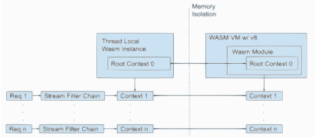

# Envoy Proxy Wasm分析
## To implement a WASM filter

1. Implement a root context class which inherits base root context class
2. Implement a stream context class which inherits the base context class.
3. Override context API methods to handle corresponding initialization and stream events from host.
4. Register the root context and stream context.


Root Context和Context是WASM Filter中比较关键的两个对象，前者用于WASM实例之间的全局共享，而Context则是和Stream相关的一个Context贯穿整个请求的生命周期
在这个请求之上的各个WASM实例可以共享这个Context，下面这张图是Wasm实例和Context之间的关系。
git 



Wasm在Envoy内部又分为两类，一类是用来提供Service能力的，另外一类则是用来提供Silo的，架构如下。


启动阶段创建Wasm Service，一个Wasm Service其实就是Wasm VM实例，可以设置为单例，也可以设置为per worker per Wasm VM
每一个Wasm VM下面可以运行多个Plugin。这些Plugin是用来提供服务能力的，比如log、metrics等等，和Wasm Http Filter、Network Filter是两类Wasm
这两者之间通过SharedData和MessageQueue进行相互通信


```protobuf
// WasmService is configured as a built-in *envoy.wasm_service* :ref:`ServiceConfig
// <envoy_api_msg_extensions.wasm.v3.WasmService>`. This opaque configuration will be used to
// create a Wasm Service.
message WasmService {
  // General plugin configuration.
  PluginConfig config = 1;

  // If true, create a single VM rather than creating one VM per worker. Such a singleton can
  // not be used with filters.
  bool singleton = 2;
}
```

```cpp
void WasmServiceExtension::createWasm(Server::Configuration::ServerFactoryContext& context) {
  auto plugin = std::make_shared<Common::Wasm::Plugin>(
      config_.config(), envoy::config::core::v3::TrafficDirection::UNSPECIFIED, context.localInfo(),
      nullptr);

  auto callback = [this, &context, plugin](Common::Wasm::WasmHandleSharedPtr base_wasm) {
    if (!base_wasm) {
      if (plugin->fail_open_) {
        ENVOY_LOG(error, "Unable to create Wasm service {}", plugin->name_);
      } else {
        ENVOY_LOG(critical, "Unable to create Wasm service {}", plugin->name_);
      }
      return;
    }
    if (config_.singleton()) {
      // Return a Wasm VM which will be stored as a singleton by the Server.
      wasm_service_ = std::make_unique<WasmService>(
          plugin,
          Common::Wasm::getOrCreateThreadLocalPlugin(base_wasm, plugin, context.dispatcher()));
      return;
    }
    // Per-thread WASM VM.
    // NB: the Slot set() call doesn't complete inline, so all arguments must outlive this call.
    auto tls_slot =
        ThreadLocal::TypedSlot<Common::Wasm::PluginHandle>::makeUnique(context.threadLocal());
    tls_slot->set([base_wasm, plugin](Event::Dispatcher& dispatcher) {
      return Common::Wasm::getOrCreateThreadLocalPlugin(base_wasm, plugin, dispatcher);
    });
    wasm_service_ = std::make_unique<WasmService>(plugin, std::move(tls_slot));
  };

  if (!Common::Wasm::createWasm(plugin, context.scope().createScope(""), context.clusterManager(),
                                context.initManager(), context.dispatcher(), context.api(),
                                context.lifecycleNotifier(), remote_data_provider_,
                                std::move(callback))) {
    // NB: throw if we get a synchronous configuration failures as this is how such failures are
    // reported to xDS.
    throw Common::Wasm::WasmException(
        fmt::format("Unable to create Wasm service {}", plugin->name_));
  }
}
```

```cpp
class WasmService {
public:
  WasmService(PluginSharedPtr plugin, PluginHandleSharedPtr singleton)
      : plugin_(plugin), singleton_(std::move(singleton)) {}
  WasmService(PluginSharedPtr plugin, ThreadLocal::TypedSlotPtr<PluginHandle>&& tls_slot)
      : plugin_(plugin), tls_slot_(std::move(tls_slot)) {}

private:
  PluginSharedPtr plugin_;
  PluginHandleSharedPtr singleton_;
  ThreadLocal::TypedSlotPtr<PluginHandle> tls_slot_;
};
```

WasmService持有对Plugin的Handle，Plugin Handle持有Wasm Handle也就是`Common::Wasm::WasmHandleSharedPtr`，通过`getOrCreateThreadLocalPlugin`来创建

```C++
PluginHandleSharedPtr
getOrCreateThreadLocalPlugin(const WasmHandleSharedPtr& base_wasm, const PluginSharedPtr& plugin,
                             Event::Dispatcher& dispatcher,
                             CreateContextFn create_root_context_for_testing) {
  if (!base_wasm) {
    if (!plugin->fail_open_) {
      ENVOY_LOG_TO_LOGGER(Envoy::Logger::Registry::getLog(Envoy::Logger::Id::wasm), critical,
                          "Plugin configured to fail closed failed to load");
    }
    return nullptr;
  }
  return std::static_pointer_cast<PluginHandle>(proxy_wasm::getOrCreateThreadLocalPlugin(
      std::static_pointer_cast<WasmHandle>(base_wasm), plugin,
      getCloneFactory(getWasmExtension(), dispatcher, create_root_context_for_testing),
      getPluginFactory(getWasmExtension())));
}
```


`Common::Wasm::createWasm` 创建 wasm vm实例，内部调用`Common::Wasm::createWasmInternal`


createWasmInternal会根据Config来创建Wasm实例:

1. wasm的code是否来自远程，如果是则从远程获取，并维护code cache
2. 创建wasm stats
3. 清除code cache缓存
4. 如果不是来自远程就从本地加载
5. 如果远程获取失败就继续获取，并设置callback
6. 如果获取成功就直接构建Wasm
  1. 创建vmKey，用于唯一表示一个wasm(相同的配置，但是code不同也是不同的wasm vm)
  2. 创建wasm
    1. 从map中根据vm_key查找对应的wasm，查找到后直接返回
    2. 如果没有查找到就创建一个Wasm


内部获取到code后，会调用`proxy_wasm::createWasm`来创建最终的wasm vm实例，最终创建的实例就是`Wasm`


以一个Rust Example为例，来分析下，整个流程:

1. Rust SDK中定义了许多由Envoy暴露给Wasm的方法，这些方法只有声明没有定义，具体的实现在Envoy中，是在创建wasm的时候由wasm进行link

```rust
extern "C" {
    fn proxy_log(level: LogLevel, message_data: *const u8, message_size: usize) -> Status;
}

pub fn log(level: LogLevel, message: &str) -> Result<(), Status> {
    unsafe {
        match proxy_log(level, message.as_ptr(), message.len()) {
            Status::Ok => Ok(()),
            status => panic!("unexpected status: {}", status as u32),
        }
    }
}

extern "C" {
    fn proxy_get_current_time_nanoseconds(return_time: *mut u64) -> Status;
}

pub fn get_current_time() -> Result<SystemTime, Status> {
    let mut return_time: u64 = 0;
    unsafe {
        match proxy_get_current_time_nanoseconds(&mut return_time) {
            Status::Ok => Ok(UNIX_EPOCH + Duration::from_nanos(return_time)),
            status => panic!("unexpected status: {}", status as u32),
        }
    }
}
......
```

2. 拿`proxy_log`举例来说，

```rust

pub fn _start() {
    proxy_wasm::set_log_level(LogLevel::Trace);
    proxy_wasm::set_root_context(|_| -> Box<dyn RootContext> { Box::new(HelloWorld) });
}

struct HelloWorld;

impl Context for HelloWorld {}

impl RootContext for HelloWorld {
    fn on_vm_start(&mut self, _: usize) -> bool {
        // 内部调用proxy_log
        info!("Hello, World!");
        self.set_tick_period(Duration::from_secs(5));
        true
    }

    fn on_tick(&mut self) {
        let datetime: DateTime<Utc> = self.get_current_time().into();
        info!("It's {}", datetime);
    }
}
```

wasm插件可以直接调用`proxy_log`相关的方法，这个proxy_log方法是host环境注册进来的。


3. host环境注册`proxy_log`方法

```cpp
  // Calls with the "proxy_" prefix.
#define _REGISTER_PROXY(_fn)                                                                       \
  wasm_vm_->registerCallback(                                                                      \
      "env", "proxy_" #_fn, &exports::_fn,                                                         \
      &ConvertFunctionWordToUint32<decltype(exports::_fn),                                         \
                                   exports::_fn>::convertFunctionWordToUint32);
  _REGISTER_PROXY(log);

  _REGISTER_PROXY(get_status);

  _REGISTER_PROXY(set_property);
  _REGISTER_PROXY(get_property);

  _REGISTER_PROXY(continue_request);
  _REGISTER_PROXY(continue_response);
  _REGISTER_PROXY(send_local_response);
```

可以看出，实际上proxy_log最终调用的是`exports::log`方法

4. `exports::log`

```cpp
Word log(void *raw_context, Word level, Word address, Word size) {
  if (level > static_cast<uint64_t>(LogLevel::Max)) {
    return WasmResult::BadArgument;
  }
  auto context = WASM_CONTEXT(raw_context);
  auto message = context->wasmVm()->getMemory(address, size);
  if (!message) {
    return WasmResult::InvalidMemoryAccess;
  }
  return context->log(level, message.value());
}
```

最终调用的ContextBase的log接口，这个接口最终由Host环境Envoy来实现


5. 最终实现

```cpp
WasmResult Context::log(uint32_t level, absl::string_view message) {
  switch (static_cast<spdlog::level::level_enum>(level)) {
  case spdlog::level::trace:
    ENVOY_LOG(trace, "wasm log{}: {}", log_prefix(), message);
    return WasmResult::Ok;
  case spdlog::level::debug:
    ENVOY_LOG(debug, "wasm log{}: {}", log_prefix(), message);
    return WasmResult::Ok;
  case spdlog::level::info:
    ENVOY_LOG(info, "wasm log{}: {}", log_prefix(), message);
    return WasmResult::Ok;
  case spdlog::level::warn:
    ENVOY_LOG(warn, "wasm log{}: {}", log_prefix(), message);
    return WasmResult::Ok;
  case spdlog::level::err:
    ENVOY_LOG(error, "wasm log{}: {}", log_prefix(), message);
    return WasmResult::Ok;
  case spdlog::level::critical:
    ENVOY_LOG(critical, "wasm log{}: {}", log_prefix(), message);
    return WasmResult::Ok;
  case spdlog::level::off:
    return WasmResult::Ok;
  }
  NOT_IMPLEMENTED_GCOVR_EXCL_LINE;
}
```

接下来看下如何调用wasm中的一个方法

1. rust exmaple

```rust

#[no_mangle]
pub fn _start() {
    proxy_wasm::set_log_level(LogLevel::Trace);
    proxy_wasm::set_http_context(|context_id, _| -> Box<dyn HttpContext> {
        Box::new(HttpHeaders { context_id })
    });
}

struct HttpHeaders {
    context_id: u32,
}

impl Context for HttpHeaders {}

impl HttpContext for HttpHeaders {
    fn on_http_request_headers(&mut self, _: usize) -> Action {
        for (name, value) in &self.get_http_request_headers() {
            trace!("#{} -> {}: {}", self.context_id, name, value);
        }

        match self.get_http_request_header(":path") {
            Some(path) if path == "/hello" => {
                self.send_http_response(
                    200,
                    vec![("Hello", "World"), ("Powered-By", "proxy-wasm")],
                    Some(b"Hello, World!\n"),
                );
                Action::Pause
            }
            _ => Action::Continue,
        }
    }

    fn on_http_response_headers(&mut self, _: usize) -> Action {
        for (name, value) in &self.get_http_response_headers() {
            trace!("#{} <- {}: {}", self.context_id, name, value);
        }
        Action::Continue
    }

    fn on_log(&mut self) {
        trace!("#{} completed.", self.context_id);
    }
}
```

拿`on_http_request_headers`举例来说，当一个请求进来的时候，并解析完成后会调用wasm插件的`on_http_request_headers`接口。


2. 获取wasm中的指定function

```cpp
#define _GET_PROXY(_fn) wasm_vm_->getFunction("proxy_" #_fn, &_fn##_);
  _GET_PROXY(validate_configuration);
  _GET_PROXY(on_vm_start);
  _GET_PROXY(on_configure);
  _GET_PROXY(on_tick);

  _GET_PROXY(on_context_create);

  _GET_PROXY(on_new_connection);
  _GET_PROXY(on_downstream_data);
  _GET_PROXY(on_upstream_data);
  _GET_PROXY(on_downstream_connection_close);
  _GET_PROXY(on_upstream_connection_close);

  _GET_PROXY(on_request_headers);
  _GET_PROXY(on_request_body);
  _GET_PROXY(on_request_trailers);
  _GET_PROXY(on_request_metadata);
  _GET_PROXY(on_response_headers);
  _GET_PROXY(on_response_body);
  _GET_PROXY(on_response_trailers);
  _GET_PROXY(on_response_metadata);
  _GET_PROXY(on_http_call_response);
  _GET_PROXY(on_grpc_receive);
  _GET_PROXY(on_grpc_close);
  _GET_PROXY(on_grpc_receive_initial_metadata);
  _GET_PROXY(on_grpc_receive_trailing_metadata);
  _GET_PROXY(on_queue_ready);
  _GET_PROXY(on_done);
  _GET_PROXY(on_log);
  _GET_PROXY(on_delete);
#undef _GET_PROXY
```

最终调用下面的代码将`on_http_request_headers_`函数指针指向

```cpp
#define _GET_MODULE_FUNCTION(T)                                                                    \
  void getFunction(string_view function_name, T *f) override {                                     \
    getModuleFunctionImpl(function_name, f);                                                       \
  };
  FOR_ALL_WASM_VM_EXPORTS(_GET_MODULE_FUNCTION)
#undef _GET_MODULE_FUNCTION
```


```rust
#[no_mangle]
pub extern "C" fn proxy_on_context_create(context_id: u32, root_context_id: u32) {
    DISPATCHER.with(|dispatcher| dispatcher.on_create_context(context_id, root_context_id))
}

#[no_mangle]
pub extern "C" fn proxy_on_done(context_id: u32) -> bool {
    DISPATCHER.with(|dispatcher| dispatcher.on_done(context_id))
}

#[no_mangle]
pub extern "C" fn proxy_on_log(context_id: u32) {
    DISPATCHER.with(|dispatcher| dispatcher.on_log(context_id))
}

#[no_mangle]
pub extern "C" fn proxy_on_delete(context_id: u32) {
    DISPATCHER.with(|dispatcher| dispatcher.on_delete(context_id))
}

```


## 基本概念

* **Wasm::Context** 

是Envoy和wasm插件的桥梁，Context继承了Envoy内部各个扩展点的接口，并且在每一个Envoy的扩展点上都创建了对应的wasm扩展，比如Http filter扩展的地方就会有一个wasm http filter扩展的实现，
最终返回的就是这个Context对象，当一个请求进入Envoy的时候，走到wasm http filter就会调用Context的decodeHeaders、decodeData、encodeData、encodeHeaders等
一系列的回调方法，在这些回调方法中会间接的调用wasm插件暴露出来的方法。同样Context中也实现了一些能力提供给插件来调用。

```cpp
class Context : public proxy_wasm::ContextBase,
                public Logger::Loggable<Logger::Id::wasm>,
                public AccessLog::Instance,
                public Http::StreamFilter,
                public Network::ConnectionCallbacks,
                public Network::Filter,
                public google::api::expr::runtime::BaseActivation,
                public std::enable_shared_from_this<Context> {
```

* **proxy_wasm::ContextBase** 

是VM host实现部分和VM之间的桥梁，主要有二个使用场景:

  1. 通过继承这个接口来提供host实现，wasm实例就可以通过ContextBase来使用host提供的能力，比如http、grpc调用、metrics等
  2. 提供给host来调用wasm实例中的方法，比如wasm通过host提供的能力异步发起http调用，当响应回来的时候，host需要调用vm中对应的方法，将response传递过去。

```cpp
class ContextBase : public RootInterface,
                    public HttpInterface,
                    public NetworkInterface,
                    public StreamInterface,
                    public HeaderInterface,
                    public HttpCallInterface,
                    public GrpcCallInterface,
                    public GrpcStreamInterface,
                    public MetricsInterface,
                    public SharedDataInterface,
                    public SharedQueueInterface,
                    public GeneralInterface {
```


* **proxy_wasm::PluginBase** 

包含了wasm插件的一些信息比如、name、root_id、vm_id、plugin配置、log_prefix，这些信息都是从`PluginConfig`中获取的，是用于配置的。

name: 每一个插件都有一个名字，在同一个wasm VM中是唯一的。也就是说，同一个VM中不能有多个相同name的插件
root_id: 在一个wasm VM中是唯一的，多个插件可以拥有相同的root_id，对于具有相同root_id的插件来说，他们之间共享Context和RootContext，如果为空，那么所有的插件共享Context
vm_id: 根据wasm code进行hash，不同的code使用不同的vm，如果code都是一样的，那么就使用同一个vm

```C++
struct PluginBase {
  PluginBase(std::string_view name, std::string_view root_id, std::string_view vm_id,
             std::string_view runtime, std::string_view plugin_configuration, bool fail_open)
      : name_(std::string(name)), root_id_(std::string(root_id)), vm_id_(std::string(vm_id)),
        runtime_(std::string(runtime)), plugin_configuration_(plugin_configuration),
        fail_open_(fail_open), key_(root_id_ + "||" + plugin_configuration_),
        log_prefix_(makeLogPrefix()) {}

  const std::string name_;
  const std::string root_id_;
  const std::string vm_id_;
  const std::string runtime_;
  const std::string plugin_configuration_;
  const bool fail_open_;

  const std::string &key() const { return key_; }
  const std::string &log_prefix() const { return log_prefix_; }

private:
  std::string makeLogPrefix() const;

  const std::string key_;
  const std::string log_prefix_;
};
```

`Common::Wasm::Plugin`继承自`proxy_wasm::PluginBase`，在PluginBase的基础上增加了额外的一些插件需要的信息，比如Metadata、LocalInfo、Direction等信息

```C++
class Plugin : public proxy_wasm::PluginBase {
public:
  Plugin(const envoy::extensions::wasm::v3::PluginConfig& config,
         envoy::config::core::v3::TrafficDirection direction,
         const LocalInfo::LocalInfo& local_info,
         const envoy::config::core::v3::Metadata* listener_metadata)
      : PluginBase(config.name(), config.root_id(), config.vm_config().vm_id(),
                   config.vm_config().runtime(), MessageUtil::anyToBytes(config.configuration()),
                   config.fail_open()),
        direction_(direction), local_info_(local_info), listener_metadata_(listener_metadata),
        wasm_config_(std::make_unique<WasmConfig>(config)) {}

  envoy::config::core::v3::TrafficDirection& direction() { return direction_; }
  const LocalInfo::LocalInfo& localInfo() { return local_info_; }
  const envoy::config::core::v3::Metadata* listenerMetadata() { return listener_metadata_; }
  WasmConfig& wasmConfig() { return *wasm_config_; }

private:
  envoy::config::core::v3::TrafficDirection direction_;
  const LocalInfo::LocalInfo& local_info_;
  const envoy::config::core::v3::Metadata* listener_metadata_;
  WasmConfigPtr wasm_config_;
};
```

总结来说`Plugin`对象本身只是一个单纯的配置类，保存了插件所需要的一些信息。


* **Envoy::Extensions::Common::Wasm::PluginHandle**

是将Plugin和WasmHandle组合一起的一个对象，包含了WasmHandle和Plugin两者。

```C++
class PluginHandle : public PluginHandleBase, public ThreadLocal::ThreadLocalObject {
public:
  explicit PluginHandle(const WasmHandleSharedPtr& wasm_handle, const PluginSharedPtr& plugin)
      : PluginHandleBase(std::static_pointer_cast<WasmHandleBase>(wasm_handle),
                         std::static_pointer_cast<PluginBase>(plugin)),
        wasm_handle_(wasm_handle),
        root_context_id_(wasm_handle->wasm()->getRootContext(plugin, false)->id()) {}

  WasmSharedPtr& wasm() { return wasm_handle_->wasm(); }
  WasmHandleSharedPtr& wasmHandleForTest() { return wasm_handle_; }
  uint32_t rootContextId() { return root_context_id_; }

private:
  WasmHandleSharedPtr wasm_handle_;
  const uint32_t root_context_id_;
};
```

PluginHandle继承了ThreadLocalObject，因此他是一个TLS对象，其创建过程如下:

```C++
std::shared_ptr<PluginHandleBase> getOrCreateThreadLocalPlugin(
    std::shared_ptr<WasmHandleBase> base_handle, std::shared_ptr<PluginBase> plugin,
    WasmHandleCloneFactory clone_factory, PluginHandleFactory plugin_factory) {
  // vm_key + || + plugin key构造了PluginHandle的唯一标识
  std::string key(std::string(base_handle->wasm()->vm_key()) + "||" + plugin->key());
  // Get existing thread-local Plugin handle.
  // 先查看本地是否有PluginHandle，有的话直接返回，没有的话开始创建
  auto it = local_plugins.find(key);
  if (it != local_plugins.end()) {
    auto plugin_handle = it->second.lock();
    if (plugin_handle) {
      return plugin_handle;
    }
    // Remove stale entry.
    local_plugins.erase(key);
  }
  // 先创建一个WasmHandle，存在当前的thread local中，然后用wasm handle初始化和配置plugin，最后创建PluginHandle
  // Get thread-local WasmVM.
  auto wasm_handle = getOrCreateThreadLocalWasm(base_handle, clone_factory);
  if (!wasm_handle) {
    return nullptr;
  }
  // Create and initialize new thread-local Plugin.
  auto plugin_context = wasm_handle->wasm()->start(plugin);
  if (!plugin_context) {
    base_handle->wasm()->fail(FailState::StartFailed, "Failed to start thread-local Wasm");
    return nullptr;
  }
  if (!wasm_handle->wasm()->configure(plugin_context, plugin)) {
    base_handle->wasm()->fail(FailState::ConfigureFailed,
                              "Failed to configure thread-local Wasm plugin");
    return nullptr;
  }
  auto plugin_handle = plugin_factory(wasm_handle, plugin);
  local_plugins[key] = plugin_handle;
  return plugin_handle;
}
```


* **Envoy::Extension::Common::Wasm::Wasm**

Wasm VM实例了，负责执行Plugin，继承自WasmBase，实现了Wasm的Envoy侧接口，Envoy通过Wasm可以载入Plugin、创建Context、RootContext、调用Wasm Plugin中暴露的方法，
Context对象就依赖Wasm对象来调用Wasm插件中的方法，所以Context对象的构造依赖Wasm对象。


```C++
  Context();                                                                    // Testing.
  Context(Wasm* wasm);                                                          // Vm Context.
  Context(Wasm* wasm, const PluginSharedPtr& plugin);                           // Root Context.
  Context(Wasm* wasm, uint32_t root_context_id, const PluginSharedPtr& plugin); // Stream context.
```

* **Envoy::Extensions::Common::Wasm::WasmHandle**

```C++
class WasmHandle : public WasmHandleBase, public ThreadLocal::ThreadLocalObject {
public:
  explicit WasmHandle(const WasmSharedPtr& wasm)
      : WasmHandleBase(std::static_pointer_cast<WasmBase>(wasm)), wasm_(wasm) {}

  WasmSharedPtr& wasm() { return wasm_; }

private:
  WasmSharedPtr wasm_;
};
```

`WasmHandle`实际上包含了Wasm，是对Wasm的包装，同时他也是一个TLS对象，在每一个线程都会存一份。


wasm在Envoy的每一个扩展点中实现了wasm plugin，也就是核心的**Wasm::Plugin**，然后将Plugin对象放在Tls中

```cpp
FilterConfig::FilterConfig(const envoy::extensions::filters::http::wasm::v3::Wasm& config,
                           Server::Configuration::FactoryContext& context)
    : tls_slot_(
          ThreadLocal::TypedSlot<Common::Wasm::PluginHandle>::makeUnique(context.threadLocal())) {
  plugin_ = std::make_shared<Common::Wasm::Plugin>(
      config.config(), context.direction(), context.localInfo(), &context.listenerMetadata());

  auto plugin = plugin_;
  auto callback = [plugin, this](const Common::Wasm::WasmHandleSharedPtr& base_wasm) {
    // NB: the Slot set() call doesn't complete inline, so all arguments must outlive this call.
    tls_slot_->set([base_wasm, plugin](Event::Dispatcher& dispatcher) {
      return Common::Wasm::getOrCreateThreadLocalPlugin(base_wasm, plugin, dispatcher);
    });
  };

  if (!Common::Wasm::createWasm(plugin_, context.scope().createScope(""), context.clusterManager(),
                                context.initManager(), context.dispatcher(), context.api(),
                                context.lifecycleNotifier(), remote_data_provider_,
                                std::move(callback))) {
    throw Common::Wasm::WasmException(
        fmt::format("Unable to create Wasm HTTP filter {}", plugin->name_));
  }
}
```

* **WasmExtension** 

将创建Wasm Handle实例、克隆Wasm实例、创建PluginHandle，创建stats、stats统计等封装成接口，可以有多种实现。默认实现是`EnvoyWasm`。

```C++
class WasmExtension : Logger::Loggable<Logger::Id::wasm> {
public:
  WasmExtension() = default;
  virtual ~WasmExtension() = default;

  virtual void initialize() = 0;
  virtual PluginHandleExtensionFactory pluginFactory() = 0;
  virtual WasmHandleExtensionFactory wasmFactory() = 0;
  virtual WasmHandleExtensionCloneFactory wasmCloneFactory() = 0;
  enum class WasmEvent : int {
    Ok,
    RemoteLoadCacheHit,
    RemoteLoadCacheNegativeHit,
    RemoteLoadCacheMiss,
    RemoteLoadCacheFetchSuccess,
    RemoteLoadCacheFetchFailure,
    UnableToCreateVM,
    UnableToCloneVM,
    MissingFunction,
    UnableToInitializeCode,
    StartFailed,
    ConfigureFailed,
    RuntimeError,
  };
  virtual void onEvent(WasmEvent event, const PluginSharedPtr& plugin) = 0;
  virtual void onRemoteCacheEntriesChanged(int remote_cache_entries) = 0;
  virtual void createStats(const Stats::ScopeSharedPtr& scope, const PluginSharedPtr& plugin)
      ABSL_EXCLUSIVE_LOCKS_REQUIRED(mutex_) = 0;
  virtual void resetStats() ABSL_EXCLUSIVE_LOCKS_REQUIRED(mutex_) = 0; // Delete stats pointers

  // NB: the Scope can become invalid if, for example, the owning FilterChain is deleted. When that
  // happens the stats must be recreated. This hook verifies the Scope of any existing stats and if
  // necessary recreates the stats with the newly provided scope.
  // This call takes out the mutex_ and calls createStats and possibly resetStats().
  Stats::ScopeSharedPtr lockAndCreateStats(const Stats::ScopeSharedPtr& scope,
                                           const PluginSharedPtr& plugin);

  void resetStatsForTesting();

protected:
  absl::Mutex mutex_;
  ScopeWeakPtr scope_;
};
```

* **WasmVmIntegration**

```C++
struct WasmVmIntegration {
  virtual ~WasmVmIntegration() {}
  virtual WasmVmIntegration *clone() = 0;
  virtual proxy_wasm::LogLevel getLogLevel() = 0;
  virtual void error(std::string_view message) = 0;
  virtual void trace(std::string_view message) = 0;
  // Get a NullVm implementation of a function.
  // @param function_name is the name of the function with the implementation specific prefix.
  // @param returns_word is true if the function returns a Word and false if it returns void.
  // @param number_of_arguments is the number of Word arguments to the function.
  // @param plugin is the Null VM plugin on which the function will be called.
  // @param ptr_to_function_return is the location to write the function e.g. of type
  // WasmCallWord<3>.
  // @return true if the function was found.  ptr_to_function_return could still be set to nullptr
  // (of the correct type) if the function has no implementation.  Returning true will prevent a
  // "Missing getFunction" error.
  virtual bool getNullVmFunction(std::string_view function_name, bool returns_word,
                                 int number_of_arguments, NullPlugin *plugin,
                                 void *ptr_to_function_return) = 0;
};
```

**WasmVmIntegration**

**WasmBase**

**WasmVM**  一个Wasm VM需要实现的接口，


Common::Wasm::createWasm
  createWasmInternal
    