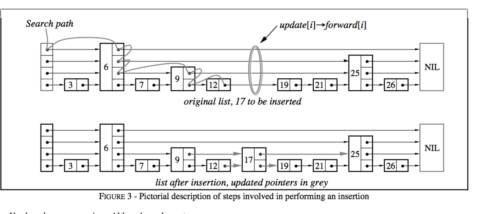
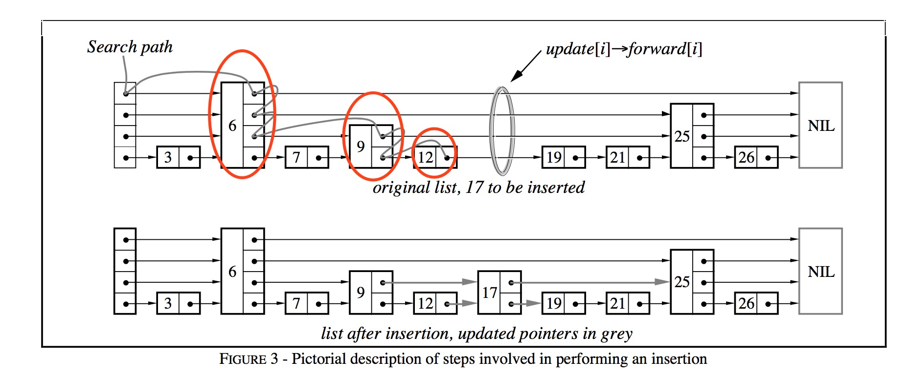
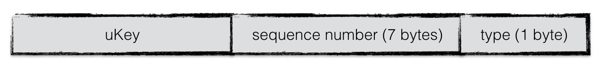
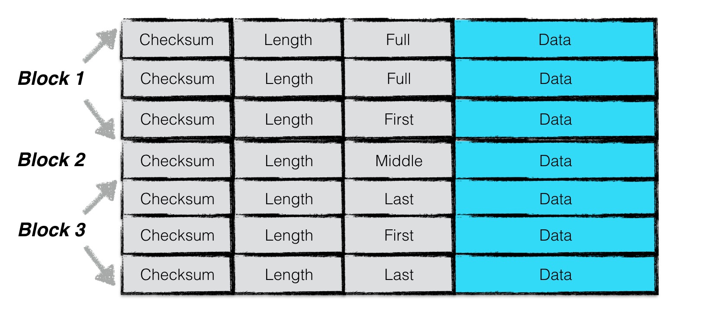
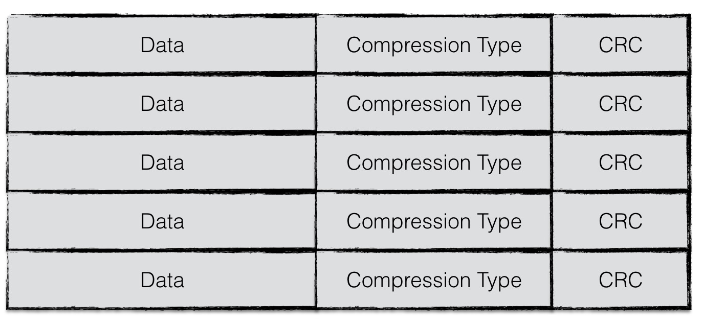
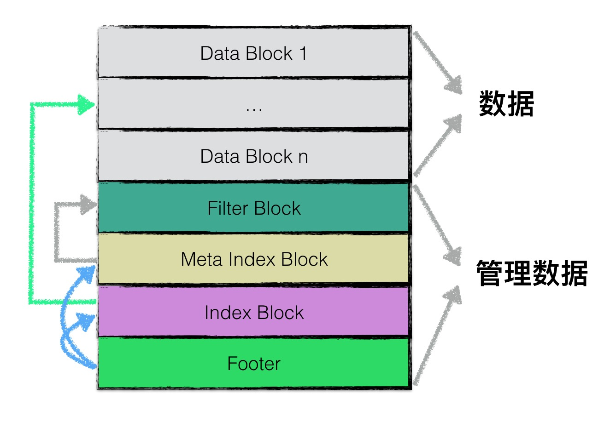
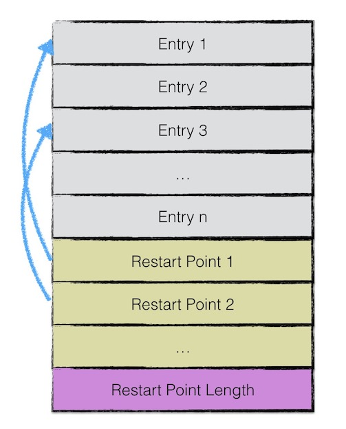
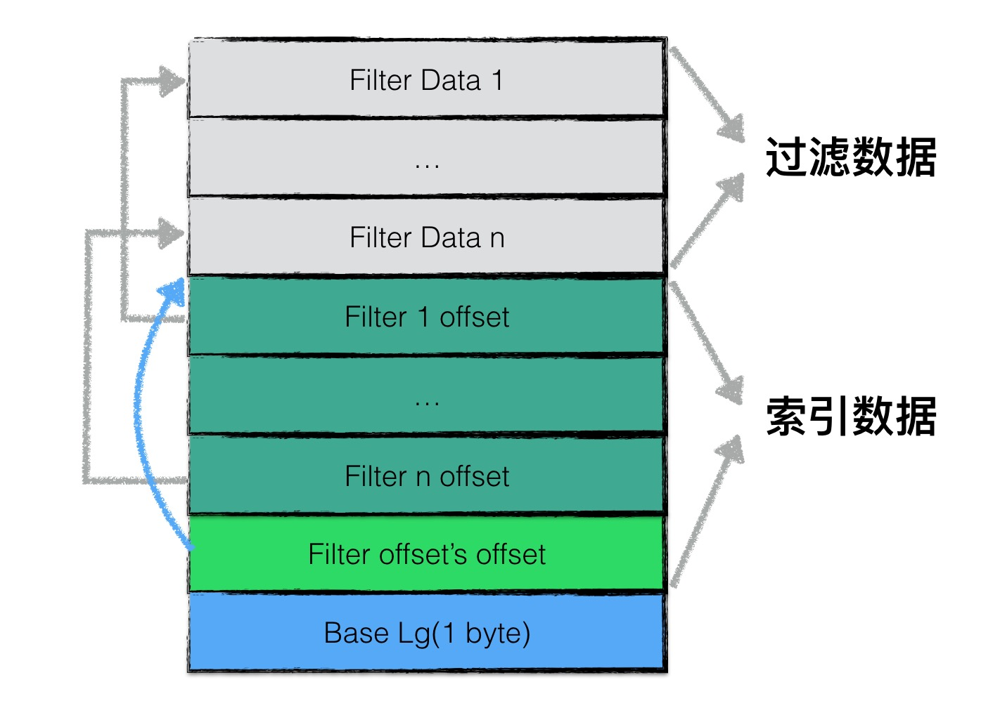
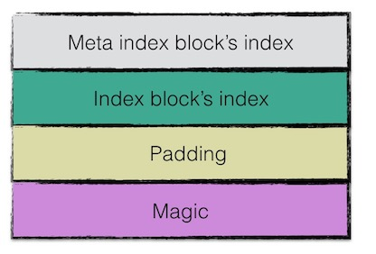

# Leveldb源码分析

## Skiplist

Leveldb内部的Memtable其核心就是Skiplist，通过Skiplist来存放所有的数据，首先我们来看下Skiplist的结构，如下图:


通过上面的Skiplist结构可知，一个Skiplist是多个链表的集合，每一个链表都有一个header指针，指向这个链表，Leveldb中使用一个数组来存储
所有的链表header.

```C++
struct SkipList<Key, Comparator>::Node {
  explicit Node(const Key& k) : key(k) {}

  Key const key;

  // Accessors/mutators for links.  Wrapped in methods so we can
  // add the appropriate barriers as necessary.
  Node* Next(int n) {
    assert(n >= 0);
    // Use an 'acquire load' so that we observe a fully initialized
    // version of the returned Node.
    return next_[n].load(std::memory_order_acquire);
  }
  void SetNext(int n, Node* x) {
    assert(n >= 0);
    // Use a 'release store' so that anybody who reads through this
    // pointer observes a fully initialized version of the inserted node.
    next_[n].store(x, std::memory_order_release);
  }

  // No-barrier variants that can be safely used in a few locations.
  Node* NoBarrier_Next(int n) {
    assert(n >= 0);
    return next_[n].load(std::memory_order_relaxed);
  }
  void NoBarrier_SetNext(int n, Node* x) {
    assert(n >= 0);
    next_[n].store(x, std::memory_order_relaxed);
  }

 private:
  // Array of length equal to the node height.  next_[0] is lowest level link.
  // 这是一个数组，使用了C/C++中的柔性数组的能力。
  std::atomic<Node*> next_[1];
};

typename SkipList<Key, Comparator>::Node* SkipList<Key, Comparator>::NewNode(
    const Key& key, int height) {
  // 根据指定的高度分配数组。
  char* const node_memory = arena_->AllocateAligned(
      sizeof(Node) + sizeof(std::atomic<Node*>) * (height - 1));
  return new (node_memory) Node(key);
}
```

这个链表数组中的第一个链表被称为Level0，通过这个链表可以遍历所有的数据，Levele1以及后面的链表则这是包含了部分数据。而且越大的level所包含的数据越少。
这么做的目的是为了在查找的时候可以更快的找到数据的位置，接下来我们来看下整个查找过程是如何的，




1. 首先从最大的Level所对应的链表进行查找(上图中就是level3)
2. 在当前遍历链表找到第一个大于或者等于要查找的key的位置或者直接查找到结束(也就是元素6的位置，因为后面没有节点了)
3. 如果当前level没有查找到就继续切换到下一个level进行查找(切换到level2，继续查找，还是在当前位置，因为25大于17找到了，继续切换到level1，这个时候找到了9)
4. 直到在level0中找到这样的位置，并返回(找到了12，然后和17进行对比发现不相等。)


```C++
bool SkipList<Key, Comparator>::Contains(const Key& key) const {
  Node* x = FindGreaterOrEqual(key, nullptr);
  if (x != nullptr && Equal(key, x->key)) {
    return true;
  } else {
    return false;
  }
}

template <typename Key, class Comparator>
bool SkipList<Key, Comparator>::KeyIsAfterNode(const Key& key, Node* n) const {
  // null n is considered infinite
  return (n != nullptr) && (compare_(n->key, key) < 0);
}

// 总是返回第一个大于等于key的前一个节点。
template <typename Key, class Comparator>
typename SkipList<Key, Comparator>::Node*
SkipList<Key, Comparator>::FindGreaterOrEqual(const Key& key,
                                              Node** prev) const {
  Node* x = head_;
  // 1. 从最大的Level开始查找
  int level = GetMaxHeight() - 1;
  while (true) {
    // 2. 遍历链表，找到第一个大于等于key的节点。
    Node* next = x->Next(level);
    if (KeyIsAfterNode(key, next)) {
      // 没有大于等于key，并且还未遍历结束，继续在当前链表进行查找
      // Keep searching in this list
      x = next;
    } else {
      // 找到第一个大于等于key的节点或者当前level遍历结束了。
      if (prev != nullptr) prev[level] = x;
      // 如果是最后一层了，就直接返回
      if (level == 0) {
        return next;
      } else {
        // 切换到下一个level继续查找
        // Switch to next list
        level--;
      }
    }
  }
}
```

从上面的查找过程可以看到从高的level开始查找的目的是为了快速找到要查找的数据在level0的大概位置，有点类似二分查找。所有的数据都可以通过level0遍历到，
高的level中只包含了level0中的部分数据。最后我们来看下如果插入数据来构建skiplist，插入过程如下图:



1. 首先找到大于等于要查找节点的前一个节点，并记录每一个level下找到的大于等于要查找数据的前一个节点。
2. 如果有相同的key就插入失败。
3. 随机获取一个高度，比如这里获取的高度是1
4. 构造新节点，并让level0指向新节点，然后找到随机获取的level所对应的前一个节点，然后指向这个新节点。

```C++
void SkipList<Key, Comparator>::Insert(const Key& key) {
  // TODO(opt): We can use a barrier-free variant of FindGreaterOrEqual()
  // here since Insert() is externally synchronized.
  Node* prev[kMaxHeight];
  Node* x = FindGreaterOrEqual(key, prev);

  // Our data structure does not allow duplicate insertion
  assert(x == nullptr || !Equal(key, x->key));

  int height = RandomHeight();
  // 如果大于当前的最大高度就进行扩展，从最大高度到获取的随机高度之间设置prev为header
  // 也就是在这个范围内，直接用header指针指向新创建的元素。
  if (height > GetMaxHeight()) {
    for (int i = GetMaxHeight(); i < height; i++) {
      prev[i] = head_;
    }
    // It is ok to mutate max_height_ without any synchronization
    // with concurrent readers.  A concurrent reader that observes
    // the new value of max_height_ will see either the old value of
    // new level pointers from head_ (nullptr), or a new value set in
    // the loop below.  In the former case the reader will
    // immediately drop to the next level since nullptr sorts after all
    // keys.  In the latter case the reader will use the new node.
    max_height_.store(height, std::memory_order_relaxed);
  }

  // 创建新的节点
  x = NewNode(key, height);
  // 从level0开始，插入到每一层。
  for (int i = 0; i < height; i++) {
    // NoBarrier_SetNext() suffices since we will add a barrier when
    // we publish a pointer to "x" in prev[i].
    x->NoBarrier_SetNext(i, prev[i]->NoBarrier_Next(i));
    prev[i]->SetNext(i, x);
  }
}
```

通过上面的代码可以看到，核心点在于随机获取了一个高度，然后从level0开始到这个高度的每一层都会插入这个新节点。

## Memtable

Leveldb写入数据时并不是直接写磁盘，而是首先写入到内存中，然后通过后台线程进行compact并写入到磁盘，而Memtable就是leveldb在内存中用来存储写入数据的结构。
所有写入的内容都会同Memtable进行排序存储，等这个Memtable的容量达到一个阀值时就将其设置为只读，然后重新创建一个新的Memtable继续提供写入操作。一个`Memtable`
核心提供了下面两个接口，通过这两个接口来实现增删查。


```C++

  // Add an entry into memtable that maps key to value at the
  // specified sequence number and with the specified type.
  // Typically value will be empty if type==kTypeDeletion.
  void Add(SequenceNumber seq, ValueType type, const Slice& key,
           const Slice& value);

  // If memtable contains a value for key, store it in *value and return true.
  // If memtable contains a deletion for key, store a NotFound() error
  // in *status and return true.
  // Else, return false.
  bool Get(const LookupKey& key, std::string* value, Status* s);
```

首先我们来看下它的`Add`方法的实现。

```C++
void MemTable::Add(SequenceNumber s, ValueType type, const Slice& key,
                   const Slice& value) {
  // Format of an entry is concatenation of:
  //  key_size     : varint32 of internal_key.size()
  //  key bytes    : char[internal_key.size()]
  //  value_size   : varint32 of value.size()
  //  value bytes  : char[value.size()]
  size_t key_size = key.size();
  size_t val_size = value.size();
  size_t internal_key_size = key_size + 8;
  const size_t encoded_len = VarintLength(internal_key_size) +
                             internal_key_size + VarintLength(val_size) +
                             val_size;
  char* buf = arena_.Allocate(encoded_len);
  char* p = EncodeVarint32(buf, internal_key_size);
  std::memcpy(p, key.data(), key_size);
  p += key_size;
  EncodeFixed64(p, (s << 8) | type);
  p += 8;
  p = EncodeVarint32(p, val_size);
  std::memcpy(p, value.data(), val_size);
  assert(p + val_size == buf + encoded_len);
  table_.Insert(buf);
}
```

将key和value进行编码，编码的格式为`key_size`、`key`、`value_size`、`value`，其中key部分又做了一次编码，包装成了internal_key，其编码格式如下图：



这么做的目的是为了解决两个问题，第一个问题就是将删除变成add，真正的删除在进行Compaction的时候进行，因此在编码Key的时候添加了type标志，标记这个key是删除
还是添加。另外一个问题就是对象相同key的处理，如何区分新旧，因此Leveldb引入了`sequence number`，每次插入都会进行递增，因此相同的key一定具有不同的`sequence number`，
谁的`sequence number`大谁就是最新的key。所以需要将`sequence number`也编码到key中，最终产生了这个internal_key。 


Memtable是在内存中的，而且只有到达一定的大小才会通过Compaction写入到磁盘，如果在这过程中出现了异常如何保证数据不丢失呢? 这就需要WAL了。

## WAL(Write-ahead logging)

Leveldb每次在进行数据写入的时候都会先将数据写到日志文件中，然后再往Memtable中写，这样做的目的是为了防止在写入Memtable的过程中因为进程异常、系统掉电等情况导致数据丢失。
日志文件是按照Block来组织的，每个Block大小为32K，一个Block中会包含多个记录。每条记录都包含了四个部分，分别是: `Checksum`、`Length`、`RecordType`、`Data`。格式如下图:



其中这里的`RecordType`其取值范围如下:

```C++
enum RecordType {
  // Zero is reserved for preallocated files
  kZeroType = 0,

  kFullType = 1,

  // For fragments
  kFirstType = 2,
  kMiddleType = 3,
  kLastType = 4
};
```

这个`RecordType`的目的主要是为了解决那些单条数据超过32K大小的问题，对于这类数据只能分成多条记录来写，因此有了`RecordType`来表示当前的记录是否是完整的，还是片段，如果是片段，那那个是第一个片段、
那些是中间片段、那个是最后一个片段，通过`RecordType`就可以将多个片段组装一条完整的记录。`Chechsum`部分很好理解，就是记录了当前记录的校验和，用来做数据正确性校验的。`Length`部分则是用来标识


Leveldb规定`Checksum`占4个字节(正好满足crc32算法的需求)，`Length`占2个字节(2^16次方正好是32K，一个block的大小，所以是足够的)、 `RecordType`占用1个字节。这三个部分被称为固定的Header，总共
占用7个字节，下面这个方法就是用来写入一条完整记录的方法。

```C++
Status Writer::EmitPhysicalRecord(RecordType t, const char* ptr,
                                  size_t length) {
  assert(length <= 0xffff);  // Must fit in two bytes
  assert(block_offset_ + kHeaderSize + length <= kBlockSize);

  // Format the header
  // 1. 先写入header和RecordType
  char buf[kHeaderSize];
  buf[4] = static_cast<char>(length & 0xff);
  buf[5] = static_cast<char>(length >> 8);
  buf[6] = static_cast<char>(t);
  // 2. 开始计算crc32，然后写入
  // Compute the crc of the record type and the payload.
  uint32_t crc = crc32c::Extend(type_crc_[t], ptr, length);
  crc = crc32c::Mask(crc);  // Adjust for storage
  EncodeFixed32(buf, crc);
  // 3. 最后写入Data
  // Write the header and the payload
  Status s = dest_->Append(Slice(buf, kHeaderSize));
  if (s.ok()) {
    s = dest_->Append(Slice(ptr, length));
    if (s.ok()) {
      s = dest_->Flush();
    }
  }
  block_offset_ += kHeaderSize + length;
  return s;
}
```

到此为止日志的写入过程就分析完了，接下来我们看下WAL实际是如何使用的，下面是Leveldb批量写的实现。

!!! Tips
    Leveldb的写入总是批量的，即使有单次写入的API，最终在内部使用的时候，也是使用批量写的方式来做的。

    ```C++
    Status DB::Put(const WriteOptions& opt, const Slice& key, const Slice& value) {
        WriteBatch batch;
        batch.Put(key, value);
        return Write(opt, &batch);
    }
    ```


```C++
Status DBImpl::Write(const WriteOptions& options, WriteBatch* updates) {
  ......
  if (status.ok() && updates != nullptr) {  // nullptr batch is for compactions
    WriteBatch* write_batch = BuildBatchGroup(&last_writer);
    WriteBatchInternal::SetSequence(write_batch, last_sequence + 1);
    last_sequence += WriteBatchInternal::Count(write_batch);

    // Add to log and apply to memtable.  We can release the lock
    // during this phase since &w is currently responsible for logging
    // and protects against concurrent loggers and concurrent writes
    // into mem_.
    {
      mutex_.Unlock();
      // 1. 先写WAL
      status = log_->AddRecord(WriteBatchInternal::Contents(write_batch));
      bool sync_error = false;
      if (status.ok() && options.sync) {
        status = logfile_->Sync();
        if (!status.ok()) {
          sync_error = true;
        }
      }
      if (status.ok()) {
       // 2. 再写入Memtable
        status = WriteBatchInternal::InsertInto(write_batch, mem_);
      }
      mutex_.Lock();
      if (sync_error) {
        // The state of the log file is indeterminate: the log record we
        // just added may or may not show up when the DB is re-opened.
        // So we force the DB into a mode where all future writes fail.
        RecordBackgroundError(status);
      }
    }
    if (write_batch == tmp_batch_) tmp_batch_->Clear();

    versions_->SetLastSequence(last_sequence);
  }
  ......
```

通过上面的代码我们可以看到，实际上一条记录中的数据包含了`WriteBatch`中的多个key/value，那么问题来了，我通过WAL读取到记录后，也成功拿到了保存的数据，那么我如何从这个数据中获取到多个key/value呢？
WAL是不管数据中有多少key/value的，他只负责存储和读取数据，至于读到的数据如何解析成多个key/value，这个是交由使用者来处理的。WAL可以在多个地方被使用，其Data部分的格式可以是任意的，在Leveldb中不仅仅
是用来存放key/value，还被用来存放`Manifest`了。


WAL文件何时删除呢? 如果一直持续的写入那么WAL文件迟早会撑暴。而且WAL文件那么大，在出现故障的时候恢复也是一个问题，另外在Leveldb进行Compaction后部分key/value将会落盘，那么WAL中对应的数据也应该要被清理掉。否则就会导致数据重复的问题。在`Memtable`部分我们介绍过，`Memtable`的大小到达一个阀值时会被冻结变成`immutable`，只能被读取无法进行写入，这个时候对应的WAL文件也会被冻结，然后创建一个新的WAL文件，等`immutable`进行Compaction后被写入到磁盘时，对应的WAL文件才能安全的删除。

```C++
Status DBImpl::MakeRoomForWrite(bool force) {
  ......
  while (true) {
    if (!bg_error_.ok()) {
      // Yield previous error
      s = bg_error_;
      break;
    } else if (allow_delay && versions_->NumLevelFiles(0) >=
                                  config::kL0_SlowdownWritesTrigger) {
      // We are getting close to hitting a hard limit on the number of
      // L0 files.  Rather than delaying a single write by several
      // seconds when we hit the hard limit, start delaying each
      // individual write by 1ms to reduce latency variance.  Also,
      // this delay hands over some CPU to the compaction thread in
      // case it is sharing the same core as the writer.
      mutex_.Unlock();
      env_->SleepForMicroseconds(1000);
      allow_delay = false;  // Do not delay a single write more than once
      mutex_.Lock();
    } else if (!force &&
               (mem_->ApproximateMemoryUsage() <= options_.write_buffer_size)) {
      // There is room in current memtable
      break;
    } else if (imm_ != nullptr) {
      // We have filled up the current memtable, but the previous
      // one is still being compacted, so we wait.
      Log(options_.info_log, "Current memtable full; waiting...\n");
      background_work_finished_signal_.Wait();
    } else if (versions_->NumLevelFiles(0) >= config::kL0_StopWritesTrigger) {
      // There are too many level-0 files.
      Log(options_.info_log, "Too many L0 files; waiting...\n");
      background_work_finished_signal_.Wait();
    } else {
      // 创建immutable，获取新的WAL文件名，然后重新打开，后续使用新的WAL文件。
      // Attempt to switch to a new memtable and trigger compaction of old
      assert(versions_->PrevLogNumber() == 0);
      uint64_t new_log_number = versions_->NewFileNumber();
      WritableFile* lfile = nullptr;
      s = env_->NewWritableFile(LogFileName(dbname_, new_log_number), &lfile);
      if (!s.ok()) {
        // Avoid chewing through file number space in a tight loop.
        versions_->ReuseFileNumber(new_log_number);
        break;
      }
      delete log_;
      delete logfile_;
      logfile_ = lfile;
      logfile_number_ = new_log_number;
      log_ = new log::Writer(lfile);
      imm_ = mem_;
      has_imm_.store(true, std::memory_order_release);
      mem_ = new MemTable(internal_comparator_);
      mem_->Ref();
      force = false;  // Do not force another compaction if have room
      MaybeScheduleCompaction();
    }
  }
  return s;
}
```

`MakeRoomForWrite`每次在发生写入的时候都会调用，会判断当前的`Memtable`大小是否超过阀值，如果超过了就切换成功`immutable`，并重新打开一个新的WAL文件用于记录。
接着我们来看下Compaction的实现。

```C++
void DBImpl::CompactMemTable() {
  mutex_.AssertHeld();
  assert(imm_ != nullptr);

  // Save the contents of the memtable as a new Table
  VersionEdit edit;
  Version* base = versions_->current();
  base->Ref();
  // 将Memtable写成sstable
  Status s = WriteLevel0Table(imm_, &edit, base);
  base->Unref();

  if (s.ok() && shutting_down_.load(std::memory_order_acquire)) {
    s = Status::IOError("Deleting DB during memtable compaction");
  }

  // Replace immutable memtable with the generated Table
  if (s.ok()) {
    edit.SetPrevLogNumber(0);
    edit.SetLogNumber(logfile_number_);  // Earlier logs no longer needed
    s = versions_->LogAndApply(&edit, &mutex_);
  }

  if (s.ok()) {
    // Commit to the new state
    imm_->Unref();
    imm_ = nullptr;
    has_imm_.store(false, std::memory_order_release);
    // Compaction完成后，删除不需要的文件，包含了WAL文件。
    RemoveObsoleteFiles();
  } else {
    RecordBackgroundError(s);
  }
}
```


## Batch

Leveldb中每次都写都是通过Batch的方式进行批量操作，而Batch本质上做的事情就是将多次操作进行了编码，先通过WAL日志将编码后的内容落盘，然后交由Memtable进行批量写入，首先让我们看下Batch的结构。


```C++
class LEVELDB_EXPORT WriteBatch {
  public:
    .....
  private:
  friend class WriteBatchInternal;
  // 核心就是一个string，每次操作都会编码成string放在这里。
  std::string rep_;  // See comment in write_batch.cc for the format of rep_
};
```

接着我们看下WriteBatch是如何存放一次操作的。

```C++
void WriteBatch::Put(const Slice& key, const Slice& value) {
  WriteBatchInternal::SetCount(this, WriteBatchInternal::Count(this) + 1);
  rep_.push_back(static_cast<char>(kTypeValue));
  // 先通过varint把size写入，接着写内容
  PutLengthPrefixedSlice(&rep_, key);
  PutLengthPrefixedSlice(&rep_, value);
}
```

1. 先更新了WriteBatch中存放的操作个数
2. 接着写入操作类型
3. 最后将key和value的内容写入


最后我们来看下，一个WriteBatch编码后的内容格式，如下图:


一条数据包含了`sequence number`、`entry number`、`batch data`，前8个字节用来存放sequence nunber，一次WriteBatch会分配一个递增的sequence nunber。
接着8个字节用来存放这个WriteBatch中包含了多少次操作，接着就是每一次操作的具体内容了，就是上面提到的写入操作类型、key/value值等。

## SStable

Leveldb通过WriteBatch批量进行多次操作，将多次操作编码后交由WAL进行日志落盘，最后交给Memtable进行批量写入到内存，每次写入之前会调用`MakeRoomForWrite`来决定是否需要进行
Compation将Memtable变成SStable，那么SStable到底是什么呢? `WriteLevel0Table`就是其中最为关键的一个函数，通过这个函数将Memtable变成了SStable。 接下来让我们来看下这个
函数到底做了什么?

```C++
Status DBImpl::WriteLevel0Table(MemTable* mem, VersionEdit* edit,
                                Version* base) {
  mutex_.AssertHeld();
  const uint64_t start_micros = env_->NowMicros();
  // 1. 创建FileMetaData，用来描述产生的sstable文件
  FileMetaData meta;
  // 1.1 生成一个新的FileNumber，sstable文件的名字是有FileNumber组成的
  meta.number = versions_->NewFileNumber();
  pending_outputs_.insert(meta.number);
  // 1.2 创建Memtable迭代器准备写入到sstable文件中
  Iterator* iter = mem->NewIterator();
  Log(options_.info_log, "Level-0 table #%llu: started",
      (unsigned long long)meta.number);

  Status s;
  {
    mutex_.Unlock();
    // 2. 构建Table
    s = BuildTable(dbname_, env_, options_, table_cache_, iter, &meta);
    mutex_.Lock();
  }

  Log(options_.info_log, "Level-0 table #%llu: %lld bytes %s",
      (unsigned long long)meta.number, (unsigned long long)meta.file_size,
      s.ToString().c_str());
  delete iter;
  pending_outputs_.erase(meta.number);

  // Note that if file_size is zero, the file has been deleted and
  // should not be added to the manifest.
  // 3. 将文件添加到VersionEdit中
  int level = 0;
  if (s.ok() && meta.file_size > 0) {
    const Slice min_user_key = meta.smallest.user_key();
    const Slice max_user_key = meta.largest.user_key();
    if (base != nullptr) {
      level = base->PickLevelForMemTableOutput(min_user_key, max_user_key);
    }
    edit->AddFile(level, meta.number, meta.file_size, meta.smallest,
                  meta.largest);
  }

  CompactionStats stats;
  stats.micros = env_->NowMicros() - start_micros;
  stats.bytes_written = meta.file_size;
  stats_[level].Add(stats);
  return s;
}
```

可以看到，构建sstable的核心在于`BuildTable`，构建好后会产生一个文件，这个文件的元信息则是通过`FileMetaData`来描述的，最后会将这个文件的元信息存入到`VersionEdit`中。
然后Apply到`Version`中。关于`Version`和`VersionEdit`后面的重点分析，现在我们重点来看下BuildTable的实现。


```C++
Status BuildTable(const std::string& dbname, Env* env, const Options& options,
                  TableCache* table_cache, Iterator* iter, FileMetaData* meta) {
  Status s;
  meta->file_size = 0;
  iter->SeekToFirst();
  // 1. 构造Table文件名
  std::string fname = TableFileName(dbname, meta->number);
  if (iter->Valid()) {
    WritableFile* file;
    s = env->NewWritableFile(fname, &file);
    if (!s.ok()) {
      return s;
    }

    TableBuilder* builder = new TableBuilder(options, file);
    meta->smallest.DecodeFrom(iter->key());
    Slice key;
    // 2. 遍历Memtable，将key/value存入到Table中
    // 因为Memtable是有序的，因此第一个key是最小的key，最后的key是最大的key
    // 将最小key和最大key这两个元信息存入到FileMeta中
    for (; iter->Valid(); iter->Next()) {
      key = iter->key();
      builder->Add(key, iter->value());
    }
    if (!key.empty()) {
      meta->largest.DecodeFrom(key);
    }

    // Finish and check for builder errors
    s = builder->Finish();
    if (s.ok()) {
      meta->file_size = builder->FileSize();
      assert(meta->file_size > 0);
    }
    delete builder;

    // Finish and check for file errors
    // 3. 完成table构建后，开始进行文件sync，确保文件落盘
    if (s.ok()) {
      s = file->Sync();
    }
    if (s.ok()) {
      s = file->Close();
    }
    delete file;
    file = nullptr;

    if (s.ok()) {
      // Verify that the table is usable
      Iterator* it = table_cache->NewIterator(ReadOptions(), meta->number,
                                              meta->file_size);
      s = it->status();
      delete it;
    }
  }

  // Check for input iterator errors
  if (!iter->status().ok()) {
    s = iter->status();
  }

  if (s.ok() && meta->file_size > 0) {
    // Keep it
  } else {
    env->RemoveFile(fname);
  }
  return s;
}
```

通过上面的代码我们可以知道`TableBuilder`就是用来构建sstable的核心，而sstable本质上就是一个文件，文件内容是一系列排序好的key/value进行编码后的内容，那么它的格式到底是如何的呢?



为了提高整体的读写效率，一个sstable文件按照固定大小进行块划分，默认每个块的大小为4KiB。每个Block中，除了存储数据以外，还会存储两个额外的辅助字段：压缩类型和CRC校验码，上图就是其整体的
物理结构。进一步上面的Data部分又被分为了五类:

1. data block 用来存储具体的key value数据
2. filter block 用来存储一些过滤器相关的数据
3. meta index block 用来存储filter block的索引信息(也就是filter block在sstable文件中的偏移量，以及数据的长度)
4. index block 用来存储每个data block的索引信息
5. footer 用来存储meta index block和index block的索引信息




首先我们来看下data block的数据格式，如下图:



可以看到一个datablock内部包含了多个Entry，每一个Entry就是一个要存取的数据条目，也就是用户存入的key/value，让我们来看下Entry的编码格式，如下图:


一个Entry包含了5个部分，他们分别是:

1. 与前一条记录key共享部分的长度；
2. 与前一条记录key不共享部分的长度；
3. value长度；
5. 与前一条记录key非共享的内容；
6. value内容；

可以看到，一个Entry并非包含了完整的key，而是和前一个key的共享前缀，因此编码和解码的时候都需要保存上一个key的信息，才能对key进行编码或解码。这种编码方式可以有效的避免key重复内容的存储，
因为key总是有序的，所以可以最大程度的通过共享前缀的部分来节省key存储的成本，但是带来的问题也是显而易见意见的，如果要从这个文件中检索一个key的话需要完整的将所有的key都解析出来。为此leveldb
设计了`Restart point`，也就是每间隔若干个keyvalue对，将为该条记录重新存储一个完整的key。重复该过程（默认间隔值为16），每个重新存储完整key的点称之为`Restart point`。有了`Restart point`
就可以通过这些完整的key快速定位目标key所在的区域。然后通过完整的key就可以还原这个区域中所有的key信息了。为了快速找到每一个`Restart point`，leveldb会在data block的末尾存储一系列的索引信息，
和长度，方便我们在加载data block的时候就可以把这些`Restart point`加载到内存中进行快速查找，接下来我们通过下面的代码再次验证上面描述到的原理。

> 这个思想和skiplist有点类似，都是按照一定方式从原始数据进行抽样，典型的统计学原理。


```C++
void BlockBuilder::Add(const Slice& key, const Slice& value) {
  Slice last_key_piece(last_key_);
  assert(!finished_);
  assert(counter_ <= options_->block_restart_interval);
  assert(buffer_.empty()  // No values yet?
         || options_->comparator->Compare(key, last_key_piece) > 0);
  size_t shared = 0;
  // 1. 没有到Restart point的间隔，因此这里需要计算共享前缀
  if (counter_ < options_->block_restart_interval) {
    // See how much sharing to do with previous string
    const size_t min_length = std::min(last_key_piece.size(), key.size());
    while ((shared < min_length) && (last_key_piece[shared] == key[shared])) {
      shared++;
    }
  } else {
    // 2. 达到了Restart point的间隔了，因此这里需要存储完整的key/value，还需要记录索引信息(也就是restart poont的offset信息)
    // Restart compression
    restarts_.push_back(buffer_.size());
    // 计数器清零
    counter_ = 0;
  }
  const size_t non_shared = key.size() - shared;

  // 3. 开始写入共享部分的长度、非共享部分的长度、value的长度
  // Add "<shared><non_shared><value_size>" to buffer_
  PutVarint32(&buffer_, shared);
  PutVarint32(&buffer_, non_shared);
  PutVarint32(&buffer_, value.size());

  // 4. 写入共享部分的key内容、写入value的内容
  // Add string delta to buffer_ followed by value
  buffer_.append(key.data() + shared, non_shared);
  buffer_.append(value.data(), value.size());

  // 5. 更新last key，用于下一个key计算前缀
  // Update state
  last_key_.resize(shared);
  last_key_.append(key.data() + shared, non_shared);
  assert(Slice(last_key_) == key);
  counter_++;
}
```

每次添加key时产生的`Restart point`都存在了`restarts_`中，这是一个`std::vector<uint32_t>`类型，存储了每一个`Restart point`在data block中的offset。
在构建完`Restart point`后会将这些索引信息写入到data block中的尾部。

```C++
Slice BlockBuilder::Finish() {
  // Append restart array
  for (size_t i = 0; i < restarts_.size(); i++) {
    PutFixed32(&buffer_, restarts_[i]);
  }
  PutFixed32(&buffer_, restarts_.size());
  finished_ = true;
  return Slice(buffer_);
}
```

到此为止data block的构建就分析完了，通过`Restart point`可以让我们快速定位要查询的数据在data block中的位置，但是这一切的前提是我们已经知道这个data block中存在我们要查询的数据。
否则我们依然先需要遍历每一个data block。如果我们能高效的先过滤处包含要查询数据的data block那该多棒啊。Leveldb中设计了filter block帮助我们实现这个能力。接下来让我们看看filter block的格式，
以及设计filter block是如何帮助我们快速查询的吧。



通过上图可知，filter block中包含了三个部分，第一个部分存放过滤的数据、第二个部分则存放每个过滤数据的索引位置，第三个部分是用来记录第二个部分的开始位置避免和第一个部分的数据混在一起无法区分，
最后一个部分的数据是Base lg，占用1个字节，默认值是11，表示每隔2KB的数据就创建一个新的过滤器来存放。一个sstable文件只有一个filter block，其内部存储了所有data block的filter数据。
接下来让我们看下filter block是如何构建的。

```C++

void FilterBlockBuilder::StartBlock(uint64_t block_offset) {
  uint64_t filter_index = (block_offset / kFilterBase);
  assert(filter_index >= filter_offsets_.size());\
  // StartBlock(0) 这个时候不会产生任何filter数据
  // StartBlock(3K) 因为kFilterBase是2k，因此只需要产生一条filter数据即可，这个时候会调用一次GenerateFilter产生一个filter数据
  // 可以看到filter数据的产生并非严格意义上的按照2k为单位的，而只是将0~3K这个范围内添加的key一起生成一个filter数据而已。
  // StartBlock(4K) 因为kFilterBase是2k，因此需要产生二条filter数据，实际上只会生成两条内容相同的filter数据
  while (filter_index > filter_offsets_.size()) {
    GenerateFilter();
  }
}

void FilterBlockBuilder::AddKey(const Slice& key) {
  Slice k = key;
  start_.push_back(keys_.size());
  keys_.append(k.data(), k.size());
}

// 对所有的key计算处filter数据，并存入result_中
void FilterBlockBuilder::GenerateFilter() {
  const size_t num_keys = start_.size();
  if (num_keys == 0) {
    // Fast path if there are no keys for this filter
    filter_offsets_.push_back(result_.size());
    return;
  }

  // Make list of keys from flattened key structure
  start_.push_back(keys_.size());  // Simplify length computation
  tmp_keys_.resize(num_keys);
  for (size_t i = 0; i < num_keys; i++) {
    const char* base = keys_.data() + start_[i];
    size_t length = start_[i + 1] - start_[i];
    tmp_keys_[i] = Slice(base, length);
  }

  // Generate filter for current set of keys and append to result_.
  filter_offsets_.push_back(result_.size());
  policy_->CreateFilter(&tmp_keys_[0], static_cast<int>(num_keys), &result_);

  tmp_keys_.clear();
  keys_.clear();
  start_.clear();
}
```

构建filter数据是通过指定的filter过滤器，拿着所有的key作为输入，然后产生一个filter数据的结果。

```C++
Slice FilterBlockBuilder::Finish() {
  // 如果最后还有key存在，就把剩下的key生成filter数据
  if (!start_.empty()) {
    GenerateFilter();
  }

  // Append array of per-filter offsets
  // 记录filter offet的位置
  const uint32_t array_offset = result_.size();
  for (size_t i = 0; i < filter_offsets_.size(); i++) {
    // 添加filter offset
    PutFixed32(&result_, filter_offsets_[i]);
  }
  PutFixed32(&result_, array_offset);
  result_.push_back(kFilterBaseLg);  // Save encoding parameter in result
  return Slice(result_);
}
```

所有产生的filter数据都会放在一个Block中，当我们想对某一个Data Block进行过滤的时候，如何知道自己需要使用哪个filter数据呢? 这是通过Data Block的offset除以Base lg
就可以知道这块数据要使用第几个filter数据了，即使知道使用第几个filter数据，仍然不足以知道对应filter数据在Block中的offset，除非从头开始遍历。但是这样效率就太低了。
因此leveldb在Filter Block的尾部存放了索引，这些索引指明了第N个filter在Block中的offset，我们只要提前把索引加载到内存中就可以快速的找到第N个filter数据了。但是索引数据
和filter数据本身都是放在同一个block中的，我们要如何找到索引数据在Block中的位置的呢? 这就靠尾部存放的offset了，在data block尾部的有两个固定大小的内容，它告诉我们缩影数据的位置，
有了这个位置后就可以快速找到索引数据了。通过下面的`FilterBlockReader`也可以验证我们上述分析的结论。

```C++
FilterBlockReader::FilterBlockReader(const FilterPolicy* policy,
                                     const Slice& contents)
    : policy_(policy), data_(nullptr), offset_(nullptr), num_(0), base_lg_(0) {
  size_t n = contents.size();
  // 至少需要 1 + 4 个字节，1个字节存放Base lg、4个字节filter offset位置
  if (n < 5) return;  // 1 byte for base_lg_ and 4 for start of offset array
  // 先获取到base lg
  base_lg_ = contents[n - 1];
  // 获取到filter offset位置
  uint32_t last_word = DecodeFixed32(contents.data() + n - 5);
  if (last_word > n - 5) return;
  data_ = contents.data();
  offset_ = data_ + last_word;
  // 获取有多少个filter数据
  num_ = (n - 5 - last_word) / 4;
}

bool FilterBlockReader::KeyMayMatch(uint64_t block_offset, const Slice& key) {
  // block offset / base lg就可以计算出对应的filter数据在哪个位置
  uint64_t index = block_offset >> base_lg_;
  if (index < num_) {
    //找到对应filter的位置，以及下一个filter的位置
    uint32_t start = DecodeFixed32(offset_ + index * 4);
    uint32_t limit = DecodeFixed32(offset_ + index * 4 + 4);
    // 确认数据是合法的，就将filter数据保存下来，然后开始进行过滤器匹配
    if (start <= limit && limit <= static_cast<size_t>(offset_ - data_)) {
      Slice filter = Slice(data_ + start, limit - start);
      return policy_->KeyMayMatch(key, filter);
    } else if (start == limit) {
      // Empty filters do not match any keys
      return false;
    }
  }
  return true;  // Errors are treated as potential matches
}
```

Filter block本质上也是一个和Data Block一样的Block块，他们都是一起放在一个sstable文件中的，那我们如何知道Filter Block在文件中的位置呢? 
在Leveldb中是通过meta index block来进行索引的，这是一个和Data Block格式相同的block，也是key/value形式，key就是，"filter."与过滤器名字组成的常量字符串，
value为filter block在sstable中的索引信息序列化后的内容，索引信息包括：

1. 在sstable中的偏移量
2. 数据长度


索引信息在Leveldb中使用BlockHandle对象来表示。 


```C++
// BlockHandle is a pointer to the extent of a file that stores a data
// block or a meta block.
class BlockHandle {
 public:
  // Maximum encoding length of a BlockHandle
  enum { kMaxEncodedLength = 10 + 10 };

  BlockHandle();

  // The offset of the block in the file.
  uint64_t offset() const { return offset_; }
  void set_offset(uint64_t offset) { offset_ = offset; }

  // The size of the stored block
  uint64_t size() const { return size_; }
  void set_size(uint64_t size) { size_ = size; }

  void EncodeTo(std::string* dst) const;
  Status DecodeFrom(Slice* input);

 private:
  uint64_t offset_;
  uint64_t size_;
};
```

除了filter block需要索引，我们的Data Block也需要索引，Leveldb中通过index block来对Data Block进行索引，其block的格式和Data Block一样，也是key/value
形式，其key为对应Data Block的最大key，value为Data Block在sstable中的索引信息序列化后的内容，也就是offset和size。

可以看出meta index block和index block用途是相同的，都是为了对某一类block的索引，而且这两类block和Data Block本身的格式又是相同的，因此可以完全复用相同的DBlock对象。
最后为了索引meta index block和index block，Leveldb在整个sstable的尾部添加了Footer，目的是为了添加一个magic number以确保sstable是完整的，以及对meta index block
index block进行索引。下面是footer的格式。




```C++
Status Footer::DecodeFrom(Slice* input) {
  // 解码出magic number
  const char* magic_ptr = input->data() + kEncodedLength - 8;
  const uint32_t magic_lo = DecodeFixed32(magic_ptr);
  const uint32_t magic_hi = DecodeFixed32(magic_ptr + 4);
  const uint64_t magic = ((static_cast<uint64_t>(magic_hi) << 32) |
                          (static_cast<uint64_t>(magic_lo)));
  if (magic != kTableMagicNumber) {
    return Status::Corruption("not an sstable (bad magic number)");
  }

  // 解码出meta index的索引信息
  Status result = metaindex_handle_.DecodeFrom(input);
  if (result.ok()) {
    // 解码出index的索引信息
    result = index_handle_.DecodeFrom(input);
  }
  if (result.ok()) {
    // We skip over any leftover data (just padding for now) in "input"
    const char* end = magic_ptr + 8;
    *input = Slice(end, input->data() + input->size() - end);
  }
  return result;
}
```

到此维持sstable就全部分析完了，一个sstable中包含了5类信息，Data block、Filter block、meta index block、index block、footer。 读取sstable的时候
先读取footer，通过footer找到index block和meta index block，有了meta index block后就可以对查询做filter过滤，有了index block就可以定位到Data Block
最终通过遍历Data block找到最终要查询的key所对应的value。对照的代码我们再次验证我们的猜想。

```C++
Status Table::Open(const Options& options, RandomAccessFile* file,
                   uint64_t size, Table** table) {
  *table = nullptr;
  if (size < Footer::kEncodedLength) {
    return Status::Corruption("file is too short to be an sstable");
  }

  char footer_space[Footer::kEncodedLength];
  Slice footer_input;
  // 1. 读取footer
  Status s = file->Read(size - Footer::kEncodedLength, Footer::kEncodedLength,
                        &footer_input, footer_space);
  if (!s.ok()) return s;

  Footer footer;
  s = footer.DecodeFrom(&footer_input);
  if (!s.ok()) return s;

  // Read the index block
  // 2. 读取index block
  BlockContents index_block_contents;
  ReadOptions opt;
  if (options.paranoid_checks) {
    opt.verify_checksums = true;
  }
  // 通过index block的索引信息找到index block
  s = ReadBlock(file, opt, footer.index_handle(), &index_block_contents);

  if (s.ok()) {
    // We've successfully read the footer and the index block: we're
    // ready to serve requests.
    Block* index_block = new Block(index_block_contents);
    Rep* rep = new Table::Rep;
    rep->options = options;
    rep->file = file;
    rep->metaindex_handle = footer.metaindex_handle();
    rep->index_block = index_block;
    rep->cache_id = (options.block_cache ? options.block_cache->NewId() : 0);
    rep->filter_data = nullptr;
    rep->filter = nullptr;
    *table = new Table(rep);
    // 3. 读取filter block
    (*table)->ReadMeta(footer);
  }

  return s;
}
```

上面的代码是打开sstable文件，构建一个Table的过程，可以看到和我们上述描述的基本一致，通过footer加载了filter block和index block。 接着我们来看下如果在Table查询key。

```C++
Status Table::InternalGet(const ReadOptions& options, const Slice& k, void* arg,
                          void (*handle_result)(void*, const Slice&,
                                                const Slice&)) {
  Status s;
  // 1. 遍历index block中的内容
  Iterator* iiter = rep_->index_block->NewIterator(rep_->options.comparator);
  // 2. 通过key找到第一个大于要查询key的entry(index block的key就是每个data block中的最大key)
  iiter->Seek(k);
  if (iiter->Valid()) {
    // 获取value(value就是真正的Data Block的索引)
    Slice handle_value = iiter->value();
    // 3. 先进行filter过滤
    FilterBlockReader* filter = rep_->filter;
    BlockHandle handle;
    if (filter != nullptr && handle.DecodeFrom(&handle_value).ok() &&
        !filter->KeyMayMatch(handle.offset(), k)) {
      // Not found
    } else {
      // 读取Data Block
      Iterator* block_iter = BlockReader(this, options, iiter->value());
      // 4. 找到key的位置，调用handle_result处理查询到的结果
      block_iter->Seek(k);
      if (block_iter->Valid()) {
        (*handle_result)(arg, block_iter->key(), block_iter->value());
      }
      s = block_iter->status();
      delete block_iter;
    }
  }
  if (s.ok()) {
    s = iiter->status();
  }
  delete iiter;
  return s;
}
```

## Table Cache

通过Table Cache缓存Table(是sstable加载到内存后的形式)，缓存的key是file_number

```C++
Status TableCache::Get(const ReadOptions& options, uint64_t file_number,
                       uint64_t file_size, const Slice& k, void* arg,
                       void (*handle_result)(void*, const Slice&,
                                             const Slice&)) {
  Cache::Handle* handle = nullptr;
  // 根据给的file number、file size等信息将sstable加载到内存中，然后进行查询。
  // TableCache就是用来缓存sstable的。
  Status s = FindTable(file_number, file_size, &handle);
  if (s.ok()) {
    Table* t = reinterpret_cast<TableAndFile*>(cache_->Value(handle))->table;
    s = t->InternalGet(options, k, arg, handle_result);
    cache_->Release(handle);
  }
  return s;
}

Status TableCache::FindTable(uint64_t file_number, uint64_t file_size,
                             Cache::Handle** handle) {
  Status s;
  char buf[sizeof(file_number)];
  EncodeFixed64(buf, file_number);
  // file number作为Table的key
  Slice key(buf, sizeof(buf));
  // 先查询这个file number对应的sstable是否已经缓存
  *handle = cache_->Lookup(key);
  // 如果没有缓存就创建Table，并缓存起来
  if (*handle == nullptr) {
    std::string fname = TableFileName(dbname_, file_number);
    RandomAccessFile* file = nullptr;
    Table* table = nullptr;
    s = env_->NewRandomAccessFile(fname, &file);
    if (!s.ok()) {
      std::string old_fname = SSTTableFileName(dbname_, file_number);
      if (env_->NewRandomAccessFile(old_fname, &file).ok()) {
        s = Status::OK();
      }
    }
    if (s.ok()) {
      s = Table::Open(options_, file, file_size, &table);
    }

    if (!s.ok()) {
      assert(table == nullptr);
      delete file;
      // We do not cache error results so that if the error is transient,
      // or somebody repairs the file, we recover automatically.
    } else {
      TableAndFile* tf = new TableAndFile;
      tf->file = file;
      tf->table = table;
      *handle = cache_->Insert(key, tf, 1, &DeleteEntry);
    }
  }
  return s;
}
```

## Version / VersionEdit / VersionSet

每次我们进行Compation的时候，可能会新增sstable文件，也有可能会删除老的sstable文件，无论删除还是新增，这些变化都会生成VersionEdit对象，通过这个对象来描述
sstable文件的变化。VersionEdit需要Apply到Version中，通过Version我们就可以知道当前版本下有多少sstable文件。因为Leveldb可能会存在多个版本，因此就有了
VersionSet，通过链表的方式来管理多个Version。下面是一个VersionEdit如何Apply到Version的过程。


```C++
Status VersionSet::LogAndApply(VersionEdit* edit, port::Mutex* mu) {
  if (edit->has_log_number_) {
    assert(edit->log_number_ >= log_number_);
    assert(edit->log_number_ < next_file_number_);
  } else {
    edit->SetLogNumber(log_number_);
  }

  if (!edit->has_prev_log_number_) {
    edit->SetPrevLogNumber(prev_log_number_);
  }

  edit->SetNextFile(next_file_number_);
  edit->SetLastSequence(last_sequence_);

  // 1. 创建一个新的Version
  Version* v = new Version(this);
  {
    // 2. 将VersionEdit做Apply当前的Version，然后产生一个新的Version
    Builder builder(this, current_);
    builder.Apply(edit);
    builder.SaveTo(v);
  }
  // 3. 提前计算出下一次Compation需要合并的level和sstable文件
  Finalize(v);
  
  // 4. 最后将Version信息存入到Manifest文件中。
  // Initialize new descriptor log file if necessary by creating
  // a temporary file that contains a snapshot of the current version.
  std::string new_manifest_file;
  Status s;
  if (descriptor_log_ == nullptr) {
    // No reason to unlock *mu here since we only hit this path in the
    // first call to LogAndApply (when opening the database).
    assert(descriptor_file_ == nullptr);
    new_manifest_file = DescriptorFileName(dbname_, manifest_file_number_);
    edit->SetNextFile(next_file_number_);
    s = env_->NewWritableFile(new_manifest_file, &descriptor_file_);
    if (s.ok()) {
      descriptor_log_ = new log::Writer(descriptor_file_);
      s = WriteSnapshot(descriptor_log_);
    }
  }

  // Unlock during expensive MANIFEST log write
  {
    mu->Unlock();

    // Write new record to MANIFEST log
    if (s.ok()) {
      std::string record;
      edit->EncodeTo(&record);
      s = descriptor_log_->AddRecord(record);
      if (s.ok()) {
        s = descriptor_file_->Sync();
      }
      if (!s.ok()) {
        Log(options_->info_log, "MANIFEST write: %s\n", s.ToString().c_str());
      }
    }

    // If we just created a new descriptor file, install it by writing a
    // new CURRENT file that points to it.
    if (s.ok() && !new_manifest_file.empty()) {
      s = SetCurrentFile(env_, dbname_, manifest_file_number_);
    }

    mu->Lock();
  }

  // Install the new version
  // 5. 重新设置当前Version为最新产生的Version
  if (s.ok()) {
    AppendVersion(v);
    log_number_ = edit->log_number_;
    prev_log_number_ = edit->prev_log_number_;
  } else {
    delete v;
    if (!new_manifest_file.empty()) {
      delete descriptor_log_;
      delete descriptor_file_;
      descriptor_log_ = nullptr;
      descriptor_file_ = nullptr;
      env_->RemoveFile(new_manifest_file);
    }
  }

  return s;
}
```

## Manifest


## Compation

在Leveldb中Compation分为两种，第一种被称为Minor Compation，只有当immutable存在的时候才会触发，将immutable变成sstable，其过程如下:

```C++
void DBImpl::CompactMemTable() {
  mutex_.AssertHeld();
  assert(imm_ != nullptr);

  // Save the contents of the memtable as a new Table
  VersionEdit edit;
  Version* base = versions_->current();
  base->Ref();
  // 1. 产生新的sstable文件，因此这里初始化了VersionEdit来记录sstable文件的变化
  Status s = WriteLevel0Table(imm_, &edit, base);
  base->Unref();

  if (s.ok() && shutting_down_.load(std::memory_order_acquire)) {
    s = Status::IOError("Deleting DB during memtable compaction");
  }

  // Replace immutable memtable with the generated Table
  if (s.ok()) {
    edit.SetPrevLogNumber(0);
    edit.SetLogNumber(logfile_number_);  // Earlier logs no longer needed
    // 2. 应用到VersionSet中。
    s = versions_->LogAndApply(&edit, &mutex_);
  }

  if (s.ok()) {
    // 3. 释放immutable，然后异常一些废弃的文件
    // Commit to the new state
    imm_->Unref();
    imm_ = nullptr;
    has_imm_.store(false, std::memory_order_release);
    RemoveObsoleteFiles();
  } else {
    RecordBackgroundError(s);
  }
}
```

产生的sstable文件也是分为多个level的。在sstable中查找的时候，先从高level的sstable文件中查找，然后依次从下一个level中进行查找，高level的sstable包含的key范围越广。
上面的`WriteLevel0Table`也并非只是将sstable写入到level0中，而是会通过下面这个函数找到一个合适的level。

```C++
int Version::PickLevelForMemTableOutput(const Slice& smallest_user_key,
                                        const Slice& largest_user_key) {
  int level = 0;
  // 1. 先判断level0中的sstable和新增的sstable是否重叠，如果重叠就直接添加进去等着Major Compaction
  if (!OverlapInLevel(0, &smallest_user_key, &largest_user_key)) {
    // Push to next level if there is no overlap in next level,
    // and the #bytes overlapping in the level after that are limited.
    InternalKey start(smallest_user_key, kMaxSequenceNumber, kValueTypeForSeek);
    InternalKey limit(largest_user_key, 0, static_cast<ValueType>(0));
    std::vector<FileMetaData*> overlaps;
    // 2. 如果不重叠就继续往下一个level查找，如果下一个level也不重叠，并且下下个level重叠的大小小于 10 * 2M。
    while (level < config::kMaxMemCompactLevel) {
      if (OverlapInLevel(level + 1, &smallest_user_key, &largest_user_key)) {
        break;
      }
      if (level + 2 < config::kNumLevels) {
        // Check that file does not overlap too many grandparent bytes.
        GetOverlappingInputs(level + 2, &start, &limit, &overlaps);
        const int64_t sum = TotalFileSize(overlaps);
        if (sum > MaxGrandParentOverlapBytes(vset_->options_)) {
          break;
        }
      }
      // 3. 符合条件递增level，继续查找。
      level++;
    }
  }
  return level;
}
```

这么做的目的是为了避免Compation，当一个sstable文件准备添加进去的时候，如果和level0并没有任何键重叠，并且上一层也没有重叠，而且上上层重叠大小不超过20M，那么可以直接
将文件放到上一层，避免Major Compaction，算是一种优化吧。不过这个条件还是挺苛刻的。后面在谈到Major Compaction的时候会说到leveldb中更多关于Compation的优化。
到此为止minor Compation算是讲完了，还是比较简单的，这也是leveldb对于Minor Compation的要求，要求其尽可能短的时间内完成，否则会堵塞正常的写入操作，因此Minor Compation
的优先级是高于major compation。

Leveldb中除了上面谈到的Minor Compation外，还有一个最重要的Compation就是Major Compation了，上面说到一次minor compaction的产出是一个0层的sstable文件(也有可能因为优化产生一个高level的文件)，
其中包含了所有的内存数据。但是若干个0层文件中是可能存在数据overlap的。如果只有minor compaction，那么要查询一个数据的时候，就导致了我们需要遍历所有的level0文件。为此有了Major Compation。
通过Major Compation将level0层中重叠的文件进行merge变成不重叠的文件，并放到level1中。以确保level1的文件都是不重叠的，那么我们只需要在level1中搜索依次就可以找到目的文件了。那么到底何时触发Major Compation呢? Major Compation的过程是如何的? 首先来看下Major Compation发生的条件:

1. 当0层文件数超过预定的上限（默认为4个）
2. 当level i层文件的总大小超过(10 ^ i) MB；
3. 当某个文件无效读取的次数过多

每次做完Minor Compation的时候都会调用`Finalize`来计算Major Compation需要操作的文件和level，计算的条件就是上面的第一条和第二条，下面这个函数会将第一个和第二条件转换分数进行计算。

```C++
void VersionSet::Finalize(Version* v) {
  // Precomputed best level for next compaction
  int best_level = -1;
  double best_score = -1;

  for (int level = 0; level < config::kNumLevels - 1; level++) {
    double score;
    if (level == 0) {
      // We treat level-0 specially by bounding the number of files
      // instead of number of bytes for two reasons:
      //
      // (1) With larger write-buffer sizes, it is nice not to do too
      // many level-0 compactions.
      //
      // (2) The files in level-0 are merged on every read and
      // therefore we wish to avoid too many files when the individual
      // file size is small (perhaps because of a small write-buffer
      // setting, or very high compression ratios, or lots of
      // overwrites/deletions).
      score = v->files_[level].size() /
              static_cast<double>(config::kL0_CompactionTrigger);
    } else {
      // Compute the ratio of current size to size limit.
      const uint64_t level_bytes = TotalFileSize(v->files_[level]);
      score =
          static_cast<double>(level_bytes) / MaxBytesForLevel(options_, level);
    }

    if (score > best_score) {
      best_level = level;
      best_score = score;
    }
  }

  v->compaction_level_ = best_level;
  v->compaction_score_ = best_score;
}
```

每次进行数据查询的时候，都会产生stats，这些stats记录了哪个文件未查询到的次数，如果无效读取次数太多就会记录下来，保存在`file_to_compact_`中，这就是对应到上面的第三个条件。

```C++
bool Version::UpdateStats(const GetStats& stats) {
  FileMetaData* f = stats.seek_file;
  if (f != nullptr) {
    f->allowed_seeks--;
    if (f->allowed_seeks <= 0 && file_to_compact_ == nullptr) {
      file_to_compact_ = f;
      file_to_compact_level_ = stats.seek_file_level;
      return true;
    }
  }
  return false;
}
```

最后通过compaction_score_和file_to_compact_两个值来决定是否需要做Major Compation。

```C++
  // Returns true iff some level needs a compaction.
  bool NeedsCompaction() const {
    Version* v = current_;
    return (v->compaction_score_ >= 1) || (v->file_to_compact_ != nullptr);
  }

  void DBImpl::MaybeScheduleCompaction() {
  mutex_.AssertHeld();
  if (background_compaction_scheduled_) {
    // Already scheduled
  } else if (shutting_down_.load(std::memory_order_acquire)) {
    // DB is being deleted; no more background compactions
  } else if (!bg_error_.ok()) {
    // Already got an error; no more changes
  } else if (imm_ == nullptr && manual_compaction_ == nullptr &&
             !versions_->NeedsCompaction()) {
    // No work to be done
  } else {
    // 如果满足Compation的条件，开始进行下一次Compation
    background_compaction_scheduled_ = true;
    env_->Schedule(&DBImpl::BGWork, this);
  }
}
```

MaybeScheduleCompaction会在以下几个地方执行。

1. 上一次Compation完成后，会调用MaybeScheduleCompaction，决定是否需要进行下一次Compation
2. 每次查询完数据后，会调用MaybeScheduleCompaction
3. Mmemtab切换成immutable的时候
4. RecordReadSample

说完了Major Compation触发的条件，那么接下来我们来看看Major Compation的过程是如何的?

```C++
Compaction* VersionSet::PickCompaction() {
  Compaction* c;
  int level;

  // We prefer compactions triggered by too much data in a level over
  // the compactions triggered by seeks.
  const bool size_compaction = (current_->compaction_score_ >= 1);
  const bool seek_compaction = (current_->file_to_compact_ != nullptr);
  if (size_compaction) {
    level = current_->compaction_level_;
    assert(level >= 0);
    assert(level + 1 < config::kNumLevels);
    c = new Compaction(options_, level);

    // Pick the first file that comes after compact_pointer_[level]
    for (size_t i = 0; i < current_->files_[level].size(); i++) {
      FileMetaData* f = current_->files_[level][i];
      if (compact_pointer_[level].empty() ||
          icmp_.Compare(f->largest.Encode(), compact_pointer_[level]) > 0) {
        c->inputs_[0].push_back(f);
        break;
      }
    }
    if (c->inputs_[0].empty()) {
      // Wrap-around to the beginning of the key space
      c->inputs_[0].push_back(current_->files_[level][0]);
    }
  } else if (seek_compaction) {
    level = current_->file_to_compact_level_;
    c = new Compaction(options_, level);
    c->inputs_[0].push_back(current_->file_to_compact_);
  } else {
    return nullptr;
  }

  c->input_version_ = current_;
  c->input_version_->Ref();

  // Files in level 0 may overlap each other, so pick up all overlapping ones
  if (level == 0) {
    InternalKey smallest, largest;
    GetRange(c->inputs_[0], &smallest, &largest);
    // Note that the next call will discard the file we placed in
    // c->inputs_[0] earlier and replace it with an overlapping set
    // which will include the picked file.
    current_->GetOverlappingInputs(0, &smallest, &largest, &c->inputs_[0]);
    assert(!c->inputs_[0].empty());
  }

  SetupOtherInputs(c);

  return c;
}
```

## FileType

1. `CURRENT`

里面存放了当前的MANIFEST文件名称，通过CURRENT文件可以找到MANIFEST文件路径

2. `LOCK`

文件锁，避免多个进程同时操作相同的数据库文件


3. `LOG`

Leveldb自己的日志

4. `LOG.old`


5. `MANIFEST-[0-9]+`
6. `[0-9]+.(log|sst|ldb)`


## 参考文献

* [Leveldb-handbook](https://leveldb-handbook.readthedocs.io/zh/latest)