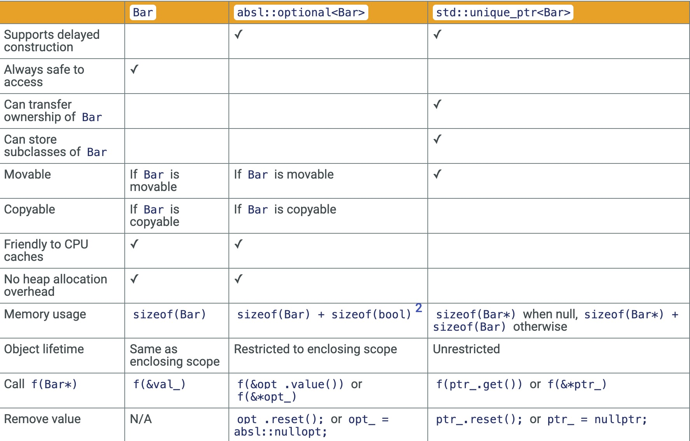

---
hide:
  - toc        # Hide table of contents
---
# Tip of the Week #123: absl::optional and std::unique_ptr

> Originally posted as totw/123 on 2016-09-06
> By Alexey Sokolov (sokolov@google.com) and Etienne Dechamps (edechamps@google.com)

## How to Store Values

本Tips讨论了几种存储值的方法。这里我们以类成员变量为例，但是以下许多要点也适用于局部变量。

```cpp
#include <memory>
#include "third_party/absl/types/optional.h"
#include ".../bar.h"

class Foo {
  ...
 private:
  Bar val_;
  absl::optional<Bar> opt_;
  std::unique_ptr<Bar> ptr_;
};
```

### As a Bare Object

这是最简单的方法。 `val_`分别在`Foo`的构造函数和`Foo`的析构函数中进行构造和销毁的。如果`Bar`具有默认构造函数，甚至无需显式初始化。
`val`_非常安全，因为其值不能为`null`。这样可以消除一类潜在的错误。

但是裸的对象不是很灵活：

* `val_`的生存期从根本上与其父`Foo`对象的生命周期相关，这有时是不期望的，如果`Bar`支持移动或交换操作，则可以使用这些操作替换`val_`的内容，
  而任何现有的`val_`指针或引用将继续指向或引用同一`val_`对象（作为容器），而不是指向其中存储的值。

* 需要传递给`Bar`构造函数的任何参数都必须在`Foo`的构造函数的初始化列表中进行计算，如果涉及复杂的表达式，则可能会很困难。

### As absl::optional<Bar>

这是裸露对象的简单性与`std::unique_ptr`的灵活性之间结合体，该对象存储在`Foo`中，但是与裸对象不同，`absl::optional`可以为空。
可以随时通过赋值`(opt_ = ...)`或通过原地构造对象`(opt_.emplace（...))`来填充它。由于对象是内联存储的，因此有关在栈上分配大对象的常见警告也适用于`absl::optional`
就像裸对象一样。另请注意，空的`absl::optional`使用的内存与填充的内存一样多。

与裸对象相比，`absl::optional`具有一些缺点：

* 对于读者来说，对象构造和析构发生的地方不太明显。
* 存在访问不存在的对象的风险

### As std::unique_ptr<Bar>

这是最灵活的方式。该对象存储在`Foo`外部。就像`absl::optional`一样，`std::unique_ptr`可以为空，但是,与`absl::optional`不同的是，
可以将对象的所有权转移到别的对象上(通过一个移动操作),或者从别的对象获取所有权(构造或通过赋值)时,或者假设从一个原始指针获取所有权(构造或通过`ptr_ = absl::WrapUnique(…)`)
更多细节可以参考[TotW 126](https://abseil.io/tips/126)。

当`std::unique_ptr`为null时，它没有分配对象，仅消耗了1个指针大小。

如果对象可能需要超过`std::unique_ptr`(所有权转移)的作用域，则有必要将对象包装在`std::unique_ptr`中。

这种灵活性会带来一些成本：

* 增加读者的认知负担:
  * 存储在内部的内容（`Bar`或从`Bar`派生的东西）不太明显。但是，由于读者只能将注意力集中在指针所拥有的基本接口，因此也可能减轻认知负担。
  * 它甚至不如使用`absl::optional`发生对象构造和析构的情况那么明显，因为可以转让对象的所有权。

* 与`absl::optional`一样，存在访问不存在的对象的风险，也就是著名的空指针解引用问题。

* 他的指针引入了另外一个间接级别，该级别需要堆分配，并且对CPU缓存不友好。这是否重要在很大程度上取决于特定的用例。

* 即使`Bar`是可以复制的，但是`std::unique_ptr<Bar>`仍然是不可复制的， 这导致`Foo`也不能被复制。

## Conclusion

与往常一样，努力避免不必要的复杂性，并使用最简单的方法。如果适合您的情况，则最好选择裸露的对象。否则，请尝试`absl::optional`。作为最后的选择，请使用`std::unique_ptr`。

