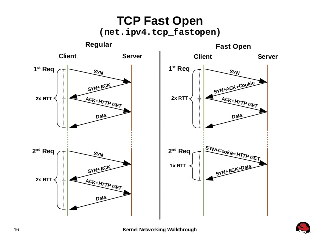

三次握手的过程中，当用户首次访问server时，发送`syn`包，server根据用户IP生成`cookie`，并与`syn+ack`一同发回client，client再次访问server时，在syn包携带TCP cookie；如果server校验合法，则在用户回复ack前就可以直接发送数据；否则按照正常三次握手进行。TFO提高性能的关键是省去了热请求的三次握手，这在充斥着小对象的移动应用场景中能够极大提升性能。客户端使用起来比较麻烦如果使用`sendmsg/sendto`系统调用，需要加上`MSG_FASTOPEN`这个flag，服务端不需要做任何设置。

#### Reference

* [为Linux系统开启 TCP Fast Open (TFO)](https://chenjx.cn/linux-tfo/)
* [3.7. 開啟封包轉送與 Nonlocal 綁定 - Red Hat Customer Portal](https://access.redhat.com/documentation/zh-tw/red_hat_enterprise_linux/7/html/load_balancer_administration/s1-initial-setup-forwarding-vsa)
