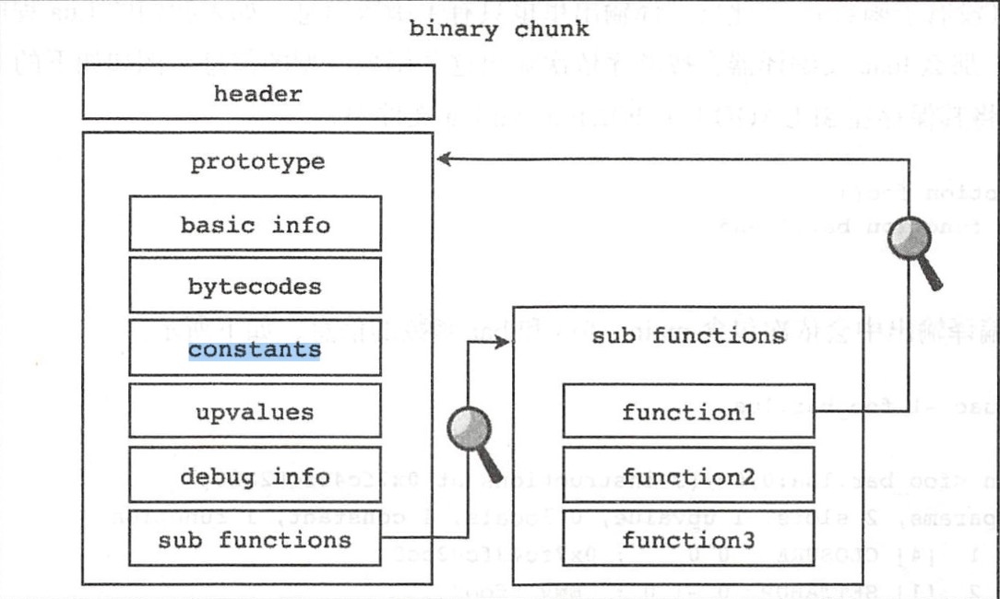

## Lua语言基础

* 字符串连接用 `..`
* 字符串长度用 `#`
* 数字字符串相加会转换为数字相加
* Lua中的表可以是hashmap、可以是关联数组，没初始化的table是nil，表的值不能是nil
* Lua中的数组索引是从1开始
* Lua中的主要工作在协程中，任意时刻只能运行一个协程，并且处于运行状态的协程只有在被挂起时才会停止。
* userdata是一种用户自定义类型，由应用程序或者C++创建的类型，可以将任意C++的任意数据类型的数据转存储在Lua变量中
* ipairs和pairs都是迭代器，其中ipars只迭代索引类型的元素，pairs则是所有
* module机制本质上就是一个module表，将需要暴露出来的方法填入module表中即可
* lua中的goto语句存在一些限制
  1. 不能jump到block中，因为label如果在block中，对外就不可见了
  2. 不能跳出函数
  3. 不能jump到一个本地变量的作用域中

* repeat关键字

* return 关键字

For syntactic reasons, a return can appear only as the last statement of a block: in other words, 
as the last statement in our chunk or just before an end, an else, or an until. For instance, in the next example, 
return is the last statement of the then block:

## Lua原理

* Lua中一段可以被解释器解释执行的代码叫做Chunk，Luac将源代码翻译成二进制的Chunk，然后交由Lua来解释运行



* Lua编译器是以函数为单位进行编译，每一个函数会被Lua编译器编译为一个内部结构，这个结构叫做原型，
  主要包含六个部分: 函数的基本信息(参数数量、局部变量等)、字节码、常量表、Upvalue表、调试信息、子函数原型表


```lua
print("Hello World")

转换为:

function main(...)
  print("Hello World")
  return
end
```

使用两个`-l`选项可以进入详细模式，打印出常量表、局部变量表、Upvalue表等信息

`luac -l -l hello.lua`

```lua
main <hello.lua:0,0> (4 instructions at 0x7f8440c031c0)
0+ params, 2 slots, 1 upvalue, 0 locals, 2 constants, 0 functions
        1       [1]     GETTABUP        0 0 -1  ; _ENV "print"
        2       [1]     LOADK           1 -2    ; "Hello World"
        3       [1]     CALL            0 2 1
        4       [1]     RETURN          0 1
constants (2) for 0x7f8440c031c0:
        1       "print"
        2       "Hello World"
locals (0) for 0x7f8440c031c0:
upvalues (1) for 0x7f8440c031c0:
        0       _ENV    1       0
```

一个二进制chunk主要由头部、主函数中的upvalues表的数量、函数原型等三个部分组成，其中头部总共30个字节，包含了
签名、版本号、格式号、LUAC_DATA、各种数据类型占用的字节数、以及大小端、浮点数格式识别信息等。签名的值是`0x1B4C7561`，其
字面量的形式就是`\x1bLua`，版本号由三个部分组成、Major Version、Minor Verison、Release Version，只会保存
Major和Minor的版本号，因为Release号只表示bug修复，不影响二进制格式。chunk格式号默认是0，表示chunk的格式。
LUAC_DATA占六个字节，前二个字节是0x1993这是lua的发布年份、后面四个字节是0x0D、0x0A、0x1、0A。剩下的就是cint、size_t、Lua虚拟机指令、lua整数、
lua浮点数等五种数据类型的占用的字节数大小。接着会有一个LUAC_INT，其值为0x5678，


```bash
 $  xxd -u -g 1 luac.out
00000000: 1B 4C 75 61 53 00 19 93 0D 0A 1A 0A 04 08 04 08  .LuaS...........
00000010: 08 78 56 00 00 00 00 00 00 00 00 00 00 00 28 77  .xV...........(w
00000020: 40 01 0B 40 68 65 6C 6C 6F 2E 6C 75 61 00 00 00  @..@hello.lua...
00000030: 00 00 00 00 00 00 01 02 04 00 00 00 06 00 40 00  ..............@.
00000040: 41 40 00 00 24 40 00 01 26 00 80 00 02 00 00 00  A@..$@..&.......
00000050: 04 06 70 72 69 6E 74 04 0C 48 65 6C 6C 6F 20 57  ..print..Hello W
00000060: 6F 72 6C 64 01 00 00 00 01 00 00 00 00 00 04 00  orld............
00000070: 00 00 01 00 00 00 01 00 00 00 01 00 00 00 01 00  ................
00000080: 00 00 00 00 00 00 01 00 00 00 05 5F 45 4E 56     ..........._ENV
```

函数原型主要包含了函数的基本信息、指令表、常量表、upvalue表、子函数原型表以及调试信息等。
基本信息包括源文件名、起止行号、固定参数个数、是否是vararg函数以及运行函数所必要的寄存器数量
调试信息包括行号表、局部变量表以及upvalue名列表等。

## Lua 指令

Lua虚拟机指令可以分为四类、分别对应四种编码模式:iABC、iABx、iAsBx、iAx

* iABC 可以携带A、B、C三个操作数，分别占用8、9、9个比特
* iABx 可以携带A和Bx两个操作数、分别占用8和18个比特
* iAsBx 可以携带A和sBx两个操作数
* iAx 只携带一个操作数，占用26个比特

只有iAsBx模式下的sBx操作数会被解释成有符号整数，其他情况下操作数都解释为无符号整数。

## Lua API

lua_State是对解释器状态的封装，可以在多个解释器实例之间进行切换，使用lua_newstate类创建lua_State实例

Lua中一共支持8种数据类型，分别是nil、布尔、数字、字符串、表、函数、线程、用户数据


## Lua C API

Lua与C/C++交互的核心在于虚拟栈，为什么这么说呢? 在lua中我们可以很简单的通过`t[k] = v`来操作一个表，并且k和v是任意lua类型，
但是在C中要想实现这个能力就比较困难了，C中的类型都是静态的，我们可能需要提供不同lua类型的重载函数才能实现这个表的赋值操作。
或者是提供一个复合类型，他可以表示任何lua类型。


```lua
lua_Integer luaL_checkinteger (lua_State *L, int arg);
检查函数的第 arg 个参数是否是一个整数（或是可以被转换为一个整数）并以 lua_Integer 类型返回这个整数值。

void luaL_argcheck (lua_State *L,
                    int cond,
                    int arg,
                    const char *extramsg);
检查 cond 是否为真。如果不为真，以标准信息形式抛出一个错误（参见 luaL_argerror）。
```


```lua
void lua_pushnil(lua_State *L);
void lua_pushboolea(lua_State *L, int bool);
void lua_pushnumber(lua_State *L, lua_Number n);
void lua_pushinteger(lua_State *L, lua_Integer n);
void lua_pushlstring(lua_State *L, const char *s, size_t len); 
void lua_pushstring(lua_State *L, const char *s);

// 默认的lua栈大小是20，通过LUA_MINISTACK定义
int lua_checkstack (lua_State *L, int sz);

// 对lua_checkstack的封装，不返回错误码，会返回错误内容
void luaL_checkstack (lua_State *L, int sz, const char *msg);


// 检查堆栈指定位置的值是否是指定类型
int lua_is* (lua_State *L, int index);
```

```c
typedef int (*lua_CFunction) (lua_State *L);
```


* 用来创建一个`lua_State`，一个`lua_State`就表示一个lua虚拟机，所有的lua API的第一个参数都是`lua_State`
```lua
lua_open()  //lua5.1的语法
luaL_newstate() //最新的用法
```

* 用来加载标准库
```lua
luaL_openlibs
```

* 运行lua脚本

```lua
int luaL_dostring (lua_State *L, const char *str);
Loads and runs the given string. It is defined as the following macro:

     (luaL_loadstring(L, str) || lua_pcall(L, 0, LUA_MULTRET, 0))
```


```lua
LUA_GCCOUNT
LUA_GCCOUNTB

lua_gc
```